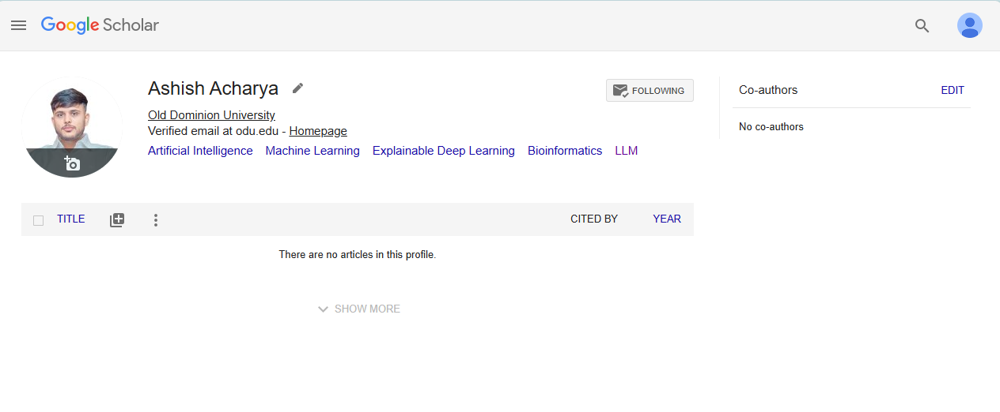
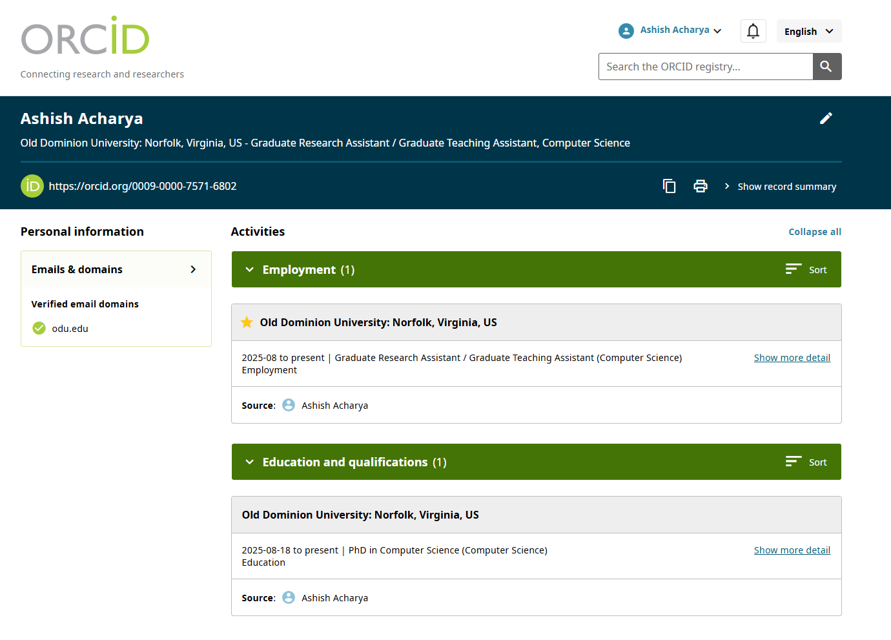
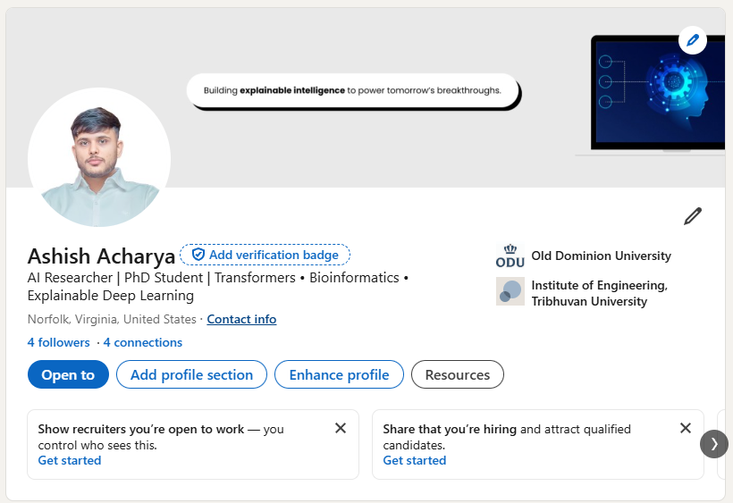
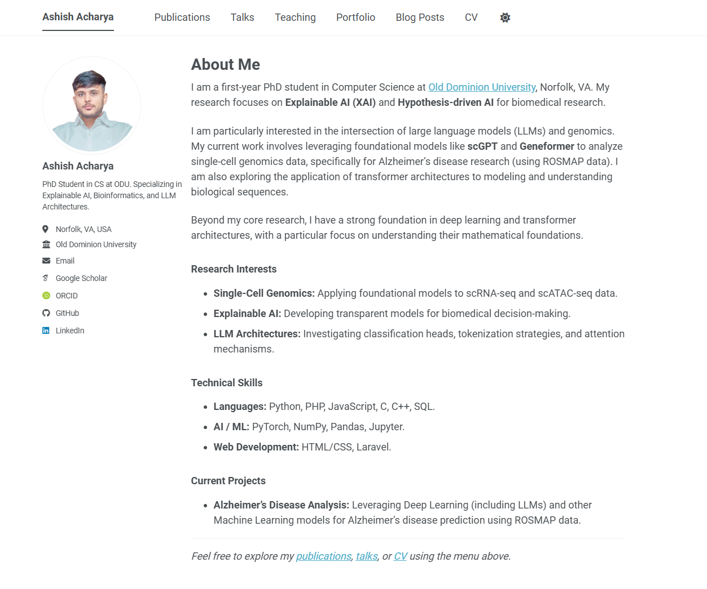
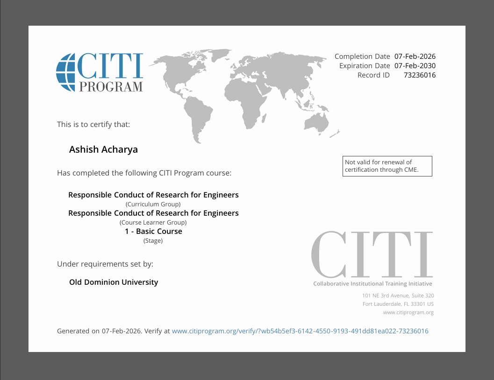

# Assignment 2: Presence, Tools, and RCR
**CS 800 Research Methods, Spring 2026**
**Student:** Ashish Acharya

## Description
This assignment establishes my professional digital presence as a researcher. It includes the creation and linkage of academic profiles (Google Scholar, ORCID, LinkedIn), the development of a personal academic webpage, an introduction to LaTeX using Overleaf, and verification of the Responsible Conduct of Research (RCR) training.

## Directory and File Structure
The files for this assignment are organized as follows:

* [images](./images/): Contains the compiled LaTeX PDF and screenshots verifying my professional profiles and RCR training completion.
* `ReadMe.md`: This file the very file you are reading right now, documenting the assignment submission

## Professional Presence Links
Below are the links to my established professional accounts. These accounts have been cross-linked to ensure bi-directional discovery.

* **Google Scholar Profile:** [https://scholar.google.com/citations?user=x0WXuPwAAAAJ&hl=en](https://scholar.google.com/citations?user=x0WXuPwAAAAJ&hl=en)

    

* **ORCID iD:** [https://orcid.org/0009-0000-7571-6802](https://orcid.org/0009-0000-7571-6802)

    

* **LinkedIn Profile:** [https://www.linkedin.com/in/acharya-ashish](https://www.linkedin.com/in/acharya-ashish)

    

* **Academic Webpage:** [https://cs.odu.edu/~cs_aacha003/](https://cs.odu.edu/~cs_aacha003/)
    * *Note:* My CS department URL (https://cs.odu.edu/~cs_aacha003/) redirects to my github.io homepage.
    * *Template Used:* [https://github.com/academicpages/academicpages.github.io]

    

### Scholars & Faculty Followed
I have followed the following ODU CS Faculty and researchers in my area of interest on Google Scholar:
1.  Dr. Hong Qin
2.  Dr. Michael L. Nelson
3.  Dr. Mahmoud Nazzal
4.  Dr. Yaohang Li
5.  Dr. Jiangwen Sun

## LaTeX and Overleaf
I have completed Part 1 of the LaTeX introduction on Overleaf. I modified the provided template with my own information, including updated URLs and text.

* **PDF Submission:** [CS800___LaTeX_basics.pdf](./images/CS800___LaTeX_basics.pdf)

## Responsible Conduct of Research (RCR)
I have completed the CITI RCR training.

* **Certificate Link:** <a href="https://www.citiprogram.org/verify/?wb54b5ef3-6142-4550-9193-491dd81ea022-73236016">Click here to view Verify Certificate</a>
* **Verification Screenshot:** See the screenshot below.

## 6. Video Demonstration

I have recorded a video walkthrough of these accounts, the LaTeX document, and my RCR certification.

**YouTube Link:** [https://youtu.be/Lis0xCnc7p8](https://youtu.be/Lis0xCnc7p8)