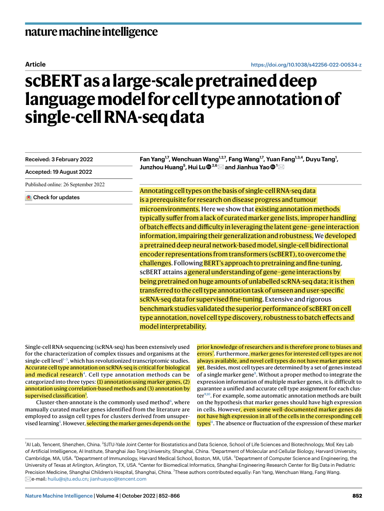
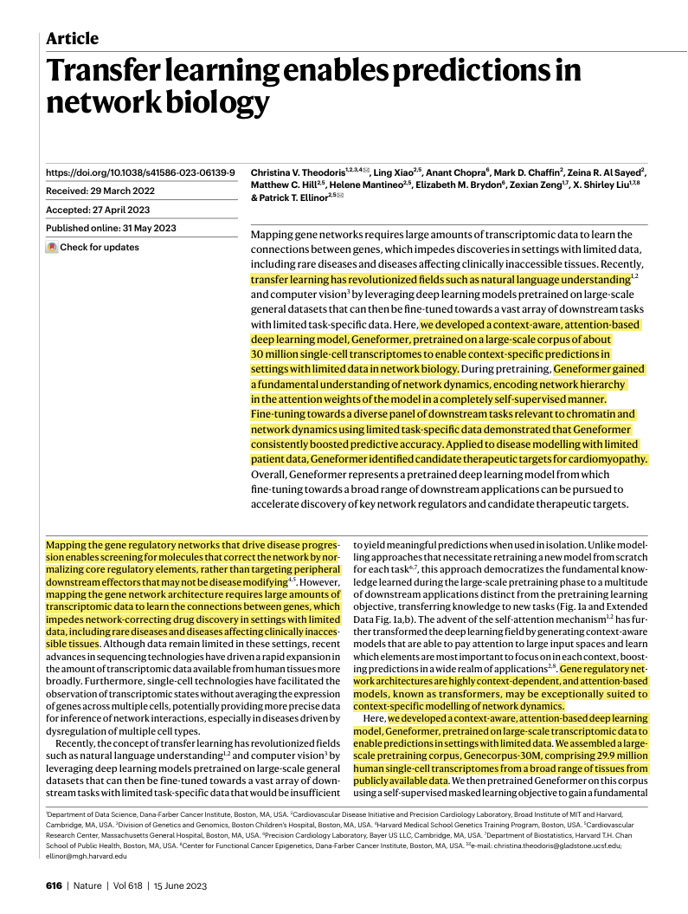
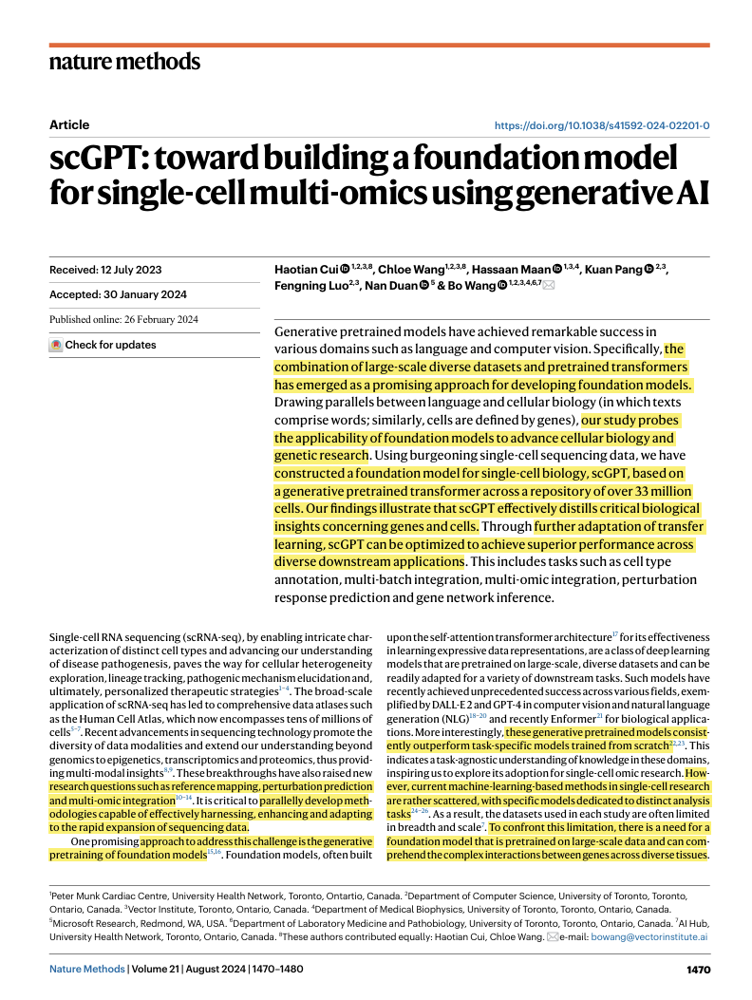
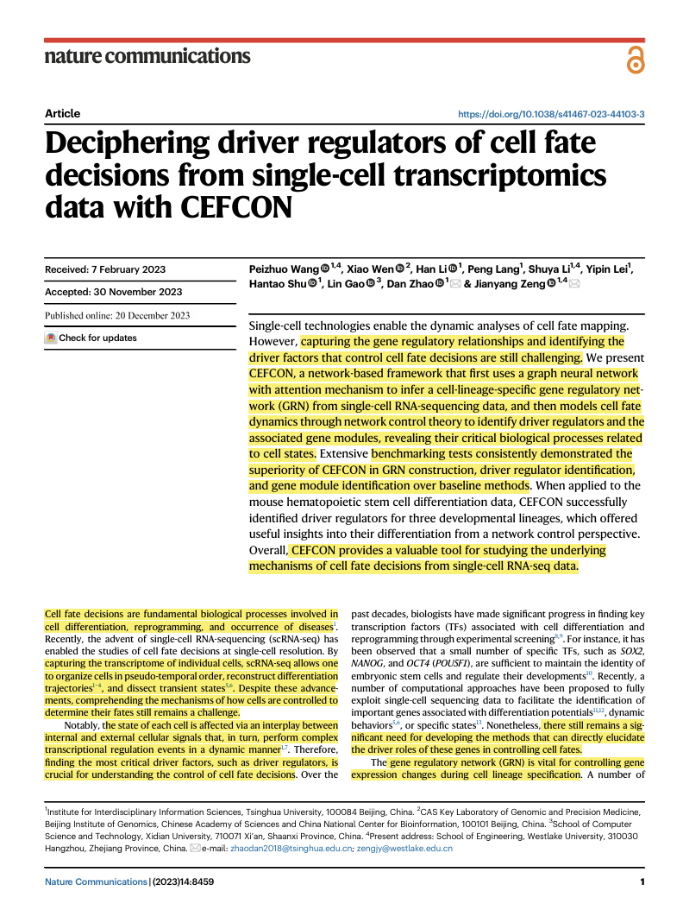
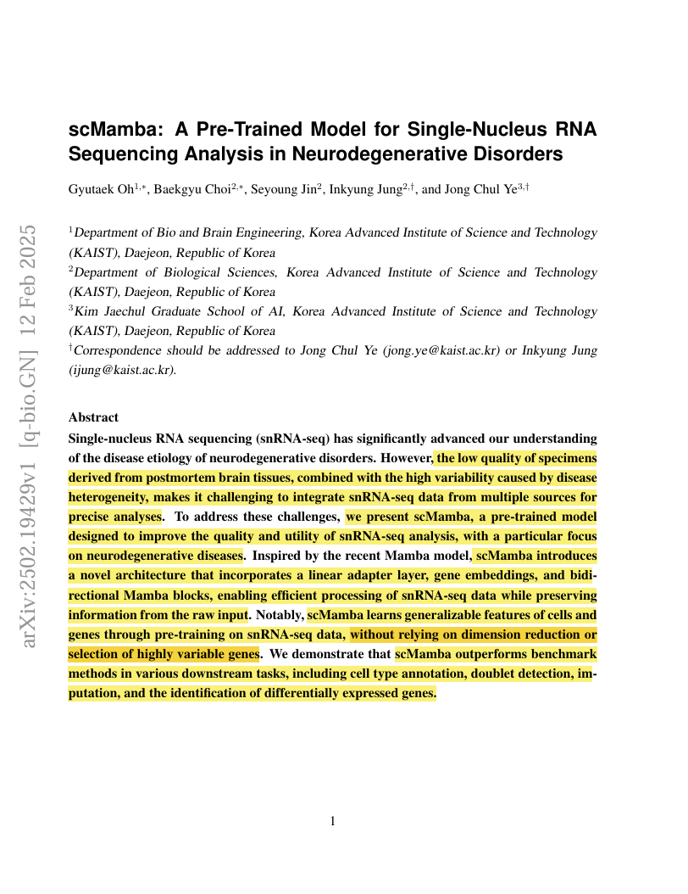

# Assignment 3: Reading Papers (Keshav's 1st Pass)
**CS 800 Research Methods, Spring 2026**
**Student:** Ashish Acharya

## Description
This assignment applies **Keshav’s 1st Pass** to five research papers related to my research interests. The focus is on identifying the core problem, the proposed approach, and the scientific contributions of each work.

Each paper includes:
- Reference line
- DOI link
- BibTeX entry
- Marked-up PDF with highlights
- Screenshot of page 1

## Directory and File Structure
The files for this assignment are organized as follows:

* [images](./images/): Contains the screenshots of page 1 of each paper.
* `ReadMe.md`: This file the very file you are reading right now, documenting the assignment submission.
* [papers](./papers/): Contains the marked-up pdfs of each papers.

## Papers
Below are the five papers on which **Keshav’s 1st Pass** has been performed.


### Paper 1: scBERT as a large-scale pretrained deep language model for cell type annotation of single-cell RNA-seq data


**Refrence:** Yang, F., Wang, W., Wang, F., et al.: scbert as a large-scale pretrained deep language model for cell type annotation of single-cell rna-seq data. Nature Machine Intelligence 4(10), 852–866 (2022) https://doi.org/10.1038/s42256-022-00534-z

```bibtex
@article{yang2022scbert,
  title={scBERT as a large-scale pretrained deep language model for cell type annotation of single-cell RNA-seq data},
  author={Yang, Fan and Wang, Wenchuan and Wang, Fang and others},
  journal={Nature Machine Intelligence},
  volume={4},
  number={10},
  pages={852--866},
  year={2022},
  publisher={Nature Publishing Group},
  doi = "10.1038/s42256-022-00534-z"
}
```

**DOI:** https://doi.org/10.1038/s42256-022-00534-z

**Keshav’s 1st Pass:**

- **Problem:** Traditional cell type annotation methods often depend on curated marker gene lists, handle batch effects poorly, and struggle to leverage latent gene-gene interaction information. Most methods are forced to use dimensionality reduction, which can lead to a loss of critical high-dimensional biological information.

- **Approach:** The model, scBERT, follows the BERT paradigm of pretraining on millions of unlabeled cells and then fine-tuning for specific tasks. It utilizes a "Performer" encoder to overcome the computational limitations of traditional transformers, allowing it to handle over 16,000 gene inputs simultaneously without highly variable gene selection.

- **Contributions:** scBERT provides robust and accurate cell type annotations and is capable of discovering novel cell types. It offers significant model interpretability, as its attention mechanism can highlight the importance of individual genes in its decision-making process.

**Marked-up PDF:** [paper_1](./papers/paper1.pdf)

**Screenshot (Page 1):**



---

### Paper 2: Transfer learning enables predictions in network biology

**Refrence:** Theodoris, C.V., Xiao, L., Chopra, A., et al.: Transfer learning enables predictions in network biology. Nature 618(7965), 616–624 (2023) https://doi.org/10.1038/s41586-023-06139-9

```bibtex
@article{theodoris2023transfer,
  title={Transfer learning enables predictions in network biology},
  author={Theodoris, Christina V and Xiao, Ling and Chopra, Anant and others},
  journal={Nature},
  volume={618},
  number={7965},
  pages={616--624},
  year={2023},
  publisher={Nature Publishing Group},
  doi = "10.1038/s41586-023-06139-9"
}
```

**DOI:** https://doi.org/10.1038/s41586-023-06139-9

**Keshav’s 1st Pass:**

- **Problem:** Mapping gene regulatory networks typically requires massive amounts of transcriptomic data, which is often unavailable for rare diseases or clinically inaccessible tissues. Existing modeling approaches often require retraining from scratch for every new task rather than leveraging broader foundational knowledge.

- **Approach:** The authors developed Geneformer, an attention-based deep learning model pretrained on a massive corpus of approximately 30 million single-cell transcriptomes (Genecorpus-30M). It utilizes a self-supervised masked learning objective and a rank-value encoding system to represent the transcriptome of each single cell.

- **Contributions:** During pretraining, Geneformer gains a fundamental, self-supervised understanding of network hierarchy and dynamics. Fine-tuning the model with limited data enables accurate context-specific predictions, such as identifying therapeutic targets for cardiomyopathy and predicting gene dosage sensitivity.

**Marked-up PDF:** [paper_2](./papers/paper2.pdf)

**Screenshot (Page 1):**



---


### Paper 3: scGPT: toward building a foundation model for single-cell multi-omics using generative AI

**Refrence:** Cui, H., Wang, C., Maan, H., et al.: scgpt: toward building a foundation modelfor single-cell multi-omics using generative ai. Nature Methods 21(8), 1470–1480 (2024) https://doi.org/10.1038/s41592-024-02201-0

```bibtex
@article{cui2024scgpt,
  title={scGPT: toward building a foundation model for single-cell multi-omics using generative AI},
  author={Cui, Haotian and Wang, Chloe and Maan, Hassaan and others},
  journal={Nature Methods},
  volume={21},
  number={8},
  pages={1470--1480},
  year={2024},
  publisher={Nature Publishing Group},
  doi="10.1038/s41592-024-02201-0"
}
```

**DOI:** https://doi.org/10.1038/s41592-024-02201-0

**Keshav’s 1st Pass:**

- **Problem:** Machine learning models in single-cell research are currently scattered and task-specific, often trained on limited datasets. There is a critical need for a unified foundation model capable of comprehending complex gene-gene interactions across diverse tissues and modalities at a massive scale.

- **Approach:** scGPT is a generative foundation model pretrained on over 33 million cells. It employs a generative pretrained transformer architecture to simultaneously learn cell and gene representations through a unified workflow designed for non-sequential omics data.

- **Contributions:** scGPT achieves state-of-the-art performance across a wide array of tasks, including multi-batch/multi-omic integration, cell type annotation, genetic perturbation response prediction, and gene network inference. It demonstrates a "scaling effect," where larger pretraining datasets lead to progressively better performance on downstream biological tasks.

**Marked-up PDF:** [paper_3](./papers/paper3.pdf)

**Screenshot (Page 1):**



---

### Paper 4: Deciphering driver regulators of cell fate decisions from single-cell transcriptomics data with CEFCON

**Refrence:** Wang, P., Wen, X., Li, H., et al.: Deciphering driver regulators of cell fate decisions from single-cell transcriptomics data with cefcon. Nature Communications 14(1), 8459 (2023) https://doi.org/10.1038/s41467-023-44103-3

```bibtex
@article{wang2023deciphering,
  title={Deciphering driver regulators of cell fate decisions from single-cell transcriptomics data with CEFCON},
  author={Wang, Peizhuo and Wen, Xiao and Li, Han and others},
  journal={Nature Communications},
  volume={14},
  number={1},
  pages={8459},
  year={2023},
  publisher={Nature Publishing Group},
  doi="10.1038/s41467-023-44103-3"
}
```

**DOI:** https://doi.org/10.1038/s41467-023-44103-3

**Keshav’s 1st Pass:**

- **Problem:** Identifying critical driver factors and gene regulatory relationships that control cell fate decisions from single-cell transcriptomics is challenging. Existing methods often struggle with inaccurate gene regulatory network (GRN) construction and fail to capture the continuous dynamics of cell fate transitions.

- **Approach:** The authors developed CEFCON, a network-based framework that uses a graph neural network (GNN) with an attention mechanism to infer cell-lineage-specific GRNs. It then applies network control theory (minimum feedback vertex sets and minimum dominating sets) alongside a proprietary influence score to identify key driver regulators.

- **Contributions:** CEFCON demonstrates superior performance in GRN construction and driver regulator identification over existing baselines. It successfully identified regulators in mouse hematopoietic stem cell differentiation, offering a valuable tool for understanding biological mechanisms from a network control perspective.

**Marked-up PDF:** [paper_4](./papers/paper4.pdf)

**Screenshot (Page 1):**



---

### Paper 5: scMamba: A Pre-Trained Model for Single-Nucleus RNA Sequencing Analysis in Neurodegenerative Disorders

**Refrence:** Oh, G., Choi, B., Jin, S., Jung, I., Ye, J.C.: scmamba: A pre-trained model for single-nucleus rna sequencing analysis in neurodegenerative disorders. arXiv preprint arXiv:2502.19429 (2025) https://doi.org/10.48550/arXiv.2502.19429

```bibtex
@article{oh2025scmamba,
  title={scMamba: A Pre-Trained Model for Single-Nucleus RNA Sequencing Analysis in Neurodegenerative Disorders},
  author={Oh, Gyutaek and Choi, Baekgyu and Jin, Seyoung and Jung, Inkyung and Ye, Jong Chul},
  journal={arXiv preprint arXiv:2502.19429},
  year={2025},
  doi="10.48550/arXiv.2502.19429"
}
```

**DOI:** https://doi.org/10.48550/arXiv.2502.19429

**Keshav’s 1st Pass:**

- **Problem:** Single-nucleus RNA sequencing (snRNA-seq) data, particularly from postmortem brain tissue, suffers from low quality, high variability, and dropout (high zero counts). Additionally, traditional transformer-based models face quadratic computational complexity when processing the tens of thousands of genes captured in such data.

- **Approach:** The authors introduced scMamba, a pre-trained model using selective state space models (SSMs). The architecture incorporates bidirectional Mamba blocks, a linear adapter layer, and gene embeddings, allowing it to process full-gene data with linear complexity without requiring dimensionality reduction or selection of highly variable genes.

- **Contributions:** scMamba outperforms benchmark methods in various downstream tasks, including cell type annotation, doublet detection, and snRNA-seq imputation. It effectively corrects batch effects and enhances the robustness of differential gene expression analysis in neurodegenerative research.

**Marked-up PDF:** [paper_5](./papers/paper5.pdf)

**Screenshot (Page 1):**



---

## 6. Video Demonstration

I have recorded a video walkthrough of **Keshav’s 1st Pass** highlight for each of the papers and overview of the assignment submission.

**YouTube Link:** [https://youtu.be/WHGMSOQQxUs](https://youtu.be/WHGMSOQQxUs)