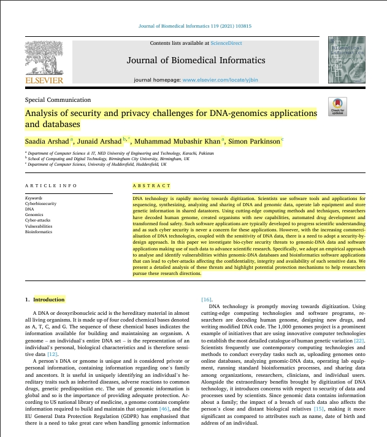
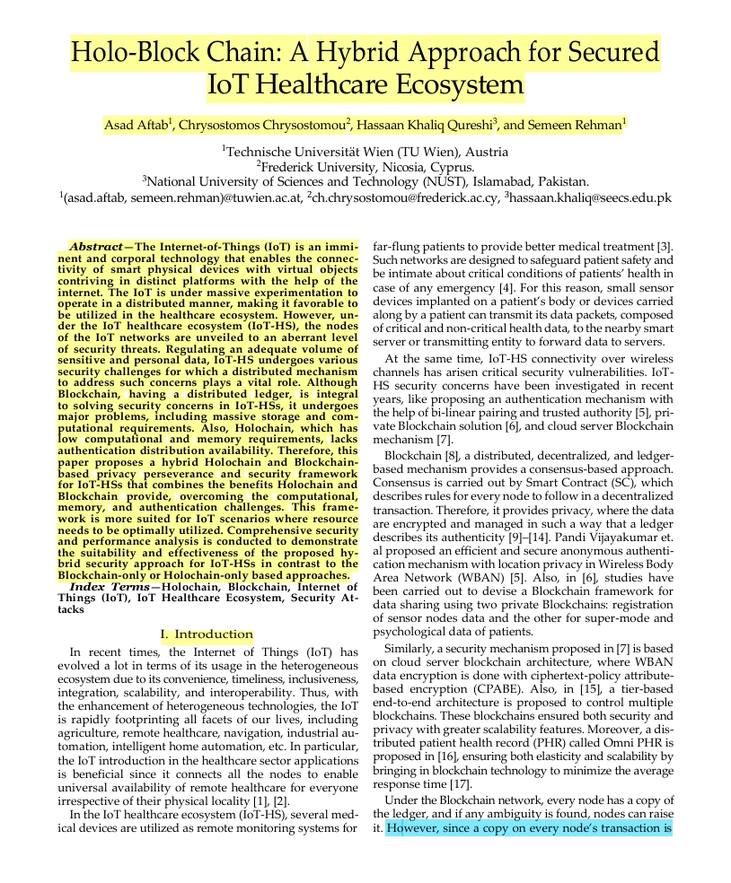
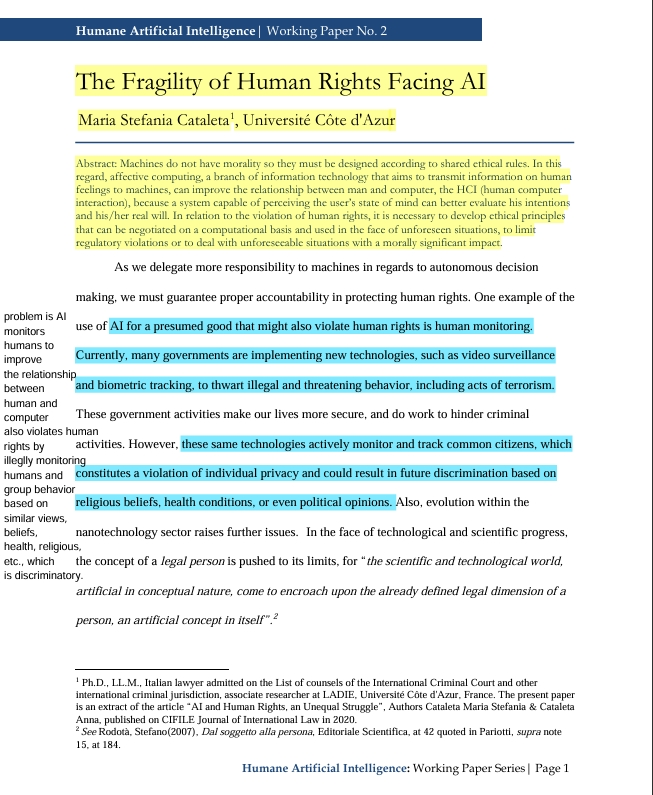
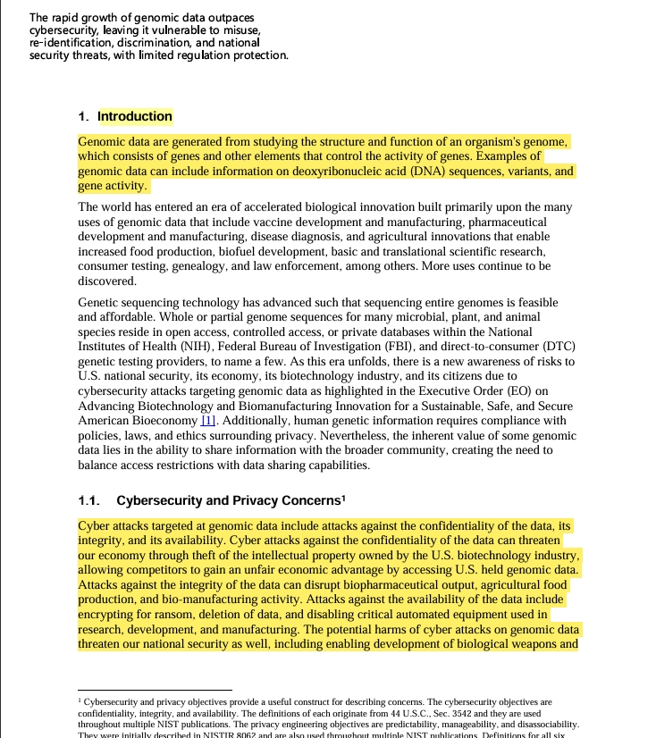

## Assignment 3: Reading Papers
#### CS 800 Research Methods

This submission includes five papers from my research (privacy persistance), each with Keshav's 1st pass summary of problem, approach, and contributions; reference; link; BibTex; and marked up PDF.

#### Directory Structure
**Marked-up papers** -- Marked up PDFs of five papers (Keshav 1st pass problem, approach, and contributions)
**imgs** Screenshots of of each paper
**README.md** This file includes description, links, and screenshots

#### Papers
###### Paper 1: Analysis of Security and Privacy Challenges for DNA Genomics Applications and Databases 
**Reference:**
Saadia Arshad, Junaid Arshad, Muhammad Mubashir Khan, Simon Parkinson (2021)

**Link:**
https://doi.org/10.1016/j.jbi.2021.103815

**BibTex:**
```bibtex
title = {Analysis of Security and Privacy Challenges for DNA Genomics Applications and Databases}
author = {Saadia Arshad, Junaid Arshad, Muhammad Mubashir Khan, Simon Parkinson}
publisher = {Science Direct}
year = {2021}
```

**Screenshot 1**


###### Paper 2: Holo-Block Chain: A Hybrid Approach for Secure IoT Healthcare Ecosystem
**Reference:** 
Asad Aftab, Chrysostomos Chrysostomou, Hassaan Khaliq Qureshi, and Semeen Rehman (2022)

**Link:**
www.arxiv.org/abs/2304.14175

**BibTex:**
```bibtex
title = {Holo-Block Chain: A Hybrid Approach for Secure IoT Healthcare Ecosystem}
author = {Asad Aftab, Chrysostomos Chrysostomou, Hassaan Khaliq Qureshi, and Semeen Rehman}
publisher = {IEEE}
year = {2022}
```

**Screenshot 2**


###### Paper 3: Humane Artificial Intelligence: The Fragility of Human Rights Facing AI 
**Reference:**
Maria Stefania Cataleta

**Link:**
www.jstor.org/stable/resrep25514

**BibTex:**
```bibtex
title = {Human Artificial Intelligence: The Fragility of Human Rights Facing AI}
author = {Maria Stefania Cataleta}
publisher = {JSTOR}
year = {2020}
```

**Screenshot 3**


###### Paper 4: Cybersecurity of Genomic Data
**Reference:**
Ron Pulivarti, Natalis Martin, Fred Byers, Justin Wagner, and Justin Zook (2023)

**Link:** 
https://doi.org/10.6028.NIST.IR.8432

**BibTex:**
```bibtex
title = {Cybersecurity of Genomic Data}
author = {Ron Pulivarti, Natalis MArtin, Fred Byers, Justin Wagner, and Justin Zook}
publisher = {NIST}
year = {2023}
```

**Screenshot 4:**


###### Paper 5: The Medical Ethics of HeLa Cells
**Reference:**
Elizabeth Pratt (2020-2021)

**Link:**
www.digitalcommons.cortland.edu/cgi/viewcontent.cgi?article=1007&context=rhetdragonsresearchinquiry

**BibTex:**
```bibtex
title = {The Medical Ethics of HeLa Cells}
author = {Elizabeth Pratt}
publisher = {SUNY Cortland}
year = {2020-2021}
```

**Screenshot 5:**


