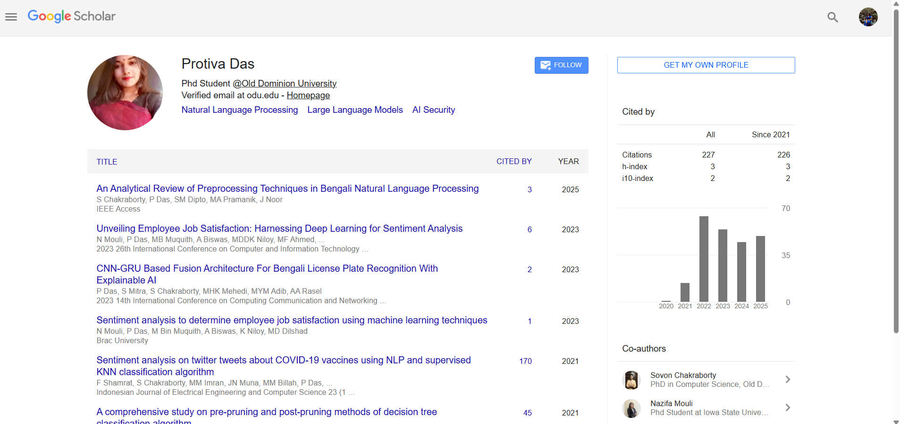
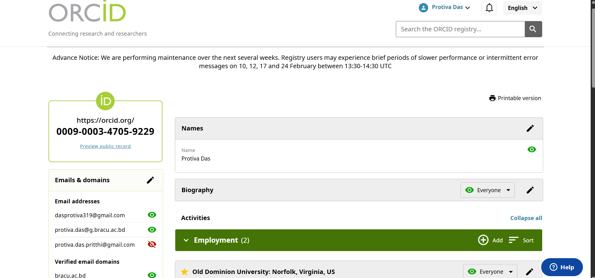
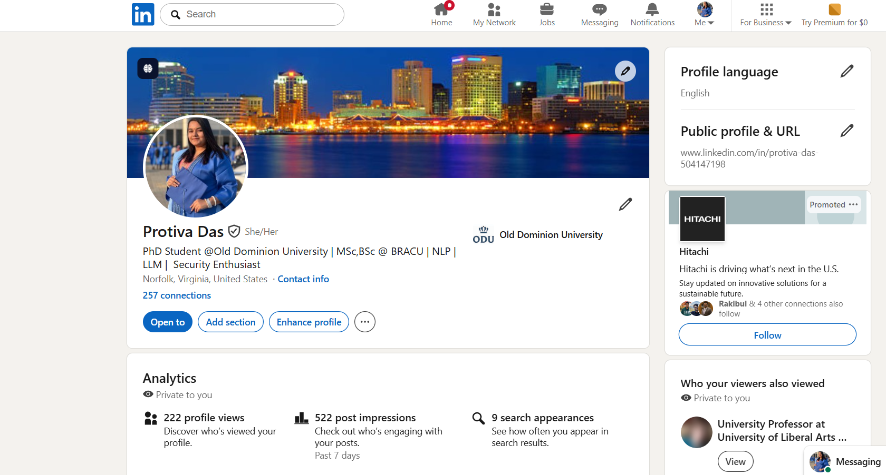
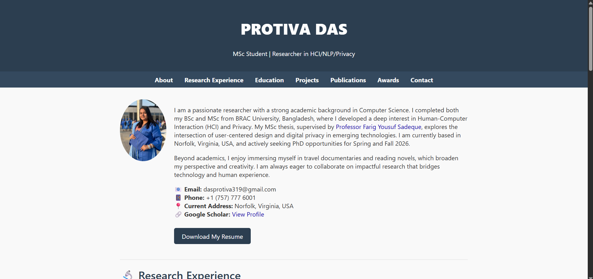

# CS 800 – Assignment 2: Presence, Tools, RCR  
**Course:** CS 800 – Research Methods, Spring 2026  
**Due:** 2026-02-09  

---

## 1. Assignment Description

This assignment demonstrates professional online presence, familiarity with research tools, LaTeX proficiency, and completion of Responsible Conduct of Research (RCR) training.

The components include:

- Professional online accounts  
- Academic webpage  
- LaTeX assignment in Overleaf  
- RCR certificate  
- Walkthrough video  

---

## 2. Professional Accounts

### 2.1 Google Scholar

**Profile link:**  
https://scholar.google.com/citations?hl=en&user=7Vkqm00AAAAJ&view_op=list_works&sortby=pubdate  

**Screenshot:**  

**Faculty / Researchers followed:**

**ODU Faculty**
- Jonathan Takeshita  
- Daniel Takabi  
- Mohammad GhasemiGol  
- Sampath Jayarathna  
- Pratip Rana  

**Additional Researchers**
- Traian Rebedea  
- Shaona Ghosh  
- Keltin Grimes  
- Francisco Aguilera-Martinez  
- Dezhang Kong  

---

### 2.2 ORCID

**Profile link:**  
https://orcid.org/0009-0003-4705-9229  

**Screenshot:**  

---

### 2.3 LinkedIn

**Profile link:**  
https://www.linkedin.com/in/protiva-das-504147198/  

**Screenshot:**  

**Other accounts linked:**  
Google Scholar, ORCID, Academic Webpage

---

## 3. Academic Webpage

**Webpage link:**  
https://protivapritthi.github.io/das_protiva_pritthi.github.io/  

**Screenshot:**  

**Notes:**  
Bi-directional linkage to all professional accounts is included.

---

## 4. LaTeX Assignment (Overleaf)

**PDF Download:**  
[Assignment 2 PDF](Latex_CS800_protiva.pdf)

**Notes:**  
Used Overleaf template from class Slide 65. Replaced all URLs, images, and text with personal information.

---

## 5. Responsible Conduct of Research (RCR)

**Certificate PDF:**  
[RCR Certificate](citi.pdf)

**Completion Notes:**  
Completed **“Responsible Conduct of Research for Engineers”** modules at Old Dominion University.

---

## 6. Walkthrough Video

**YouTube Link:**  
https://youtu.be/eNcpnhtHoS4  

**Notes:**  
Demonstrates all accounts, RCR completion, and academic webpage.

---

## 7. Notes / Additional Information

- All accounts include profile pictures and filled bios  
- Repository structure is organized for easy navigation  
- Links are bi-directional where applicable  

_Last updated: February 9, 2026_
