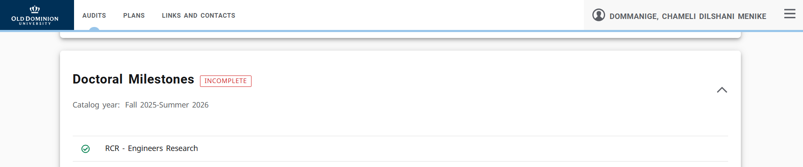

# Assignment 2 – Professional Presence, Tools, and RCR  
**CS 800 – Research Methods (Spring 2026)**  
**Due:** Feb 9, 2026  

## Overview
This assignment focuses on building a professional academic online presence and becoming familiar with essential research tools and responsible conduct requirements.

The goal is to create and connect multiple academic/professional profiles, set up an academic webpage, learn basic LaTeX using Overleaf, and complete the Responsible Conduct of Research (RCR) training.

---

## Contents of Repository
This repository contains:
- Screenshots of completed RCR training  
- LaTeX-generated PDF from Overleaf  
- Links to completed profiles
- The link to academis profile
- README.md  

---

## Professional Presence

### Google Scholar
**Profile link:** [https://scholar.google.com/citations?user=dyQ8NCMAAAAJ&hl]

**Tasks completed:**
- Updated the existing Google Scholar profile  
- Added profile picture and bio  
- Followed ODU CS faculty  

**Faculty followed:**
- Dr. Jian Wu  
- Dr. Michele C. Weigle  
- Dr. Michael L. Nelson  
- Dr. Sampath Jayarathna  
- Dr. Vikas G. Ashok  
- Dr. Ravi Mukkamala

---

### ORCID
**ORCID link:** [https://orcid.org/0009-0005-6179-5403]

### LinkedIn
**Profile link:** [https://www.linkedin.com/in/chameli-dommanige-90b94615a/]

## Academic Webpage
**Webpage link:** [https://chamelid.github.io/]  
**ODU redirect link:** [https://www.cs.odu.edu/~cs_cdomm001/]

**Description:**
- Updated the existing professional academic webpage  
- Included email and research interests  
- Added links to Google Scholar, ORCID, LinkedIn  
- Used professional layout, color, and visual design  
- Ensured bi-directional linking between platforms  

## LaTeX and Overleaf

**PDF included in repository:**  
CS800___LaTeX_basics___Dommanige.pdf

**Tasks completed:**
- Completed LaTeX tutorial (Part 1)  
- Used provided template  
- Replaced template content with personal information  
- Generated and downloaded PDF  

## Responsible Conduct of Research (RCR)

I have previously completed the Responsible Conduct of Research (RCR) training.

**Option completed:**  
Responsible Conduct of Research for Engineers

As required, I verified completion through DegreeWorks under **Doctoral Milestones** and included a screenshot showing the completed RCR requirement. I have also included the official CITI completion certificate.

**Proof of completion:**
- DegreeWorks completion screenshot  
- CITI RCR completion certificate  

**Files included:**
- `Screenshot -RCR.png`  
- `citiCompletionCertificate.pdf`

**DegreeWorks Screenshot:**  

---

## YouTube Walkthrough Video

**Video link:** [Add YouTube link here]

