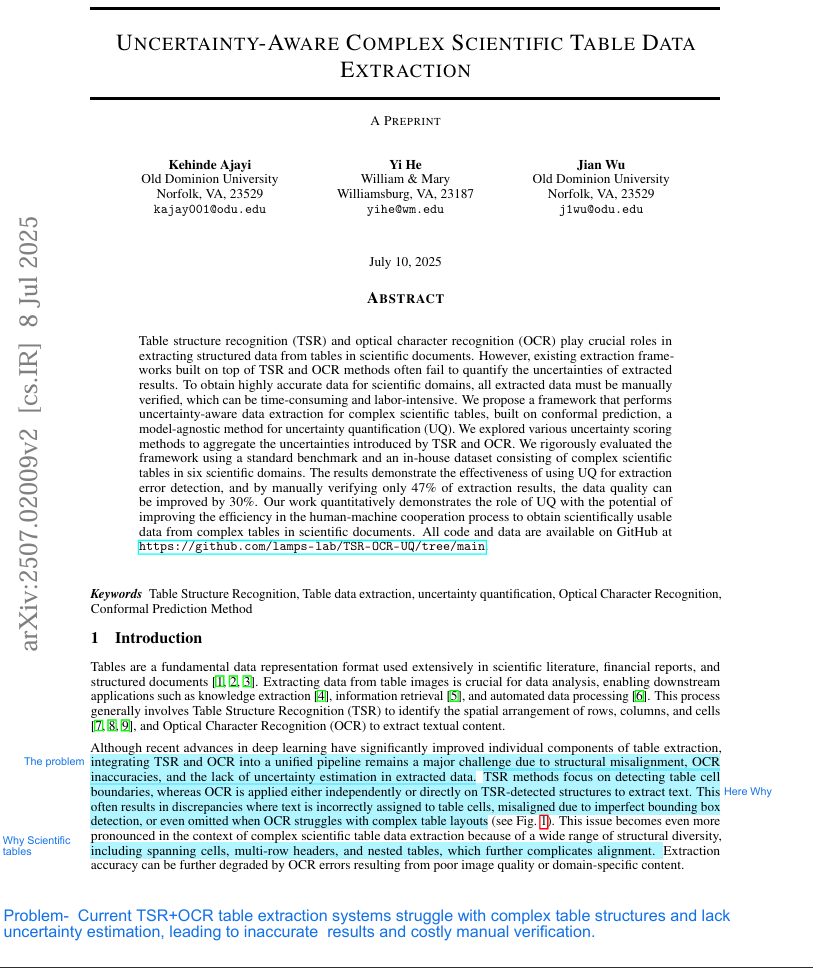
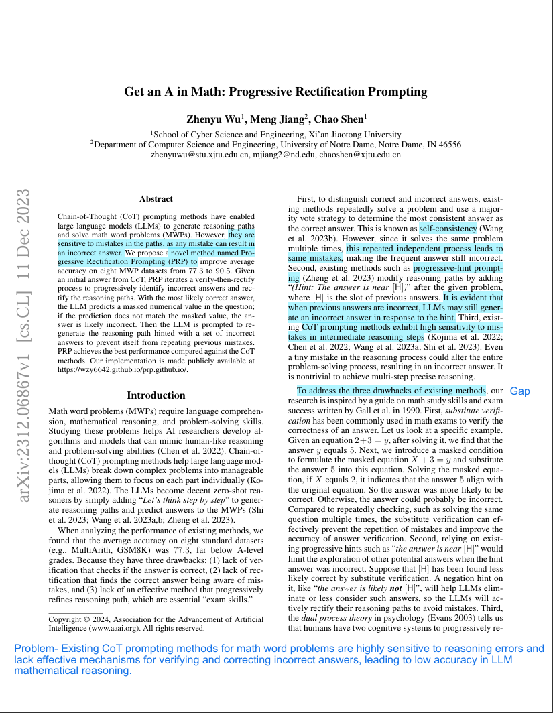
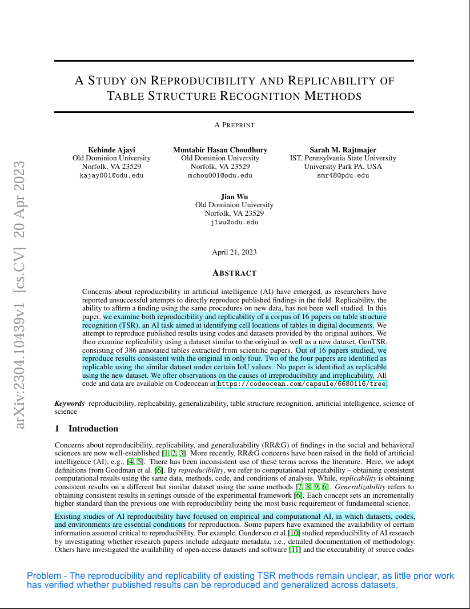
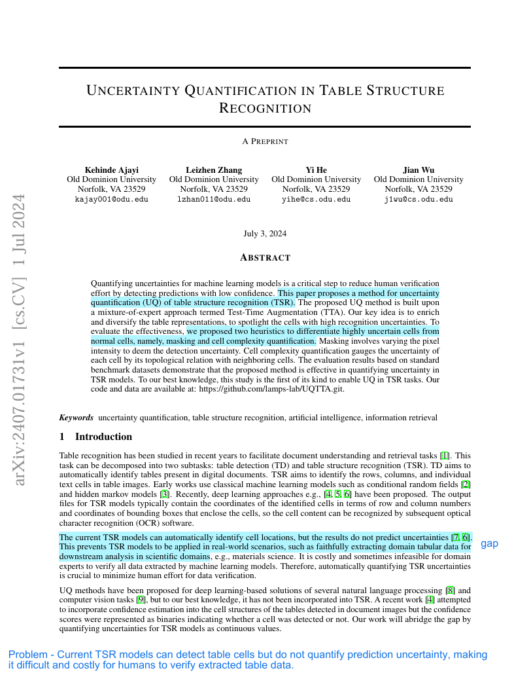

Assignment 3 – Reading Papers

CS 800 – Research Methods (Spring 2026)

This assignment focuses on reading and analyzing research papers in my research area using Keshav’s 1st-pass method.

The goal is to identify the problem, approach, and contributions of five selected papers, properly format their references and BibTeX entries, and demonstrate understanding through marked-up PDFs and structured summaries.

Papers

1. Uncertainty-Aware Complex Scientific Table Data Extraction

BibTeX

@misc{ajayi2025uncertaintyawarecomplexscientifictable,
      title={Uncertainty-Aware Complex Scientific Table Data Extraction}, 
      author={Kehinde Ajayi and Yi He and Jian Wu},
      year={2025},
      eprint={2507.02009},
      archivePrefix={arXiv},
      url={https://arxiv.org/abs/2507.02009}, 
}

**DOI:**  
https://doi.org/10.48550/arXiv.2507.02009  

Problem
Current TSR+OCR table extraction systems struggle with complex table structures and lack uncertainty estimation, leading to inaccurate results and costly manual verification.

Approach
The paper proposes an uncertainty-aware framework that integrates TSR and OCR with CP to align extracted data with table structures and automatically flag unreliable results.

contributions
Proposes an uncertainty-aware table extraction framework that integrates TSR and OCR using grid-cell alignment and CP to quantify uncertainty, automatically detect unreliable extractions, identify the most effective uncertainty scoring methods, and improve data accuracy by about 30% while reducing manual verification effort by 53%.

**First Page Screenshot:**  

**PDF:** [Open PDF](papers/Paper1.pdf)
----
2. Get an A in Math: Progressive Rectification Prompting

BibTeX

@misc{wu2023mathprogressiverectificationprompting,
      title={Get an {A} in Math: Progressive Rectification Prompting}, 
      author={Zhenyu Wu and Meng Jiang and Chao Shen},
      year={2023},
      eprint={2312.06867},
      archivePrefix={arXiv},
      primaryClass={cs.CL},
      url={https://arxiv.org/abs/2312.06867}, 
}

**DOI:**  
https://doi.org/10.48550/arXiv.2312.06867  

Problem
Existing CoT prompting methods for math word problems are highly sensitive to reasoning errors and lack effective mechanisms for verifying and correcting incorrect answers, leading to low accuracy in LLM mathematical reasoning.

Approach
The paper proposes PRP, an iterative zero-shot prompting method that verifies answers through substitute verification and progressively rectifies incorrect reasoning paths using feedback from previously rejected answers.

Contributions
The paper proposes PRP, a zero-shot iterative verify-then-rectify prompting framework that automatically checks and corrects LLM reasoning, achieving state-of-the-art accuracy across multiple MWP datasets.

**First Page Screenshot:**  

**PDF:** [Open PDF](papers/Paper2.pdf)
----
3. SciTableQA: A Question-Answering Benchmark for Complex Scientific Tables

BibTeX

@inproceedings{Ajayi2025SciTableQAAQ,
  title={{SciTableQA}:{A} Question-Answering Benchmark for Complex Scientific Tables},
  author={Kehinde Ajayi and Yi He and Matthew Maisonave and Kris SeekFord and Jian Wu},
  booktitle={International Conference on Theory and Practice of Digital Libraries},
  year={2025},
  url={https://api.semanticscholar.org/CorpusID:281043955}
}

**DOI:**  
https://doi.org/10.1007/978-3-032-05409-8_7  

Problem
Existing TableQA benchmarks and datasets do not adequately capture the structural complexity and reasoning challenges of standalone scientific tables, making it difficult to properly evaluate LLM reasoning over complex scientific tables.

Approach
The paper constructs the SciTableQA benchmark by collecting complex scientific tables from multiple domains, generating question–answer pairs using LLMs, verifying them through human annotation, and evaluating LLM performance across structural, content, and domain-specific reasoning tasks.

Contribution
Introduces SciTableQA, a benchmark dataset and evaluation framework for assessing LLM reasoning on standalone complex scientific tables, and identifies key challenges in structural and content-based table reasoning.

**First Page Screenshot:**  

**PDF:** [Open PDF](papers/Paper3.pdf)
----
4. A Study On Reproducibility And Replicability Of Table Structure Recognition Methods

BibTeX

@misc{ajayi2023studyreproducibilityreplicabilitytable,
      title={A Study on Reproducibility and Replicability of Table Structure Recognition Methods}, 
      author={Kehinde Ajayi and Muntabir Hasan Choudhury and Sarah Rajtmajer and Jian Wu},
      year={2023},
      eprint={2304.10439},
      archivePrefix={arXiv},
      primaryClass={cs.CV},
      url={https://arxiv.org/abs/2304.10439}, 
}

**DOI:** https://doi.org/10.48550/arXiv.2304.10439  

Problem
The reproducibility and replicability of existing TSR methods remain unclear, as little prior work has verified whether published results can be reproduced and generalized across datasets

Approach
The paper systematically evaluates 16 TSR methods by executing their released code, reproducing reported results, and testing replicability on similar benchmark datasets and a new dataset (GenTSR)

Contribution
The paper conducts a systematic reproducibility and replicability study of state-of-the-art TSR methods, introduces the GenTSR dataset across six scientific domains, and identifies key causes of non-reproducibility and non-replicability in existing AI table recognition research.

**First Page Screenshot:**  

**PDF:** [Open PDF](papers/Paper4.pdf)
----
5. Uncertainty Quantification In Table Structure Recognition

BibTeX

@misc{ajayi2024uncertaintyquantificationtablestructure,
      title={Uncertainty Quantification in Table Structure Recognition}, 
      author={Kehinde Ajayi and Leizhen Zhang and Yi He and Jian Wu},
      year={2024},
      eprint={2407.01731},
      archivePrefix={arXiv},
      primaryClass={cs.CV},
      url={https://arxiv.org/abs/2407.01731}, 
}

**DOI:** https://doi.org/10.48550/arXiv.2407.01731  

Problem
Current TSR models can detect table cells but do not quantify prediction uncertainty, making it difficult and costly for humans to verify extracted table data. 

Approach
The paper proposes an uncertainty quantification framework for TSR using a TTA-m that augments table images, fine-tunes models, and estimates uncertainty from prediction variations across augmented inputs.

Contribution
The paper introduces a novel TTA-m-based uncertainty quantification method for TSR, proposes masking and cell-complexity heuristics to estimate uncertainty, and builds an augmented dataset to evaluate uncertainty in TSR predictions.

**First Page Screenshot:**  

**PDF:** [Open PDF](papers/Paper5.pdf)

---

## YouTube Walkthrough Video

**Video link:** []