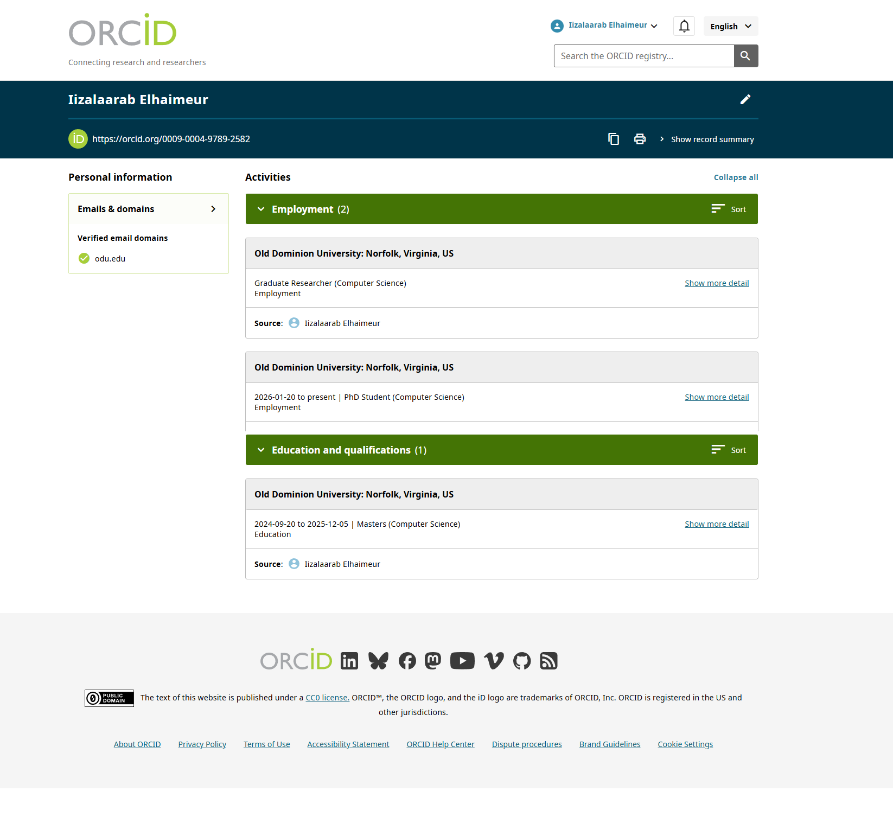
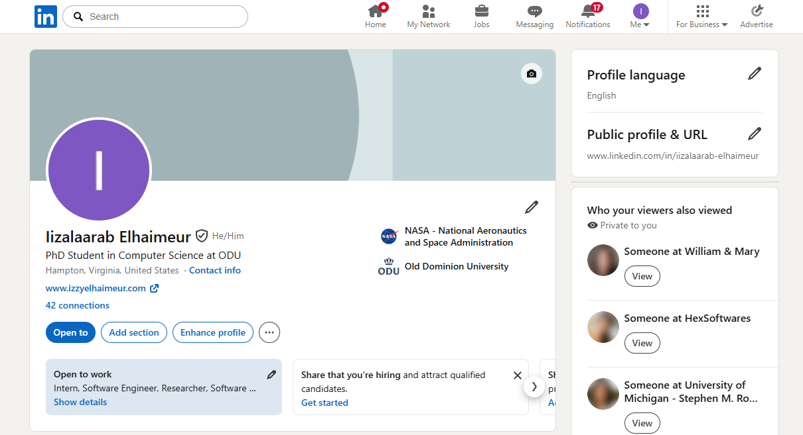
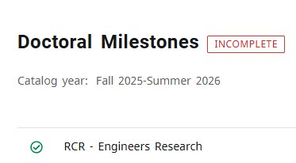

# CS 800 Assignment 2: Professional Presence, Tools, and RCR

**Student:** Iizalaarab Elhaimeur  
**Course:** CS 800 - Research Methods, Spring 2026  
**Due Date:** February 9, 2026

---

## Assignment Overview

This assignment establishes a professional online presence through multiple academic platforms, demonstrates LaTeX proficiency, and documents completion of Responsible Conduct of Research (RCR) training.

---

## 1. Google Scholar Profile

**Profile URL:** https://scholar.google.com/citations?user=XJ9Z-j0AAAAJ&hl=en

### Researchers Following

**ODU CS Faculty:**
- Nikos Chrisochoides

**Additional Researchers in Field (5+):**
- Shengbang Tong - Machine Learning, Computer Vision
- Basile Terver - AI Research
- Yann LeCunn - Deep Learning, AI
- Andrej Karpathy - AI, Neural Networks
- Yilun Kuang - Computer Science
- Wancong Zhang - Computer Science
- Andrew Maciejunes - Research Computing


---

## 2. ORCID Profile

**ORCID iD:** 0009-0004-9789-2582  
**Profile URL:** https://orcid.org/0009-0004-9789-2582

### Profile Details
- Verified ODU email: ielha003@odu.edu
- Verified domain: odu.edu
- Employment: Old Dominion University - Graduate Researcher/PhD Student
- Education: Old Dominion University - MS in Computer Science



---

## 3. LinkedIn Profile

**Profile URL:** https://www.linkedin.com/in/iizalaarab-elhaimeur/

### Profile Summary
- Professional headline: PhD Student in Computer Science at ODU
- Current affiliation: Old Dominion University
- Education and employment history included
- Professional skills and certifications listed



---

## 4. Academic Webpage

**Primary URL:** https://izzyelhaimeur.com  
**ODU CS Redirect:** https://www.cs.odu.edu/~ielha003/ (to be configured)

### Website Features
- Professional bio and research interests
- Education and experience
- Contact information (ielha003@odu.edu)
- Links to Google Scholar, ORCID, LinkedIn, and GitHub
- Project portfolio
- Downloadable resume/CV

**Cross-linking:** All platforms link to each other bidirectionally.

---

## 5. LaTeX and Overleaf

**Overleaf Account:** Created ✓  
**Tutorial Completed:** Free online introduction to LaTeX (Part 1)  
**Exercise:** Typesetting Exercise 1 (Slide 11)

**PDF File:** images/latex_exercise.tex

### Exercise Description
Completed typesetting exercise demonstrating proper handling of special characters in LaTeX:
- Escaped dollar signs (\$)
- Escaped percent signs (\%)
- Proper quotation marks (`` and '')

---

## 6. Responsible Conduct of Research (RCR)

**Training:** Responsible Conduct of Research for Engineers  
**Platform:** CITI Program  
**Status:** ✓ Completed



RCR training completion verified through ODU Doctoral Milestones system.

---

## 7. Video Walkthrough

**YouTube URL:** [https://youtu.be/KUodBqDYwds]

### Video Contents
1. Google Scholar profile and followed researchers
2. ORCID profile with verified ODU credentials
3. LinkedIn professional profile
4. Academic webpage demonstration
5. LaTeX exercise in Overleaf
6. RCR training completion

---

## Repository Structure

```
2/
├── README.md
└── images/
    ├── google-scholar.png
    ├── orcid-profile.png
    ├── linkedin-profile.png
    ├── rcr-training.png
    └── latex_exercise.tex
```

---


## Submission Checklist

- [x] Google Scholar profile with 5+ additional researchers followed
- [x] ORCID profile created and verified
- [x] LinkedIn profile complete and professional
- [x] Academic webpage live with proper content
- [x] All profiles cross-linked
- [x] LaTeX Exercise 1 completed
- [x] RCR training completed
- [x] Screenshots included
- [x] Video walkthrough uploaded

---

**Institution:** Old Dominion University, Department of Computer Science