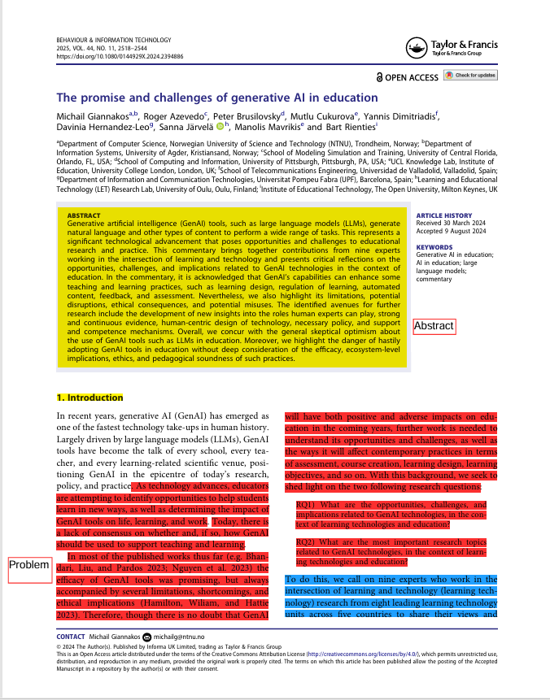
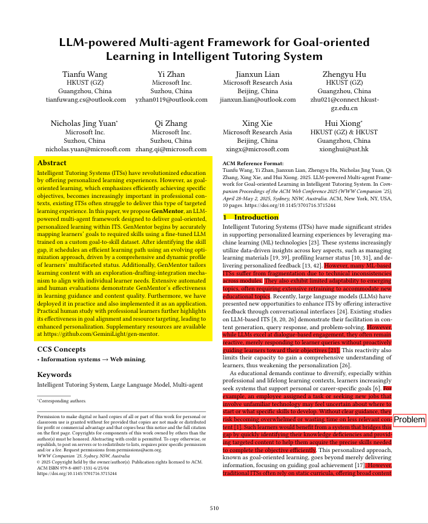
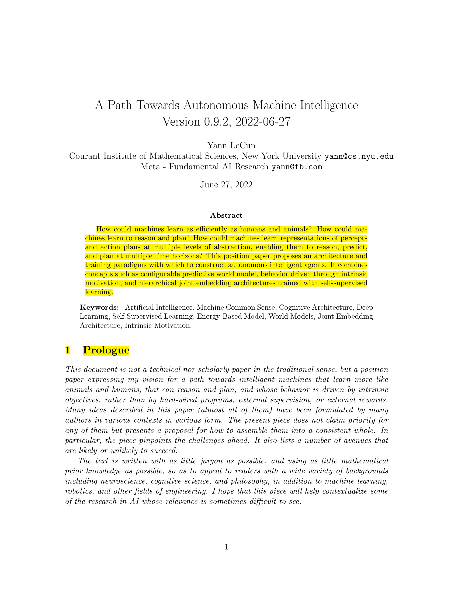
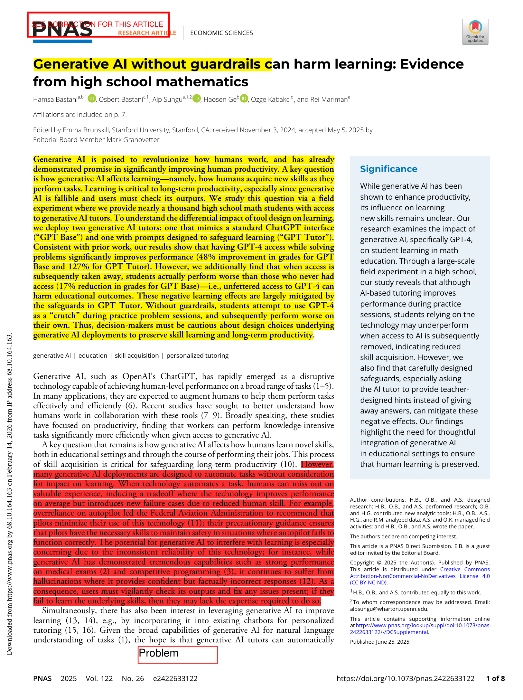
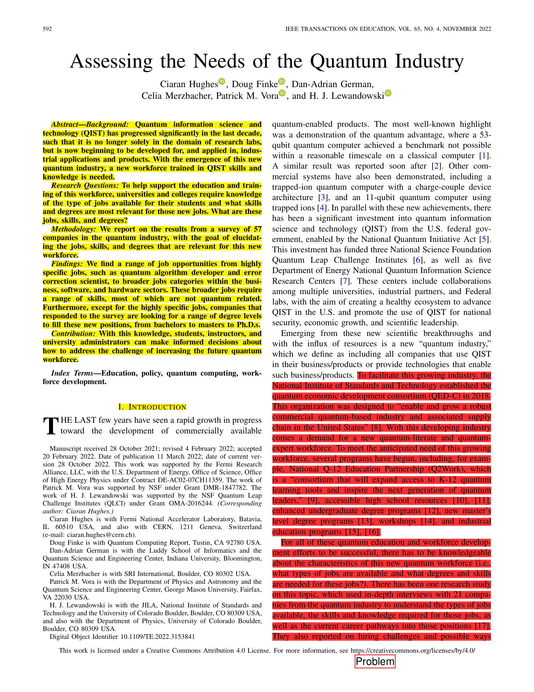

# Assignment 3: Reading Papers — CS 800 Research Methods, Spring 2026

**Due:** 2026-02-23  
**Points:** 10  
**Student:** Iizalaarab Elhaimeur  
**Research Area:** Personalized Quantum Computing Education using LLM-Powered Intelligent Tutoring Systems

---

## Description

This assignment applies [Keshav's 1st pass](http://blizzard.cs.uwaterloo.ca/keshav/home/Papers/data/07/paper-reading.pdf) reading technique to five papers related to my research on building an intelligent teaching assistant for quantum computing education. For each paper, I identify its **problem**, **approach**, and **contributions** through a first-pass reading of the title, abstract, introduction, section headings, key figures, conclusions, and references.

The papers span the key pillars of my work: GenAI in education, multi-agent tutoring systems, fundamental LLM limitations motivating architectural choices, empirical evidence on AI tutoring risks, and quantum workforce development.

## Directory Structure

```
.
├── README.md                    # This file
├── marked-up-pdfs/              # Annotated PDFs for each paper
│   ├── giannakos2024promise.pdf
│   ├── wang2025genmentor.pdf
│   ├── lecun2022path.pdf
│   ├── bastani2024generative.pdf
│   └── hughes2022assessing.pdf
└── screenshots/                 # Page 1 screenshots
    ├── giannakos2024promise_p1.png
    ├── wang2025genmentor_p1.png
    ├── lecun2022path_p1.png
    ├── bastani2024generative_p1.png
    └── hughes2022assessing_p1.png
```

## Video Walkthrough

🎥 [YouTube Video — 1st Pass Walkthrough](https://youtu.be/HboK6d-evuk)

---

## Paper 1: The Promise and Challenges of Generative AI in Education

**Reference:**  
M. Giannakos, R. Azevedo, P. Brusilovsky, M. Cukurova, Y. Dimitriadis, D. Hernandez-Leo, S. Järvelä, M. Mavrikis, and B. Rienties, "The promise and challenges of generative AI in education," *Behaviour & Information Technology*, vol. 44, no. 11, pp. 2518–2544, 2025.

**DOI:** [10.1080/0144929X.2024.2394886](https://doi.org/10.1080/0144929X.2024.2394886)

```bibtex
@article{giannakos2024promise,
  author    = {Giannakos, Michail and Azevedo, Roger and Brusilovsky, Peter
               and Cukurova, Mutlu and Dimitriadis, Yannis
               and Hernandez-Leo, Davinia and J\"{a}rvel\"{a}, Sanna
               and Mavrikis, Manolis and Rienties, Bart},
  title     = {The Promise and Challenges of Generative {AI} in Education},
  journal   = {Behaviour \& Information Technology},
  volume    = {44},
  number    = {11},
  pages     = {2518--2544},
  year      = {2025},
  doi       = {10.1080/0144929X.2024.2394886},
  publisher = {Taylor \& Francis}
}
```

**Problem:** GenAI tools like LLMs are being rapidly adopted in education, but their opportunities, limitations, ethical risks, and implications for pedagogy are not well understood.

**Approach:** Commentary bringing together nine experts (from 8 institutions across 5 countries) at the intersection of learning and technology to provide critical reflections on GenAI in education, structured around two research questions covering learning design, regulation of learning, automated content, feedback, and assessment.

**Contributions:** Identifies key opportunities (enhanced learning design, personalized feedback, automated assessment), limitations (hallucination, bias, over-reliance), and a five-theme research agenda including human-centric design, evidence-based evaluation, and policy development for GenAI in education.

### Page 1 Screenshot


---

## Paper 2: LLM-powered Multi-agent Framework for Goal-oriented Learning in Intelligent Tutoring System

**Reference:**  
T. Wang, Y. Zhan, J. Lian, Z. Hu, N. J. Yuan, Q. Zhang, X. Xie, and H. Xiong, "LLM-powered multi-agent framework for goal-oriented learning in intelligent tutoring system," in *Companion Proceedings of the ACM Web Conference 2025 (WWW '25)*, Sydney, Australia, 2025, pp. 510–519.

**DOI:** [10.1145/3701716.3715244](https://doi.org/10.1145/3701716.3715244)

```bibtex
@inproceedings{wang2025genmentor,
  author    = {Wang, Tianfu and Zhan, Yi and Lian, Jianxun and Hu, Zhengyu
               and Yuan, Nicholas Jing and Zhang, Qi and Xie, Xing
               and Xiong, Hui},
  title     = {{LLM}-powered Multi-agent Framework for Goal-oriented
               Learning in Intelligent Tutoring System},
  booktitle = {Companion Proceedings of the {ACM} Web Conference 2025
               ({WWW} '25)},
  pages     = {510--519},
  year      = {2025},
  address   = {Sydney, NSW, Australia},
  publisher = {ACM},
  doi       = {10.1145/3701716.3715244}
}
```

**Problem:** Existing Intelligent Tutoring Systems (ITS) struggle to deliver goal-oriented, personalized learning that efficiently helps learners achieve specific professional objectives. ML-based ITS suffer from fragmentation across modules, and LLM-based dialogue ITS remain reactive rather than proactively guiding learners.

**Approach:** Proposes GenMentor, an LLM-powered multi-agent framework with five specialized agents (Gap Identifier, Learner Profiler, Dynamic Learner Simulator, Learning Path Scheduler, Content Creator) that collaboratively deliver personalized instruction using a fine-tuned goal-to-skill mapping LLM and evolving optimization for learning path scheduling.

**Contributions:** A fine-tuned goal-to-skill mapping dataset with CoT reasoning, an adaptive learner modeling method grounded in educational theory, an evolvable learning path scheduling approach with simulated feedback, and an exploration-draft-integration mechanism for personalized content creation. Deployed in practice at Microsoft; evaluation shows superior learning guidance over baselines across automated and human evaluations.

### Page 1 Screenshot


---

## Paper 3: A Path Towards Autonomous Machine Intelligence

**Reference:**  
Y. LeCun, "A path towards autonomous machine intelligence," version 0.9.2, OpenReview preprint, Jun. 2022.

**OpenReview:** [https://openreview.net/forum?id=BZ5a1r-kVsf](https://openreview.net/forum?id=BZ5a1r-kVsf)

```bibtex
@misc{lecun2022path,
  author       = {LeCun, Yann},
  title        = {A Path Towards Autonomous Machine Intelligence},
  year         = {2022},
  month        = jun,
  howpublished = {OpenReview preprint},
  note         = {Version 0.9.2, 2022-06-27},
  url          = {https://openreview.net/forum?id=BZ5a1r-kVsf}
}
```

**Problem:** Current AI systems, including LLMs, lack the ability to learn as efficiently as humans and animals, cannot reason or plan effectively, and cannot learn hierarchical representations at multiple levels of abstraction and time horizons. The paper frames this as three core challenges: learning by observation, gradient-compatible reasoning, and hierarchical abstraction.

**Approach:** A position paper proposing a modular cognitive architecture for autonomous intelligent agents comprising six differentiable, trainable modules: perception, world model, cost (with intrinsic and trainable critic components), actor, short-term memory, and configurator. The architecture is centered on Hierarchical Joint Embedding Predictive Architectures (H-JEPA) trained with non-contrastive self-supervised learning (e.g., VICReg).

**Contributions:** Articulates fundamental limitations of current LLMs (lack of planning, reasoning, and world models), proposes the JEPA framework as an alternative to generative architectures for learning world models, outlines a hierarchical planning mechanism under uncertainty, and argues that both "scaling is not enough" and "reward is not enough."

### Page 1 Screenshot


---

## Paper 4: Generative AI Can Harm Learning

**Reference:**  
H. Bastani, O. Bastani, A. Sungu, H. Ge, Ö. Kabakcı, and R. Mariman, "Generative AI without guardrails can harm learning: Evidence from high school mathematics," *Proceedings of the National Academy of Sciences*, vol. 122, no. 26, p. e2422633122, 2025.

**DOI:** [10.1073/pnas.2422633122](https://doi.org/10.1073/pnas.2422633122)

```bibtex
@article{bastani2024generative,
  author    = {Bastani, Hamsa and Bastani, Osbert and Sungu, Alp
               and Ge, Haosen and Kabak{\c{c}}{\i}, \"{O}zge
               and Mariman, Rei},
  title     = {Generative {AI} Without Guardrails Can Harm Learning:
               {Evidence} from High School Mathematics},
  journal   = {Proceedings of the National Academy of Sciences},
  volume    = {122},
  number    = {26},
  pages     = {e2422633122},
  year      = {2025},
  doi       = {10.1073/pnas.2422633122}
}
```

**Problem:** While generative AI improves task performance, it is unclear whether it helps or harms the acquisition of new skills — a critical question for education where long-term learning matters more than short-term performance, and where AI is unreliable enough that users need their own skills to catch errors.

**Approach:** Pre-registered, large-scale randomized controlled trial with ~1,000 high school math students in Turkey, comparing three conditions across four 90-minute sessions: GPT Base (standard ChatGPT-like interface), GPT Tutor (with teacher-designed hints, solutions in the prompt, and safeguards against giving away answers), and a no-AI control group.

**Contributions:** Demonstrates that unfettered GPT-4 access improves practice performance (+48%) but harms subsequent learning when removed (−17% vs. control), showing students use AI as a "crutch" by copying answers rather than engaging with the material. The carefully designed GPT Tutor (+127% during practice) largely mitigates these negative effects. Additionally finds that students don't perceive any reduction in their own learning, suggesting they are unaware of how AI impedes skill acquisition.

### Page 1 Screenshot


---

## Paper 5: Assessing the Needs of the Quantum Industry

**Reference:**  
C. Hughes, D. Finke, D.-A. German, C. Merzbacher, P. M. Vora, and H. J. Lewandowski, "Assessing the needs of the quantum industry," *IEEE Transactions on Education*, vol. 65, no. 4, pp. 592–601, Nov. 2022.

**DOI:** [10.1109/TE.2022.3153841](https://doi.org/10.1109/TE.2022.3153841)

```bibtex
@article{hughes2022assessing,
  author    = {Hughes, Ciaran and Finke, Doug and German, Dan-Adrian
               and Merzbacher, Celia and Vora, Patrick M.
               and Lewandowski, H. J.},
  title     = {Assessing the Needs of the Quantum Industry},
  journal   = {IEEE Transactions on Education},
  volume    = {65},
  number    = {4},
  pages     = {592--601},
  year      = {2022},
  month     = nov,
  publisher = {IEEE},
  doi       = {10.1109/TE.2022.3153841}
}
```

**Problem:** The emergence of a quantum technology industry creates a need for a new workforce, but universities lack data-driven knowledge about what jobs exist, what skills are required, and what degree levels are most relevant for quantum industry positions.

**Approach:** Quantitative survey of 57 companies in the QED-C (Quantum Economic Development Consortium), using a closed-response format derived from analysis of 400+ quantum job postings. The survey maps job roles needed in the next 2–5 years to the specific skills and degree levels required for each role, with "importance" defined by >50% respondent consensus.

**Contributions:** Identifies a range of quantum jobs from highly specialized (quantum algorithm developer, error correction scientist) to broader roles in business, software, and hardware. Finds that most broader roles require primarily non-quantum skills, that job distribution is stable over a 2–5 year horizon, and that skills cluster into three distinct blocks (hardware, business, software). Provides four actionable recommendations for students, instructors, and university administrators to address the quantum workforce challenge.

### Page 1 Screenshot


---

## How These Papers Relate to My Research

My research focuses on building an intelligent teaching assistant for quantum computing education that combines a knowledge-graph-augmented architecture with dual LLM agents. These five papers form the conceptual foundation:

| Paper | Relevance to My Research |
|-------|--------------------------|
| Giannakos et al. (2024) | Frames the opportunities and risks of GenAI in education that my system must navigate; provides a research agenda for responsible AI tutoring |
| Wang et al. (2025) | Directly related multi-agent ITS architecture; my system uses a similar dual-agent approach with specialized roles for different tutoring functions |
| LeCun (2022) | Identifies fundamental LLM limitations (planning, reasoning, world models) that motivate my separation of concerns and structured agent architecture beyond raw LLM generation |
| Bastani et al. (2025) | Provides RCT evidence that unguarded AI harms learning; motivates the pedagogical guardrails and scaffolding in my agent design to prevent over-reliance |
| Hughes et al. (2022) | Establishes the quantum workforce gap — the range of jobs, skills, and degrees needed — that my educational platform aims to help address |