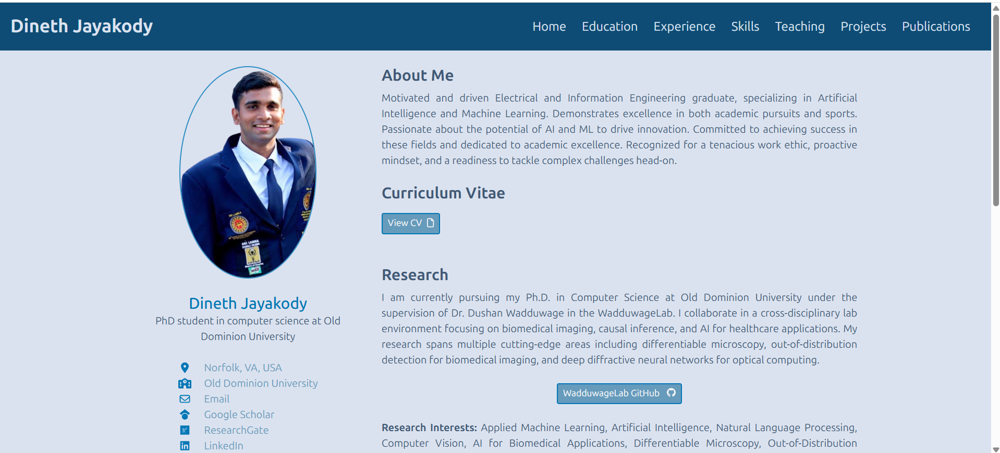
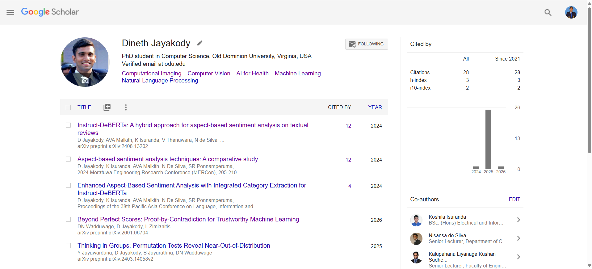
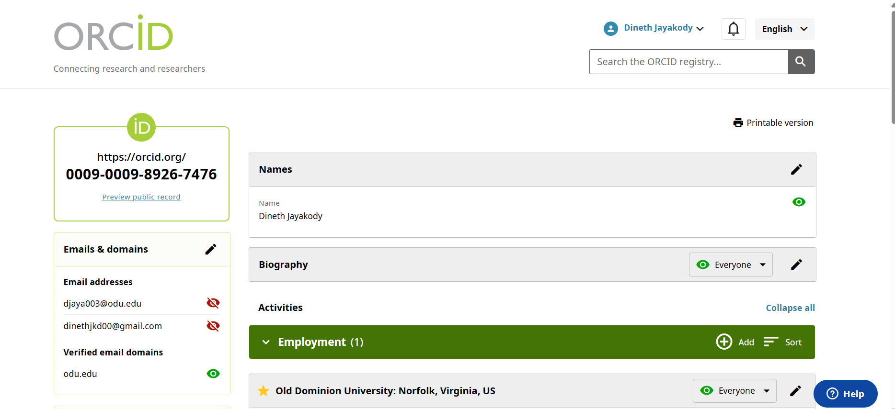
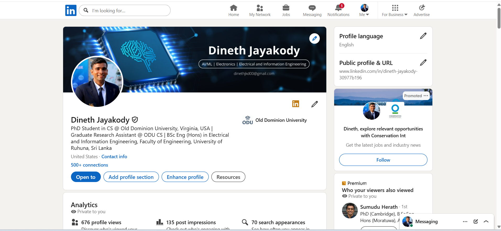
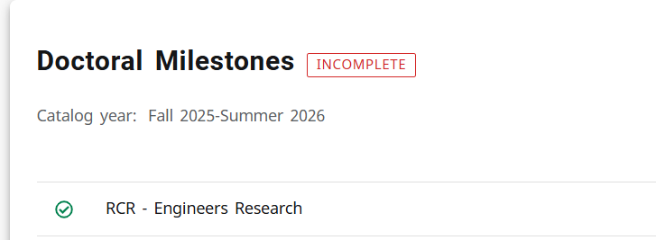
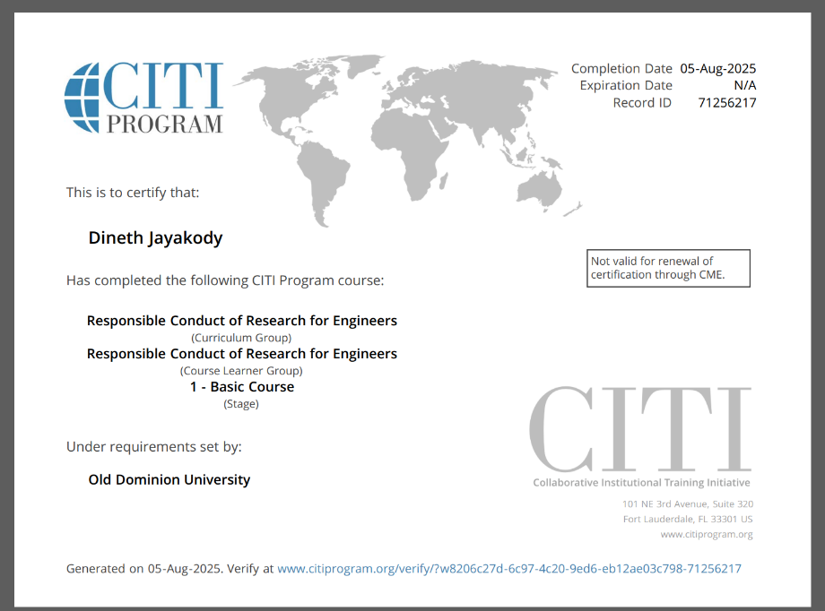

# Assignment 2: Professional Presence

**CS 800 Research Methods, Spring 2026**  

---

## Assignment Description

This assignment establishes a professional online presence by creating and linking multiple accounts and webpages. All accounts include a bio and appropriate profile picture, with bidirectional linkage where possible so that each account can be discovered from the others.

---

## Professional Accounts & Links

### Academic Webpage

- **URL:** [https://www.cs.odu.edu/~cs_djaya003/](https://www.cs.odu.edu/~cs_djaya003/)

### Google Scholar

- **Profile:** [https://scholar.google.com/citations?user=605obQkAAAAJ&hl=en](https://scholar.google.com/citations?user=605obQkAAAAJ&hl=en)

**ODU CS faculty I am following:**

1. Dr. Ravi Mukkamala
2. Dr. Dushan Wadduwage
3. Dr. Lusi Li
4. Dr. Sampath Jayarathne
5. Dr. Frank Liu
6. Dr. Michael L. Nelson 

**Additional scholars in my research area (5+):**

1. Dr. Shree Nayar
2. Dr. Peter so
3. Dr. Kaiming He
4. Dr. Yoshua Bengio
5. Dr. Yann LeCun
6. Dr. Oriol Vinyals

### ORCID

- **ORCID iD:** [https://orcid.org/0009-0009-8926-7476](https://orcid.org/0009-0009-8926-7476)

### LinkedIn

- **Profile:** [https://www.linkedin.com/in/dineth-jayakody-30977b196/](https://www.linkedin.com/in/dineth-jayakody-30977b196/)

### LaTeX & Overleaf

- **Overleaf:** Signed up for a free Overleaf account. (already had one)
- **LaTeX intro:** Completed part 1 of the LaTeX introduction.
- **Customized template:** Used the template from slide 65, substituted URLs, images, and text with my own information.
- **PDF:** The generated PDF is included in this submission as `CS800___professional_presence.pdf`

---

## Responsible Conduct of Research (RCR)

- **Training:** Completed RCR training via [ODU Impact – Responsible Conduct of Research](https://www.odu.edu/impact/responsible-conduct-of-training).
- **Course:** “Responsible Conduct of Research for Engineers” 
- **Proof:** Screenshot of the CITI RCR completion certificate and RCR requirement checkmark in Degree Works (Doctoral Milestones) is in `imgs/` and referenced below.

---

## Screenshots

### Academic Webpage

### Google Scholar

### ORCID

### LinkedIn

### RCR Completion

---

## YouTube Video Walkthrough

A narrated walkthrough of the accounts, tools, RCR, and this submission is available at:

**Video Link:** [YouTube Video](https://youtu.be/DY6dPF7NvH8)

The video covers:

- Academic webpage and linkage to other accounts
- Google Scholar (profile, faculty and scholars followed)
- ORCID
- LinkedIn
- LaTeX/Overleaf and the customized PDF
- RCR training completion
- Overview of this README and submission structure

---

*This assignment was completed as part of CS 800 Research Methods, Spring 2026 at Old Dominion University.*
