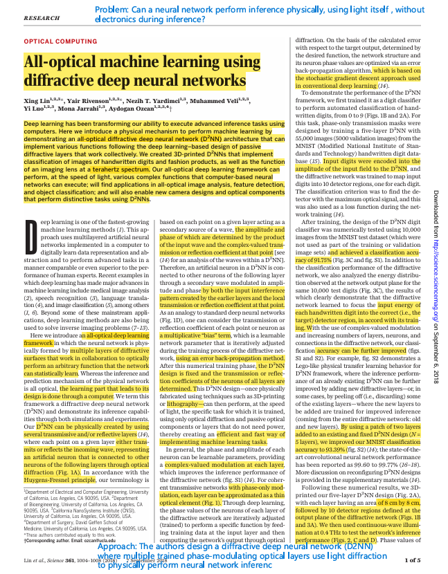
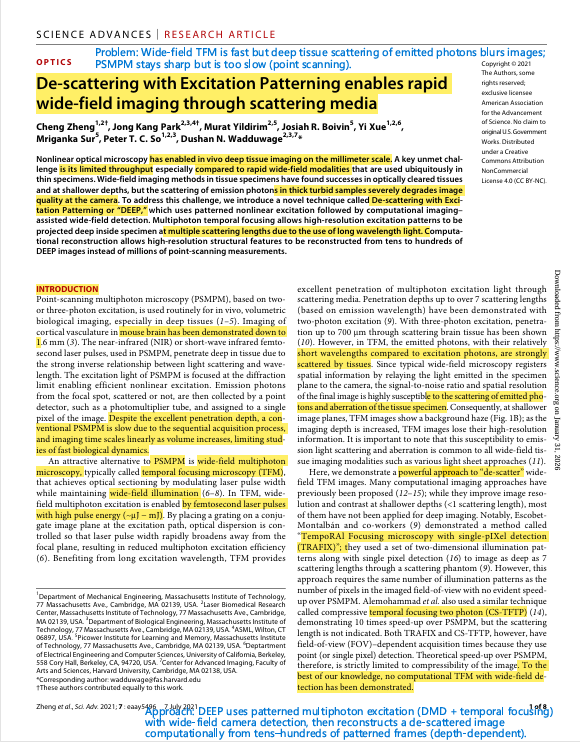
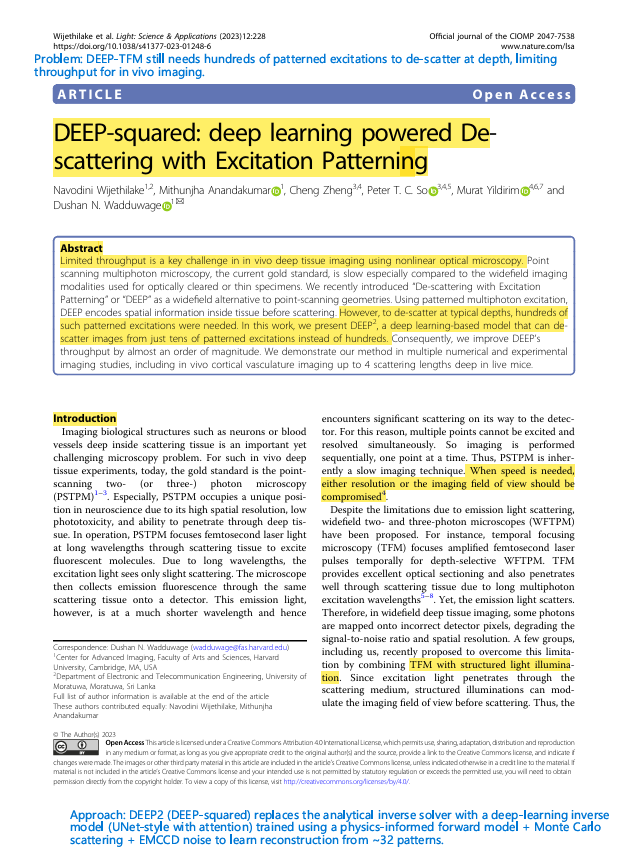
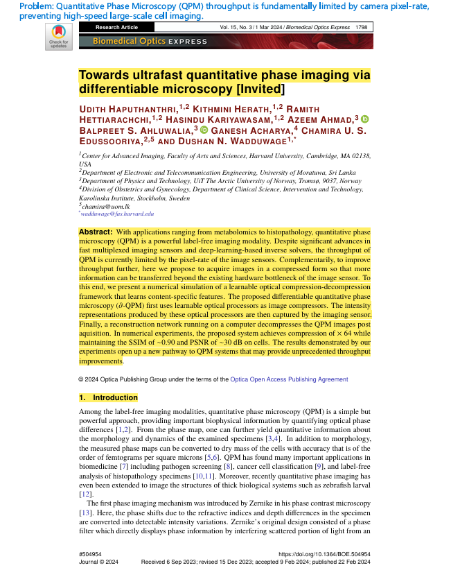
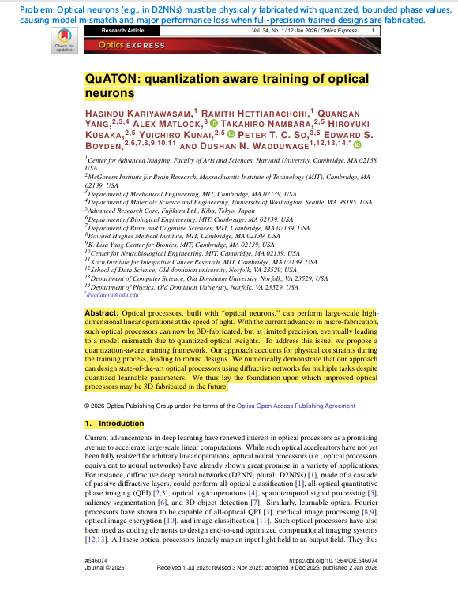

# Assignment 3: Reading Papers
## CS 800 Research Methods, Spring 2026
### Name : Dineth Jayakody


This submission contains five papers from my research area (differential microscopy, computational imaging), each with Keshav's 1st-pass summary (problem, approach, contributions), reference, DOI link, BibTeX, and a marked-up PDF.

## Directory structure

* **README.md** — This file (description, links, screenshots, video).
* **markedup-papers/** — Marked-up PDFs of the five papers (highlights/boxes/text for problem, approach, contributions).
* **imgs/** — Screenshots of page 1 of each paper.


## Papers

### Paper 1: All-optical machine learning using diffractive deep neural networks

**Reference:** Lin, X., Rivenson, Y., Yardimci, N. T., Veli, M., Luo, Y., Jarrahi, M., & Ozcan, A. (2018). All-optical machine learning using diffractive deep neural networks. *Science*, *361*(6406), 1004–1008.

**DOI:** [https://doi.org/10.1126/science.aat8084](https://doi.org/10.1126/science.aat8084)

```bibtex
@article{lin2018all,
  title={All-optical machine learning using diffractive deep neural networks},
  author={Lin, Xing and Rivenson, Yair and Yardimci, Nezih T and Veli, Muhammed and Luo, Yi and Jarrahi, Mona and Ozcan, Aydogan},
  journal={Science},
  volume={361},
  number={6406},
  pages={1004--1008},
  year={2018},
  doi={10.1126/science.aat8084}
}
```

**1st pass (Keshav):**
- **Problem:** Deep learning inference relies on electronic computation that consumes significant power and is limited by hardware speed and scalability.
- **Approach:** The authors design a diffractive deep neural network (D2NN) where multiple trained phase-modulating optical layers use light diffraction to physically perform neural network inference.
- **Contributions:**
  - Introduced the first fully passive all-optical diffractive deep neural network (D2NN) architecture.
  - Demonstrated that optical diffraction can implement neural network inference.
  - Applied backpropagation to train phase-modulating physical layers.
  - Experimentally validated the system using 3D-printed multilayer designs at terahertz frequencies.
  - Showed optical implementation of image classification and learned imaging tasks.

**Screenshot (Page 1):**



**Marked-up PDF:** [markedup-papers/paper1.pdf](markedup-papers/paper1.pdf)

---

### Paper 2: De-scattering with Excitation Patterning enables rapid wide-field imaging through scattering media

**Reference:** Zheng, C., Park, J. K., Yildirim, M., Boivin, J. R., Xue, Y., Sur, M., So, P. T. C., & Wadduwage, D. N. (2021). De-scattering with excitation patterning enables rapid wide-field imaging through scattering media. *Science Advances*, *7*(28), eaay5496.

**DOI:** [https://doi.org/10.1126/sciadv.aay5496](https://doi.org/10.1126/sciadv.aay5496)

```bibtex
@article{zheng2021scattering,
  title={De-scattering with excitation patterning enables rapid wide-field imaging through scattering media},
  author={Zheng, Cheng and Park, Jong Kang and Yildirim, Murat and Boivin, Josiah R and Xue, Yi and Sur, Mriganka and So, Peter TC and Wadduwage, Dushan N},
  journal={Science advances},
  volume={7},
  number={28},
  pages={eaay5496},
  year={2021},
  doi={10.1126/sciadv.aay5496}
}
```

**1st pass (Keshav):**
- **Problem:** Wide-field TFM is fast but deep tissue scattering of emitted photons blurs images; PSMPM stays sharp but is too slow (point scanning).
- **Approach:** DEEP uses patterned multiphoton excitation (DMD + temporal focusing) with wide-field camera detection, then reconstructs a de-scattered image computationally from tens–hundreds of patterned frames (depth-dependent).
- **Contributions:** Enables fast, FOV-independent deep imaging with far fewer measurements than PSMPM, demonstrated on beads, ex vivo tissues, and in vivo mouse brain vasculature up to ~7 scattering lengths.

**Screenshot (Page 1):**



**Marked-up PDF:** [markedup-papers/paper2.pdf](markedup-papers/paper2.pdf)

---

### Paper 3: DEEP-squared: deep learning powered De-scattering with Excitation Patterning

**Reference:** Wijethilake, N., Anandakumar, M., Zheng, C., So, P. T. C., Yildirim, M., & Wadduwage, D. N. (2023). DEEP-squared: deep learning powered de-scattering with excitation patterning. *Light: Science & Applications*, *12*(1), 228.

**DOI:** [https://doi.org/10.1038/s41377-023-01248-6](https://doi.org/10.1038/s41377-023-01248-6)

```bibtex
@article{wijethilake2023deep,
  title={DEEP-squared: deep learning powered de-scattering with excitation patterning},
  author={Wijethilake, Navodini and Anandakumar, Mithunjha and Zheng, Cheng and So, Peter TC and Yildirim, Murat and Wadduwage, Dushan N},
  journal={Light: Science \& Applications},
  volume={12},
  number={1},
  pages={228},
  year={2023},
  doi={10.1038/s41377-023-01248-6}
}
```

**1st pass (Keshav):**
- **Problem:** DEEP-TFM still needs hundreds of patterned excitations to de-scatter at depth, limiting throughput for in vivo imaging.
- **Approach:** DEEP2 (DEEP-squared) replaces the analytical inverse solver with a deep-learning inverse model (UNet-style with attention) trained using a physics-informed forward model + Monte Carlo scattering + EMCCD noise to learn reconstruction from ~32 patterns.
- **Contributions:** Cuts required patterns from ~256 → 32 (≈ 10× faster), validates on simulations + experiments (beads, neurons, cortical vasculature), and demonstrates in vivo mouse vasculature de-scattering up to ~4 scattering lengths (~200 µm) using tens of patterns.

**Screenshot (Page 1):**



**Marked-up PDF:** [markedup-papers/paper3.pdf](markedup-papers/paper3.pdf)

---

### Paper 4: Towards ultrafast quantitative phase imaging via differentiable microscopy

**Reference:** Haputhanthri, U., Herath, K., Hettiarachchi, R., Kariyawasam, H., Ahmad, A., Ahluwalia, B. S., Acharya, G., Edussooriya, C. U. S., & Wadduwage, D. N. (2024). Towards ultrafast quantitative phase imaging via differentiable microscopy. *Biomedical Optics Express*, *15*(3), 1798–1812.

**DOI:** [https://doi.org/10.1364/BOE.504954](https://doi.org/10.1364/BOE.504954)

```bibtex
@article{haputhanthri2024towards,
  title={Towards ultrafast quantitative phase imaging via differentiable microscopy},
  author={Haputhanthri, Udith and Herath, Kithmini and Hettiarachchi, Ramith and Kariyawasam, Hasindu and Ahmad, Azeem and Ahluwalia, Balpreet S and Acharya, Ganesh and Edussooriya, Chamira US and Wadduwage, Dushan N},
  journal={Biomedical Optics Express},
  volume={15},
  number={3},
  pages={1798--1812},
  year={2024},
  doi={10.1364/BOE.504954}
}
```

**1st pass (Keshav):**
- **Problem:** Quantitative Phase Microscopy (QPM) throughput is fundamentally limited by camera pixel-rate, preventing high-speed large-scale cell imaging.
- **Approach:** The paper proposes ∂-QPM (differentiable QPM), where a learnable optical processor compresses phase information optically, and a neural network reconstructs the high-resolution phase map from the compressed intensity measurements via end-to-end optimization.
- **Contributions:**
  - Introduced content-aware optical compression for QPM using differentiable microscopy.
  - Co-designed optical encoder (LFF / PhaseD2NN) and neural decoder end-to-end.
  - Demonstrated up to ×64–×256 compression with ~0.90 SSIM and ~30 dB PSNR on cell data (simulation).
  - Showed robustness to realistic detector noise conditions.

**Screenshot (Page 1):**



**Marked-up PDF:** [markedup-papers/paper4.pdf](markedup-papers/paper4.pdf)

---

### Paper 5: QuATON: quantization aware training of optical neurons

**Reference:** Kariyawasam, H., Hettiarachchi, R., Yang, Q., Matlock, A., Nambara, T., Kusaka, H., Kunai, Y., So, P. T. C., Boyden, E. S., & Wadduwage, D. N. (2026). QuATON: quantization aware training of optical neurons. *Optics Express*, *34*(1), 1–14.

**DOI:** [https://doi.org/10.1364/OE.546074](https://doi.org/10.1364/OE.546074)

```bibtex
@article{kariyawasam2026quaton,
  title={QuATON: quantization aware training of optical neurons},
  author={Kariyawasam, Hasindu and Hettiarachchi, Ramith and Yang, Quansan and Matlock, Alex and Nambara, Takahiro and Kusaka, Hiroyuki and Kunai, Yuichiro and So, Peter TC and Boyden, Edward S and Wadduwage, Dushan N},
  journal={Optics Express},
  volume={34},
  number={1},
  pages={1--14},
  year={2026},
  doi={10.1364/OE.546074}
}
```

**1st pass (Keshav):**
- **Problem:** Optical neurons (e.g., in D2NNs) must be physically fabricated with quantized, bounded phase values, causing model mismatch and major performance loss when full-precision trained designs are fabricated.
- **Approach:** The paper proposes QuATON, a quantization-aware training framework using a progressive sigmoid soft-quantization (PSQ) function with progressive or learnable temperature to train optical neurons under realistic quantization constraints.
- **Contributions:**
  - Introduced a quantization-aware training framework tailored for optical neurons.
  - Proposed Progressive Sigmoid Quantization (PSQ) with progressive and learnable temperature scheduling.
  - Demonstrated superior performance over PQ, STE, and Gumbel-Softmax across classification and phase imaging tasks.
  - Showed near full-precision performance even with low quantization levels (e.g., 4-level phase).
  - Established a practical pathway for fabrication-aware design of diffractive optical processors.

**Screenshot (Page 1):**



**Marked-up PDF:** [markedup-papers/Quaton.pdf](markedup-papers/paper5.pdf)

---

## Video walkthrough

A short YouTube video walking through the papers and discussing the 1st-pass highlights:

**Video Link:** [YouTube Video](https://youtu.be/VBLmiLCickE)
