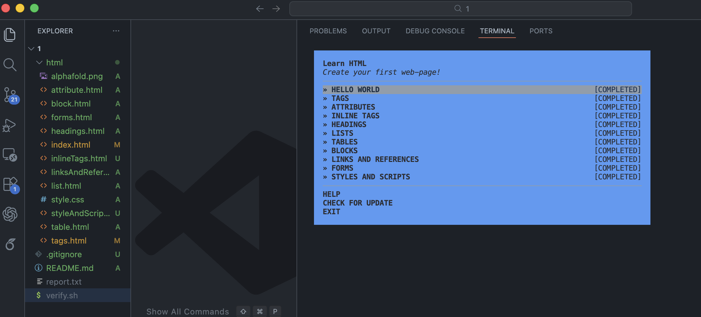

# Assignment 1: HTML Workshop Compeletion

## Assignment Description
This assignment is for student to get involve of `learnyouhtml' workshop which includes 11 modules of html learnings.

### Directory
```
.
└── 1
    ├── html
    │   ├── alphafold.png
    │   ├── attribute.html
    │   ├── block.html
    │   ├── forms.html
    │   ├── headings.html
    │   ├── index.html
    │   ├── inlineTags.html
    │   ├── linksAndReferences.html
    │   ├── list.html
    │   ├── style.css
    │   ├── styleAndScript.html
    │   ├── table.html
    │   └── tags.html
    ├── README.md
    ├── report.txt
    ├── screenshot.png
    └── verify.sh

3 directories, 17 files
```

## Screenshot of "leanryouhtml" Completion



## Youtube Video
Video of workshop completion.
[https://youtu.be/3TE_5q5LT2k](https://youtu.be/3TE_5q5LT2k)