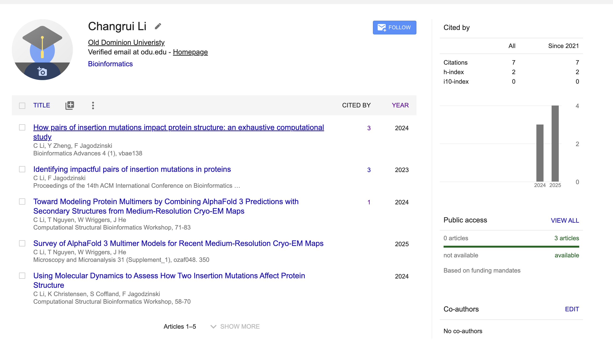
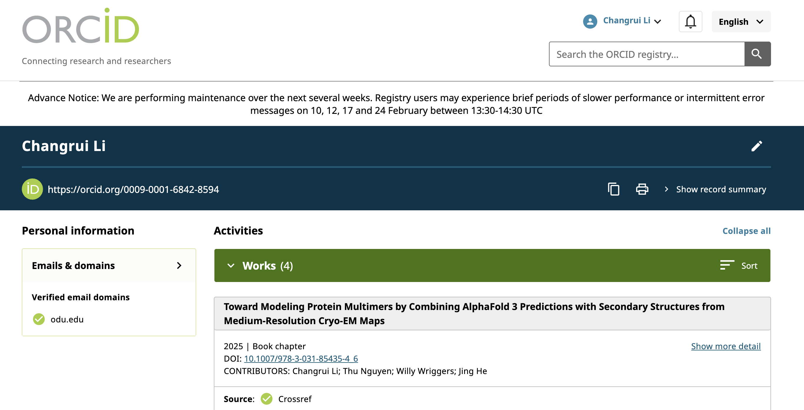
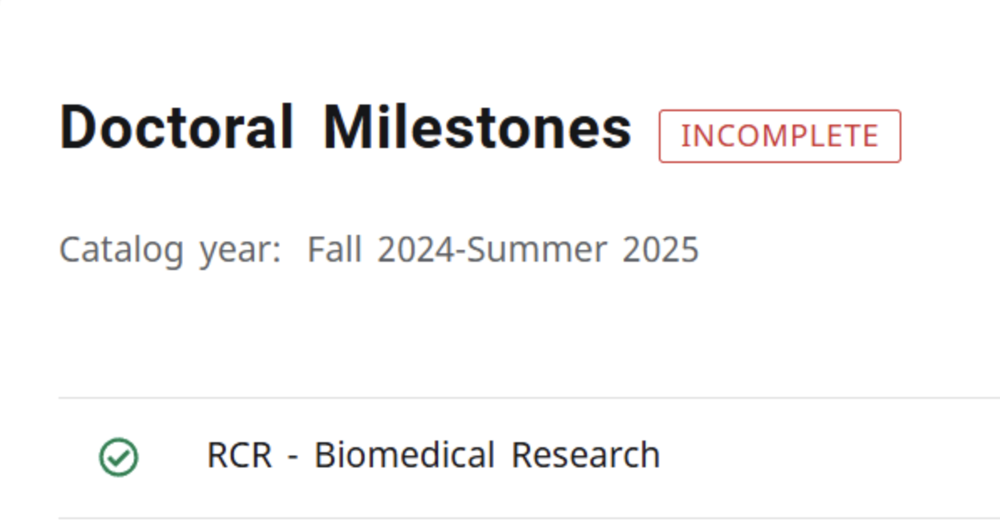

# Assignment 2: Professional Presence, Tools, and RCR
Name: Changrui Li
Course: CS800 - Research methods, Spring 2026
Due Date: February 9, 2026

## Overview
This assignment give an list of what professional presence of research look like incluing online academic platforms, latex for research writing via Overleaf, and responsible conduct of research training.

## 1. Google Scholar Profile

URL: [https://scholar.google.com/citations?user=ymzYWxoAAAAJ&hl=en](https://scholar.google.com/citations?user=ymzYWxoAAAAJ&hl=en)

Researchers Following:

- Jiangwen Sun - Machine Learning
- Nimala Karunarathna
- Frank Liu - Machine Learning
- Jing He - Bioinformatics
- Dushan N. Wadduwage
- Filip Jagodzinski - Bioinformatics
- Brian Hutchinson - Deep Learning
- Fuqun Huang - Human Error


## 2. ORCID Profile
EmailL: cli027@odu.edu\
ORCID ID: [0009-0001-6842-8594](https://orcid.org/0009-0001-6842-8594)


## 3. LinkedIn Profile
Profile URL: [changrui-l-91bbb7159L](https://www.linkedin.com/in/changrui-l-91bbb7159?trk=people-guest_people_search-card)


## 4. Academic Webpage
Primary URL: [https://www.cs.odu.edu/~cs_cli027](https://www.cs.odu.edu/~cs_cli027)\
Content:
About, Publications, CV, Contact
## 5. Latex and Overleaf
View Exercise 1 in [PDF](file/cs800_a2_latex_exercise_1.pdf)\
View Exercise from slide 65 in [PDF](file/cs800_a2_latex_assignment_slide65.pdf)

## 6. RCR Complete - Proof


## 7. YouTube Video
Link to Video: [https://youtu.be/EROkCC-QSpU](https://youtu.be/EROkCC-QSpU)

## 8. File Structure
```
.
├── file
│   ├── cs800_a2_latex_assignment_slide65.pdf
│   └── cs800_a2_latex_exercise_1.pdf
├── images
│   ├── google_scholar_following_alert.png
│   ├── google_scolar_profile.png
│   ├── linkedin.png
│   ├── orcid.png
│   └── RCR_complete.png
└── README.md

3 directories, 8 files
```