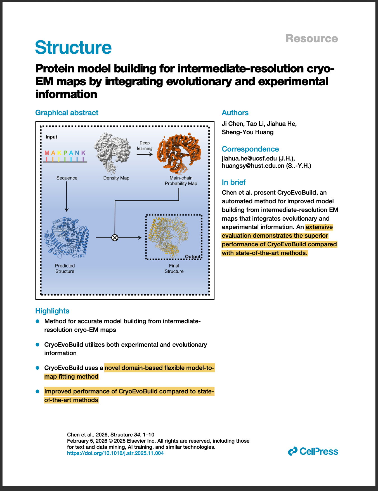
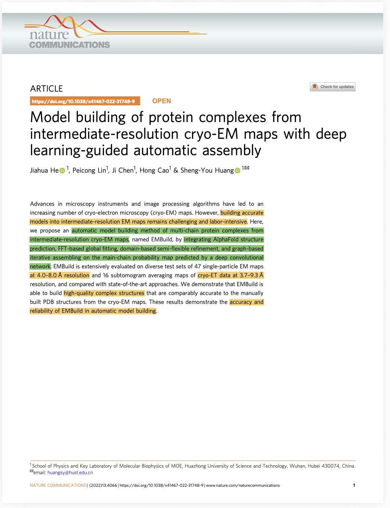
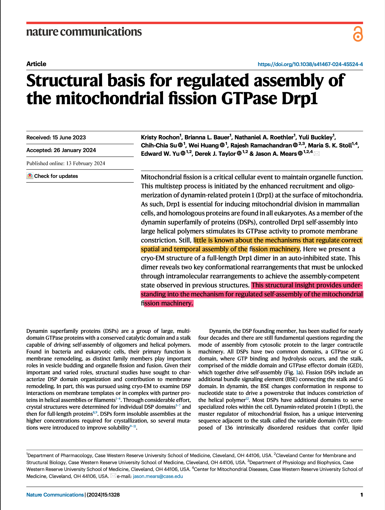
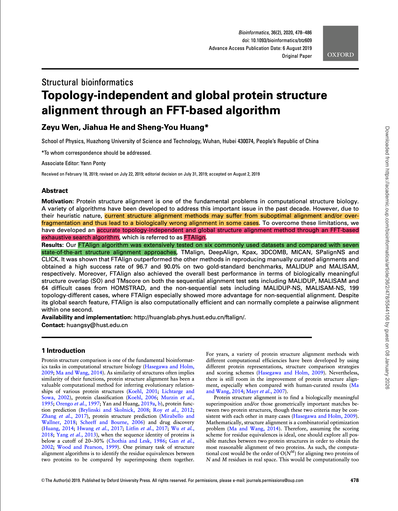

# Assignment 3: Reading Academic Papers
Name: Changrui Li\
Course: CS800 - Research methods, Spring 2026

## Overview
This repository contains the submission for Assignment 3 (Reading Papers). Selected five papers related to my research interests in protein structure prediction, cryo-EM model building, and protein structure alignment. For each paper, I performed Keshav’s 1st pass and identified the problem, approach, and contributions. Marked-up PDFs are included and highlight where I found these elements.

## Directory Structure
```
.
├── images
│   ├── screenshot_1.png
│   ├── screenshot_2.png
│   ├── screenshot_3.png
│   ├── screenshot_4.png
│   └── screenshot_5.png
├── pdfs
│   ├── Abramson et al. - 2024 - Accurate structure prediction of biomolecular interactions with AlphaFold 3.pdf
│   ├── Chen et al. - 2025 - Protein model building for intermediate-resolution cryo-EM maps by integrating evolutionary and expe.pdf
│   ├── He et al. - 2022 - Model building of protein complexes from intermedi.pdf
│   ├── Rochon et al. - 2024 - Structural basis for regulated assembly of the mitochondrial fission GTPase Drp1.pdf
│   └── Wen et al. - 2020 - Topology-independent and global protein structure alignment through an FFT-based algorithm.pdf
└── README.md

3 directories, 11 files
```
## Papers
### 1. Accurate Structure Prediction of Biomolecular Interactions with AlphaFold 3
**Reference**\
Abramson, J., Adler, J., Dunger, J. *et al*. Accurate structure prediction of biomolecular interactions with AlphaFold 3. *Nature* __630__, 493–500 (2024). [https://doi.org/10.1038/s41586-024-07487-w](https://doi.org/10.1038/s41586-024-07487-w)

```bibtex
@article{Abramson2024AlphaFold3,
  author = {Abramson, Josh and Adler, Jonas and Dunger, Jack and Evans, Richard and Green, Tim and Pritzel, Alexander and Ronneberger, Olaf and Willmore, Lindsay and Ballard, Andrew J. and Bambrick, Joshua and Bodenstein, Sebastian W. and Evans, David A. and Hung, Chia-Chun and O'Neill, Michael and Reiman, David and Tunyasuvunakool, Kathryn and Wu, Zachary and {\v Z}emgulyt{\.e}, Akvil\.{e} and Arvaniti, Eirini and Beattie, Charles and Bertolli, Ottavia and Bridgland, Alex and Cherepanov, Alexey and Congreve, Miles and Cowen-Rivers, Alexander I. and Cowie, Andrew and Figurnov, Michael and Fuchs, Fabian B. and Gladman, Hannah and Jain, Rishub and Khan, Yousuf A. and Low, Caroline M. R. and Perlin, Kuba and Potapenko, Anna and Savy, Pascal and Singh, Sukhdeep and Stecula, Adrian and Thillaisundaram, Ashok and Tong, Catherine and Yakneen, Sergei and Zhong, Ellen D. and Zielinski, Michal and {\v Z}{\'\i}dek, Augustin and Bapst, Victor and Kohli, Pushmeet and Jaderberg, Max and Hassabis, Demis and Jumper, John M.},
  title   = {Accurate Structure Prediction of Biomolecular Interactions with {AlphaFold} 3},
  journal   = {Nature},
  volume    = {630},
  year      = {2024},
  doi       = {10.1038/s41586-024-07487-w},
  url       = {https://doi.org/10.1038/s41586-024-07487-w},
  publisher = {Springer Nature}
}
```

**Keshav 1st pass**\
*Problem*: The need for accurate models of biological complexes across diverse molecular types is described early in the introduction. The authors state that the accurate models are critical to the understanding of cellular functions as well as the rational design of therapeutics. They also mention the limitations of existing methods, such as variable accuracy of specialized predictors and the challenge of modeling complexes containing many different modecular entities.\
*Approach*: A diffusion-based generative model (“AlphaFold 3”) with an architecture designed for predicting biomolecular interactions.\
*Contributions*: It has been discussed, a unified model for interaction structure prediction with reported accuracy gains over prior approaches on a range of complex types.

PDF: [AlphaFold3](pdfs/Abramson%20et%20al.%20-%202024%20-%20Accurate%20structure%20prediction%20of%20biomolecular%20interactions%20with%20AlphaFold%203.pdf)\


### 2. Protein Model Building for Intermediate-Resolution Cryo-EM Maps by Integrating Evolutionary and Experimental Information
**Reference**\
Chen, Ji et al. Protein model building for intermediate-resolution cryo-EM maps by integrating evolutionary and experimental information. Structure 2025, 34(2), 375–384.e5. [https://doi.org/10.1016/j.str.2025.11.004](https://doi.org/10.1016/j.str.2025.11.004)
```bibtex
@article{Chen2025CryoEM,
  author  = {Chen, Ji and others},
  title   = {Protein model building for intermediate-resolution {cryo-EM} maps by integrating evolutionary and experimental information},
  journal   = {Structure},
  year      = {2025},
  volume    = {34},
  number    = {2},
  pages     = {375--384.e5},
  doi       = {10.1016/j.str.2025.11.004},
  publisher = {Elsevier}
}
```
**Keshav 1st pass**\
*Problem*: Building accurate protein models from intermediate-resolution cryo-EM maps remains hard, especially when density is ambiguous. Especially on local, there is always misplacement and other issues.\
*Approach*: Using a domain-based flexible refinement, the structure can have better agreement with the density map.\
*Contributions*: Has highly accurate and reliable models built that fit well to the density map which better compare to other state-of-art automated methods.\

PDF: [CryoEvoBuild](pdfs/Chen%20et%20al.%20-%202025%20-%20Protein%20model%20building%20for%20intermediate-resolution%20cryo-EM%20maps%20by%20integrating%20evolutionary%20and%20expe.pdf)\


### 3. Model Building of Protein Complexes From Intermediate-Resolution Cryo-EM Maps With Deep Learning-Guided Automatic Assembly
**Reference**\
He, J., Lin, P., Chen, J. *et al*. Model building of protein complexes from intermediate-resolution cryo-EM maps with deep learning-guided automatic assembly. *Nat Commun* __13__, 4066 (2022). [https://doi.org/10.1038/s41467-022-31748-9](https://doi.org/10.1038/s41467-022-31748-9)
```bibtex
@article{He2022DeepLearningAssembly,
  author  = {He, Jiahua and Lin, Peicong and Chen, Ji and Cao, Hong and Huang, Sheng-You},
  title   = {Model building of protein complexes from intermediate-resolution {cryo-EM} maps with deep learning-guided automatic assembly},
  journal = {Nature Communications},
  volume  = {13},
  pages   = {4066},
  year    = {2022},
  doi     = {10.1038/s41467-022-31748-9}
}
```
**Keshav 1st pass**\
*Problem*:
Fixing accurate structure of multi-chain protein complexes into intermediate-resolution cryo-EM maps is challenging and labor-intensive. 
Existing approaches struggle with structural ambiguity, conformational flexibility, and the difficulty of manual fitting, especially at intermediate resolutions.
The need for automated, accurate, and efficient methods for model building is emphasized.\
*Approach*:
The authors propose EMBuild, an automation pipeline that combines:
Deep learning: uses a convolutional neural network to predict main-chain probability maps.
Structure prediction: employs AlphaFold2 to generate initial models of individual chains from sequences.
Global fitting: applies FFT-based approaches for initial placement of predicted structures into density maps.
Semi-flexible domain refinement: splits chains into domains, then performs iterative local fitting using a flexible refinement process.
Graph-based assembly: models the assembly as a maximum clique problem, selecting chain combinations with the highest fit scores while avoiding clashes. Also involves iterative updating of probabilities for better chain addition.\
*Contributions*:
High performance: EMBuild significantly outperforms existing methods such as phenix.dock_in_map, DEMO-EM, and gmfit in terms of TM-score and RMSD, indicating higher accuracy.
Automation and robustness: fully automated process that reduces manual labor, applicable to diverse datasets at various resolutions.

PDF:[EMBuild](pdfs/He%20et%20al.%20-%202022%20-%20Model%20building%20of%20protein%20complexes%20from%20intermedi.pdf)\


### 4. Structural Basis For Regulated Assembly Of The Mitochondrial Fission GTPase Drp1
**Reference**\
Rochon, K., Bauer, B.L., Roethler, N.A. et al. Structural basis for regulated assembly of the mitochondrial fission GTPase Drp1. *Nat Commun* __15__, 1328 (2024). [https://doi.org/10.1038/s41467-024-45524-4](https://doi.org/10.1038/s41467-024-45524-4)
```bibtex
@article{Rochon2024Drp1,
  author  = {Rochon, Kristy and Bauer, Brianna L. and Roethler, Nathaniel A. and Buckley, Yuli and Su, Chih-Chia and Huang, Wei and Ramachandran, Rajesh and Stoll, Maria S. K. and Yu, Edward W. and Taylor, Derek J. and Mears, Jason A.},
  title     = {Structural Basis For Regulated Assembly of The Mitochondrial Fission {GTPase} {Drp1}},
  journal   = {Nature Communications},
  year      = {2024},
  volume    = {15},
  pages     = {1328},
  doi       = {10.1038/s41467-024-45524-4},
  url       = {https://doi.org/10.1038/s41467-024-45524-4},
  publisher = {Springer Nature}
}
```
**Keshav 1st pass**\
*Problem*: Lack of understanding of how Drp1 assembly is regulated, auto-inhibition mechanisms, and conformational shifts during activation.\
*Approach*: Cryo-EM structural determination of full-length Drp1 in solution and mutagenesis and functional assays.\
*Contributions*: Revealed a structured auto-inhibited Drp1 dimer, help understanding into the mechanism of mitochondrial fission machinery, and represent key regulatory motion which opens the dimer preceding functional assembly.

PDF:[8T1H](pdfs/Rochon%20et%20al.%20-%202024%20-%20Structural%20basis%20for%20regulated%20assembly%20of%20the%20mitochondrial%20fission%20GTPase%20Drp1.pdf)\


### 5. Topology-Dndependent And Global Protein Structure Alignment Through An FFT-based Algorithm
**Reference**\
Wen, Z., He, J., & Huang, S. Y. (2020). Topology-independent and global protein structure alignment through an FFT-based algorithm. *Bioinformatics (Oxford, England)*, *36*(2), 478–486. [https://doi.org/10.1093/bioinformatics/btz609](https://doi.org/10.1093/bioinformatics/btz609)
```bibtex
@article{Wen2020FFTAlignment,
  author    = {Wen, Zhe and He, Jian and Huang, Shuo-Yan},
  title     = {Topology-independent and global protein structure alignment through an {FFT-based} algorithm},
  journal   = {Bioinformatics},
  volume    = {36},
  number    = {2},
  pages     = {478--486},
  year      = {2020},
  doi       = {10.1093/bioinformatics/btz609},
  publisher = {Oxford University Press}
}
```

**Keshav 1st pass**\
*Problem*: Traditional structure alignment methods often depend on heuristics, sequential constraints, or local alignments, which can lead to suboptimal or biologically irrelevant results, especially in non-sequential or topologically different cases.\
*Approach:* FTAlign represents proteins by their CA atoms and employs an FFT-based algorithm to exhaustively explore all six degrees of freedom—three translational and three rotational—finding the globally optimal superimposition. The search involves mapping structures onto a 3D grid with secondary structure-dependent values and systematically scanning the rotational space discretized evenly in Euler angles.\
*Contributions*: Developed a topology-independent, exhaustive global search approach that can handle both sequential and non-sequential alignments effectively. Demonstrated superior performance compared to seven state-of-the-art methods across multiple benchmark datasets. Maintains high computational efficiency, with GPU implementations enabling pairwise alignments, suitable for high-throughput tasks.

PDF: [FTAlign](pdfs/Wen%20et%20al.%20-%202020%20-%20Topology-independent%20and%20global%20protein%20structure%20alignment%20through%20an%20FFT-based%20algorithm.pdf)\


## YouTube Video Link
[https://youtu.be/mNKNz9JnlAo](https://youtu.be/mNKNz9JnlAo)