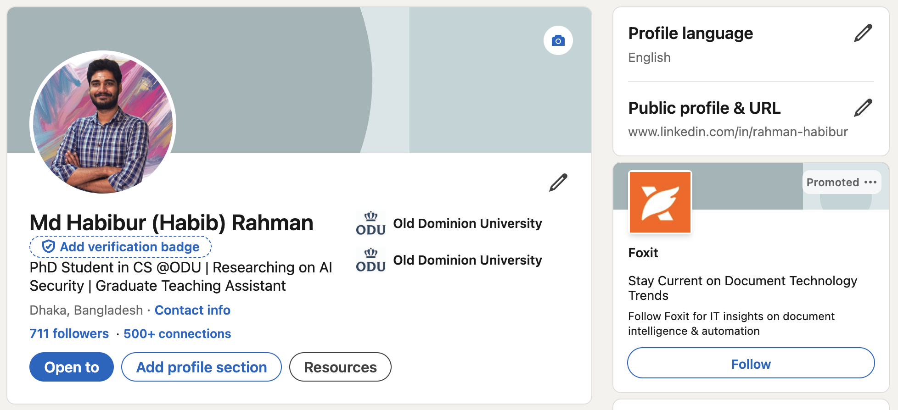
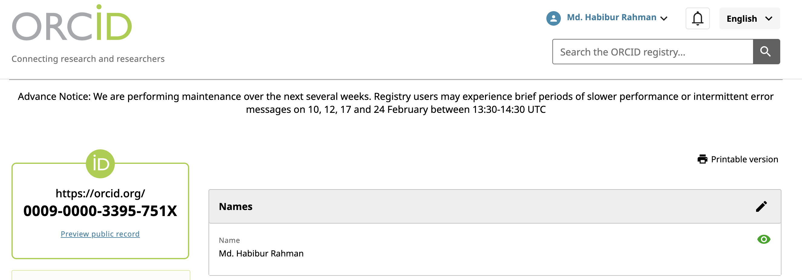

# Assignment 2 Md Habibur Rahman on Presence on media and RCR
Submitted: Monday, February 9, 2026 (11.50 PM)

### Description
This assignment focuses on creating and linking multiple social media accounts, latex and completion of Responsible Conduct of Research (RCR) training. 

### Directory
- [imgs/](../2/imgs/) -> screenshots of social media & rcr doctoral milestone
- [pdfs/](../2/pdfs/) -> pdf of latex file & rcr completion

```text
Rahman
├── 1
└── 2
    ├── README.md
    ├── imgs
    │   ├── google scholar.png
    │   ├── linkedin.png
    │   ├── orcid.png
    │   ├── rcr milestone.png
    │   └── web.png
    └── pdfs
        ├── rcr completion.pdf
        └── CS800_LaTeX_rahman.pdf
```

### Professional Accounts & Links
1. Google Scholar: [https://scholar.google.com/citations?user=F4vGKhgAAAAJ&hl=en&authuser=1](https://scholar.google.com/citations?user=F4vGKhgAAAAJ&hl=en&authuser=1)

ODU faculty I am following:
- Daniel Takabi
- Mohammad GhasemiGol
- Michele C. Weigle
- Michael L. Nelson
- Mahmoud Nazzal


2. LinkedIn: [https://www.linkedin.com/in/rahman-habibur/](https://www.linkedin.com/in/rahman-habibur/)


3. ORCID iD: [https://orcid.org/0009-0000-3395-751X](https://orcid.org/0009-0000-3395-751X)


4. Academic Webpage: [https://cs.odu.edu/~cs_mrahm015/](https://cs.odu.edu/~cs_mrahm015/)
[https://cs.odu.edu/~cs_mrahm015/](https://cs.odu.edu/~cs_mrahm015/)

### Overleaf and LaTeX
Signed up to Overleaf and made the changes on URLs, images, and tables with my information.
- PDF: [CS800_LaTeX_Rahman](../2/pdfs/CS800_LaTeX_Rahman.pdf)

### Responsible Conduct of Research (RCR)
- Completion Certificate [here](../2/pdfs/rcr%20completion.pdf)
- Doctoral Milestone


### Youtube
YouTube Video Link: [https://youtu.be/WPR4v-p2W-Y](https://youtu.be/WPR4v-p2W-Y)