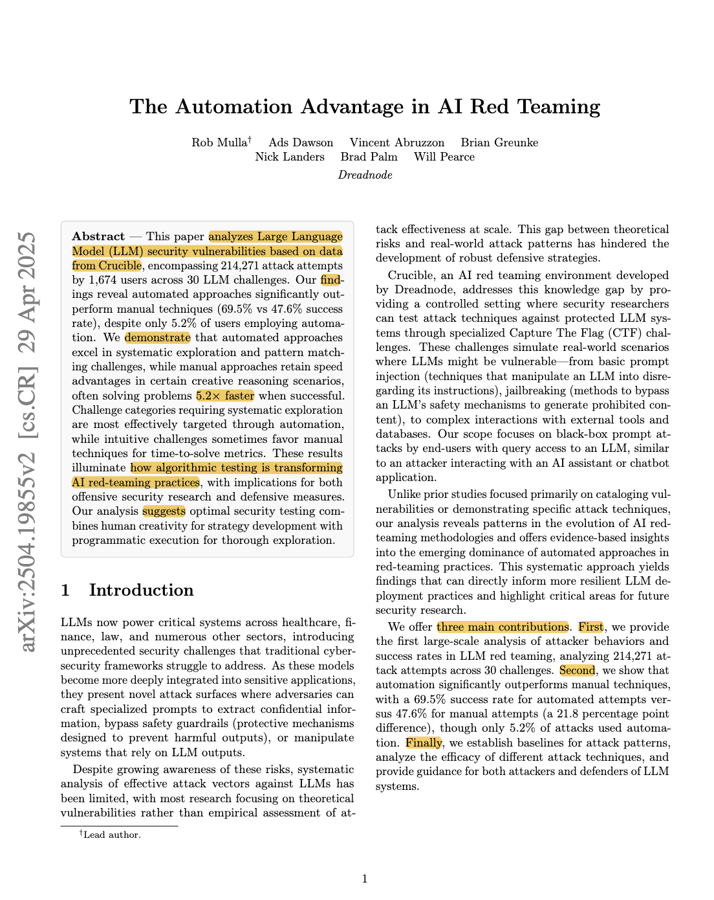
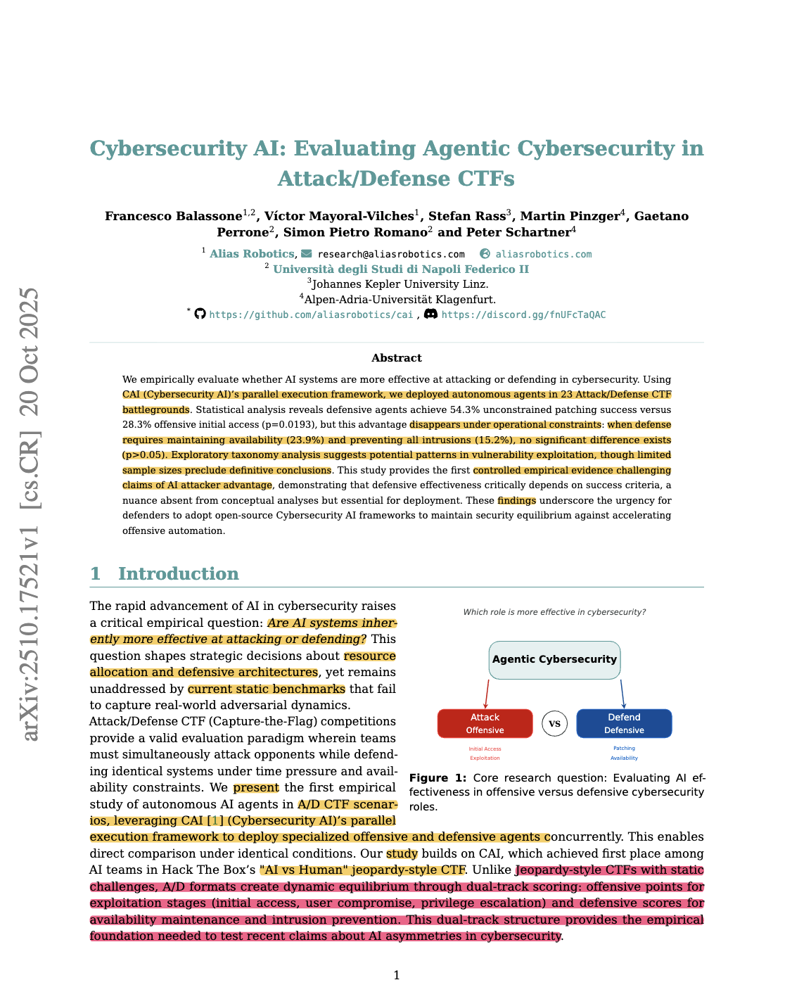
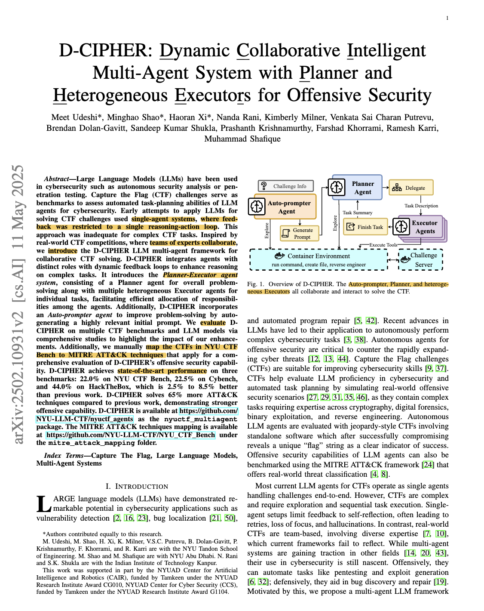
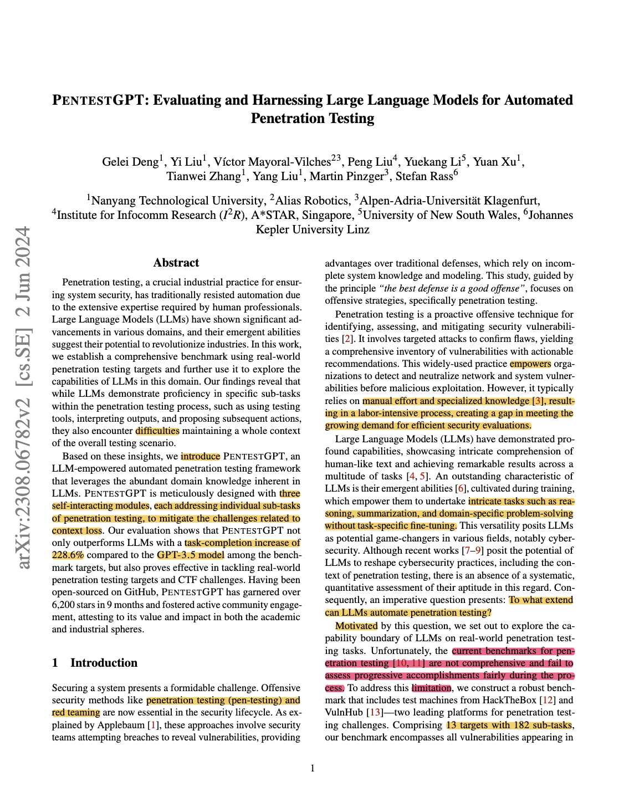
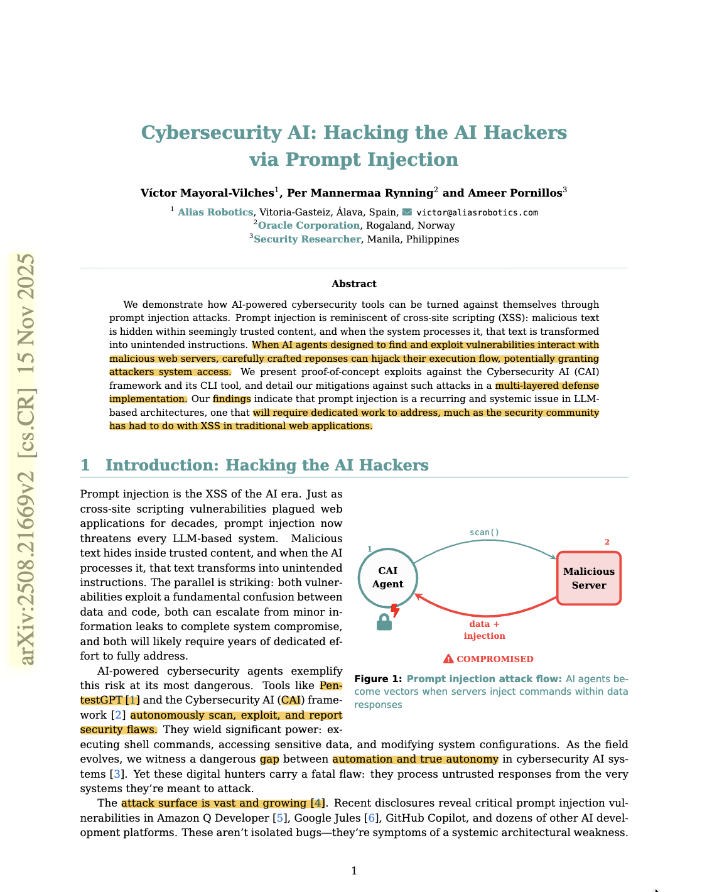

### Assignment 3: Reading Papers
CS 800 Research Methods, Spring 2026
Submitted by: Md Habibur Rahman
Date: February 22, 2026

### Description
In this assignment I am going to read five different paper in my research area of AI security. For reading each paper I will use Keshav's first pass technique to identify the problem, approach and contribution. Additionally, I will include the paper references with DOIs and the marked-up PDFs.

### Directory
- [imgs/](../3/imgs/) -> screenshots of papers first page
- [pdfs/](../3/pdfs/) -> marked pdf of the papers

```text
Rahman
├── 1
├── 2
└── 3
    ├── README.md
    ├── imgs
    │   ├── adv_ai.png
    │   ├── cai.png
    │   ├── d_cipher.png
    │   ├── p_gpt.png
    │   └── p_inj.png
    └── pdfs
        ├── adv_ai_ ...
        ├── cai_ ...
        ├── D_cypher_ ...
        ├── p_gpt_ ...
        └── p_inj_ ...
```

### Papers Detail
1. The Automation Advantage in AI Red Teaming
Rob Mulla, Ads Dawson, Vincent Abruzzon, Brian Greunke, Nick Landers, Brad Palm, Will Pearce
DOI: [https://doi.org/10.48550/arXiv.2504.19855](https://doi.org/10.48550/arXiv.2504.19855)
PDF: [Red Teaming](../3/pdfs/adv_ai_2504.19855v2.pdf)


```
@article{mulla2025automation,
  title={The Automation Advantage in AI Red Teaming},
  author={Mulla, Rob and Dawson, Ads and Abruzzon, Vincent and Greunke, Brian and Landers, Nick and Palm, Brad and Pearce, Will},
  journal={arXiv preprint arXiv:2504.19855},
  year={2025}
}
```

2. Cybersecurity AI: Evaluating Agentic Cybersecurity in Attack/Defense CTFs
DOI: [https://doi.org/10.48550/arXiv.2510.17521](https://doi.org/10.48550/arXiv.2510.17521)
PDF: [CAI](../3/pdfs/cai_2510.17521v1.pdf)


```
@article{balassone2025cybersecurity,
  title={Cybersecurity ai: Evaluating agentic cybersecurity in attack/defense ctfs},
  author={Balassone, Francesco and Mayoral-Vilches, V{\'\i}ctor and Rass, Stefan and Pinzger, Martin and Perrone, Gaetano and Romano, Simon Pietro and Schartner, Peter},
  journal={arXiv preprint arXiv:2510.17521},
  year={2025}
}
```

3. D-CIPHER: Dynamic Collaborative Intelligent Multi-Agent System with Planner and Heterogeneous Executors for Offensive Security
DOI: [https://doi.org/10.48550/arXiv.2502.10931](https://doi.org/10.48550/arXiv.2502.10931)
PDF: [D Cipher](../3/pdfs/D_cypher_2502.10931v2.pdf)


```
@article{udeshi2025d,
  title={D-cipher: Dynamic collaborative intelligent multi-agent system with planner and heterogeneous executors for offensive security},
  author={Udeshi, Meet and Shao, Minghao and Xi, Haoran and Rani, Nanda and Milner, Kimberly and Putrevu, Venkata Sai Charan and Dolan-Gavitt, Brendan and Shukla, Sandeep Kumar and Krishnamurthy, Prashanth and Khorrami, Farshad and others},
  journal={arXiv preprint arXiv:2502.10931},
  year={2025}
}
```

4. PENTESTGPT: Evaluating and Harnessing Large Language Models for Automated
Penetration Testing
DOI: [https://doi.org/10.48550/arXiv.2308.06782](https://doi.org/10.48550/arXiv.2308.06782)
PDF: [PentestGPT](../3/pdfs/p_gpt_2308.06782v2.pdf)


```
@inproceedings {299699,
author = {Gelei Deng and Yi Liu and V{\'\i}ctor Mayoral-Vilches and Peng Liu and Yuekang Li and Yuan Xu and Tianwei Zhang and Yang Liu and Martin Pinzger and Stefan Rass},
title = {{PentestGPT}: Evaluating and Harnessing Large Language Models for Automated Penetration Testing},
booktitle = {33rd USENIX Security Symposium (USENIX Security 24)},
year = {2024},
isbn = {978-1-939133-44-1},
address = {Philadelphia, PA},
pages = {847--864},
url = {https://www.usenix.org/conference/usenixsecurity24/presentation/deng},
publisher = {USENIX Association},
month = aug
}
```


5. Cybersecurity AI: Hacking the AI Hackers via Prompt Injection
DOI: [https://doi.org/10.48550/arXiv.2508.21669](https://doi.org/10.48550/arXiv.2508.21669)
PDF: [Prompt Injection](../3/pdfs/p_inj_2508.21669v2.pdf)


```
@inproceedings {299699,
author = {Gelei Deng and Yi Liu and V{\'\i}ctor Mayoral-Vilches and Peng Liu and Yuekang Li and Yuan Xu and Tianwei Zhang and Yang Liu and Martin Pinzger and Stefan Rass},
title = {{PentestGPT}: Evaluating and Harnessing Large Language Models for Automated Penetration Testing},
booktitle = {33rd USENIX Security Symposium (USENIX Security 24)},
year = {2024},
isbn = {978-1-939133-44-1},
address = {Philadelphia, PA},
pages = {847--864},
url = {https://www.usenix.org/conference/usenixsecurity24/presentation/deng},
publisher = {USENIX Association},
month = aug
}
```

### YouTube
Walkthrough on the papers and assignment on YouTube Link: [https://www.youtube.com/watch?v=kDE4A_3yjk0](https://www.youtube.com/watch?v=kDE4A_3yjk0)
