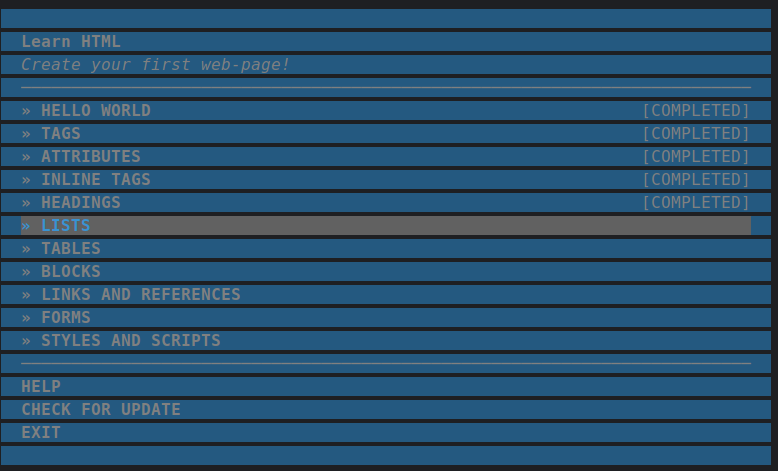
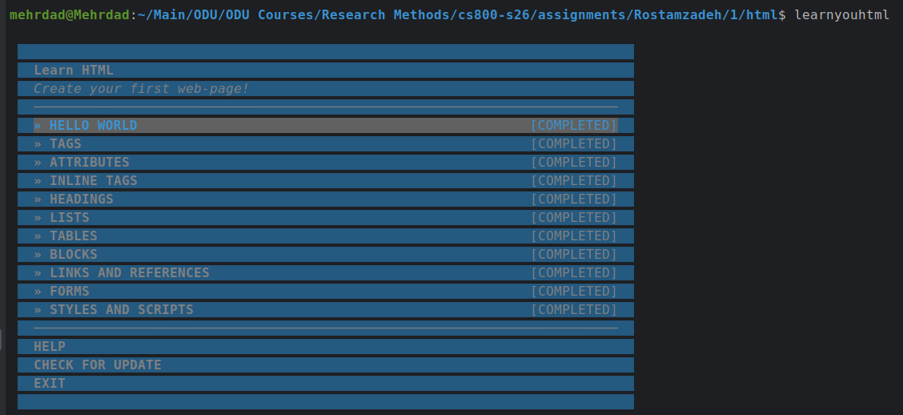

In this assignment, I have completed a series of exercises using learnyouhtml to practice HTML concepts.
The tasks covered

- Index
- Tags
- Attributes
- Inline Tags
- Headings
- Lists
- Tables
- Blocks
- Links and References
- Forms
- Styles


## Directory
```text
Rostamzadeh
└── 1
    ├── README.md
    ├── html
    │   ├── index.html
    │   ├── attributes.html
    │   ├── forms.html
    │   ├── headings.html
    │   ├── blocks.html
    │   ├── inline-tags.html
    │   ├── links.html
    │   ├── lists.html
    │   ├── styles.html
    │   ├── tables.html
    │   └── tags.html
    └── imgs
        ├── done A1.png
        └── learnyouhtml.png
```


## in progress


## After



## Completion Video URL
YouTube Video: https://youtu.be/phG5klCNxvw