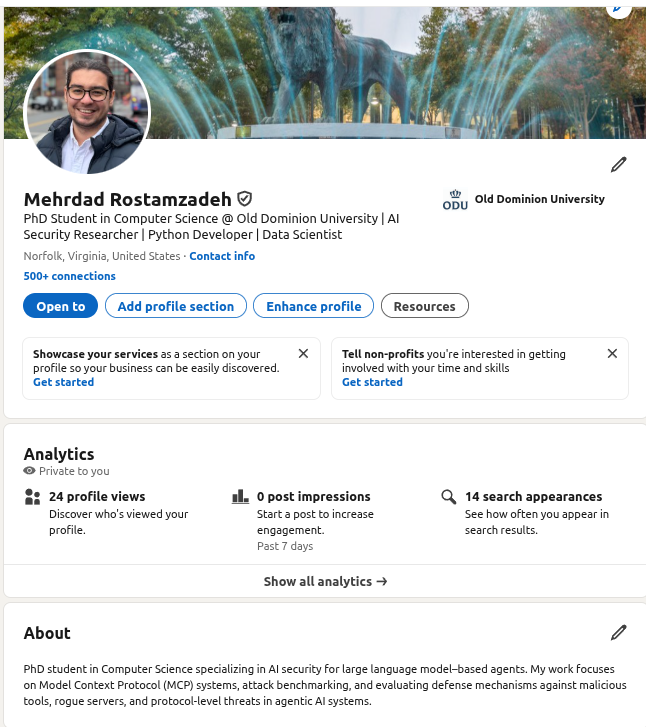
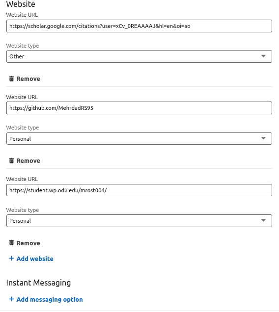

## Directory Structure

<pre>
Rostamzadeh/
├── 1/
├── 2/
│   ├── google_scholar/
│   │   ├── Followings.png
│   │   └── main.png
│   ├── latex/
│   │   └── latex_basics.pdf
│   ├── linkedin/
│   │   ├── linked_websites.png
│   │   └── profile.png
│   ├── ORCID/
│   │   └── ORCID.png
│   ├── personal_website/
│   │   └── home.png
│   ├── RCR/
│   │   ├── CitiCompletionCertificate.pdf
│   │   ├── CitiCompletionReport.pdf
│   │   └── RCR_degree_work.png
│   └── README.md
</pre>

## Google Scholar

People I followed:
I have also included a screenshot of this list in the google_scholar/ directory.
- Mikel Rodriguez
- Xinyue Shen
- Mohammad GhasemiGol
- Mahmoud Nazzal
- Nathalie Baracaldo
- Ilia Shumailov
- Alina Oprea
- Lorenzo Cavallaro
- Xinyun Chen
- Jinyuan Jia

### link to my Google Scholar:

https://scholar.google.com/citations?user=xCv_0REAAAAJ&hl=en&oi=ao
The following screenshots are included as evidence:

main.png
A screenshot of my main Google Scholar profile page, showing my name, affiliation, research interests, and profile
setup.

[View Google Scholar Followings](google_scholar/Followings.png)

## RCR

Responsible Conduct of Research (RCR)

I have completed the Responsible Conduct of Research (RCR) training as required for graduate students at Old Dominion
University.

The RCR/ directory contains official documentation verifying completion:

#### citiCompletionCertificate.pdf

The official completion certificate issued by the CITI Program for the Responsible Conduct of Research for Engineers
course.

https://www.citiprogram.org/verify/?wc4299db7-8758-470e-a1b5-ed0246eb9b64-70302324

#### citiCompletionReport.pdf

The detailed completion report from the CITI Program showing all required modules successfully completed.

#### RCR_degree_work.png
A screenshot from Degree Works indicating that the RCR requirement has been satisfied under Doctoral Milestones at Old
Dominion University.

Here is the link to the completion report:
https://www.citiprogram.org/verify/?k447df973-0728-4ef6-95f3-1353442e3736-70302324

## ORCID

URL for my ORCID:
https://orcid.org/0000-0003-0977-6510

#### ORCID Profile
A screenshot of my ORCID profile:
[ORCID profile](ORCID/ORCID.png)

- ORCID URL
  https://orcid.org/0000-0003-0977-6510

## Linkedin

My LinkedIn profile includes a professional photo, a brief biography, and information about my role as a PhD student
  in Computer Science at Old Dominion University. It also provides direct links to my academic webpage and other
  research profiles, enabling bi-directional discovery across my professional online presence.

The following screenshots are included as evidence:

profile.png
A screenshot of the main LinkedIn profile page showing my name, headline, and professional summary.

- linked_website.png
  A screenshot showing the external websites linked from my LinkedIn profile, including my academic webpage and research
  profiles.

- **LinkedIn profile:**  
https://www.linkedin.com/in/mehrdad-rostamzadeh-513b11ab 

Linkedin profile

## Academic Webpage

I have created a professional academic webpage that serves as the central hub for my academic and professional online presence.
The webpage includes my role as a PhD student in the Computer Science Department at Old Dominion University, my email address, and links to my Google Scholar, ORCID, LinkedIn, and GitHub profiles.

Academic webpage:
https://student.wp.odu.edu/mrost004/
-WEBPAGE-URL

ODU CS redirect:
https://www.cs.odu.edu/~cs_mrost004/

The webpage uses a clean layout with a modest use of color and visual elements to
ensure a professional and visually appealing presentation. Screenshots of the webpage and the working redirect are included in the repository.

## Latex

LaTeX and Overleaf

I created an Overleaf account and completed Part 1 of the LaTeX introduction as required. Using the template provided in class (slide 65), I replaced the placeholder text, URLs, and images with my own information, including my name, affiliation, email address, and links to my academic profiles.

The latex/ directory contains:

[LaTeX Basics (PDF)](latex/latex_basics.pdf)

The compiled PDF generated from Overleaf, demonstrating successful use of LaTeX and completion of the required template customization.

This PDF was downloaded directly from Overleaf and is included here as part of the Assignment 2 submission.

## Completion Video URL
YouTube Video: https://www.youtube.com/watch?v=v8Vr0rC8Oy4