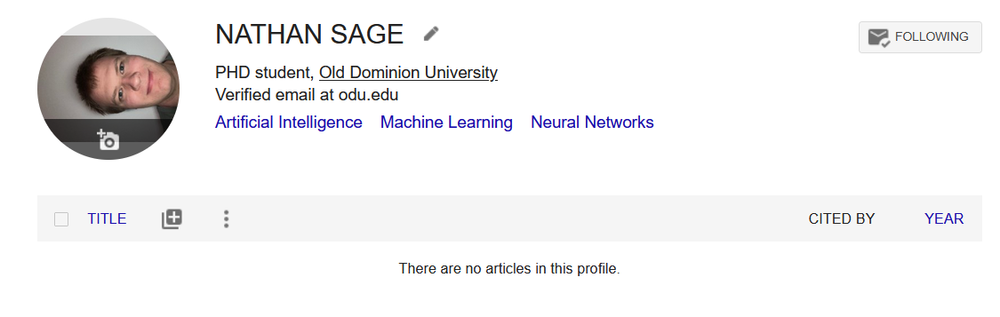
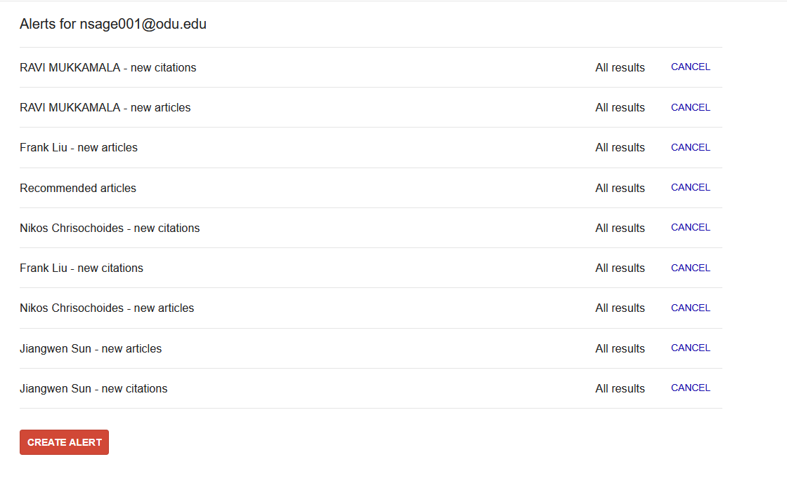
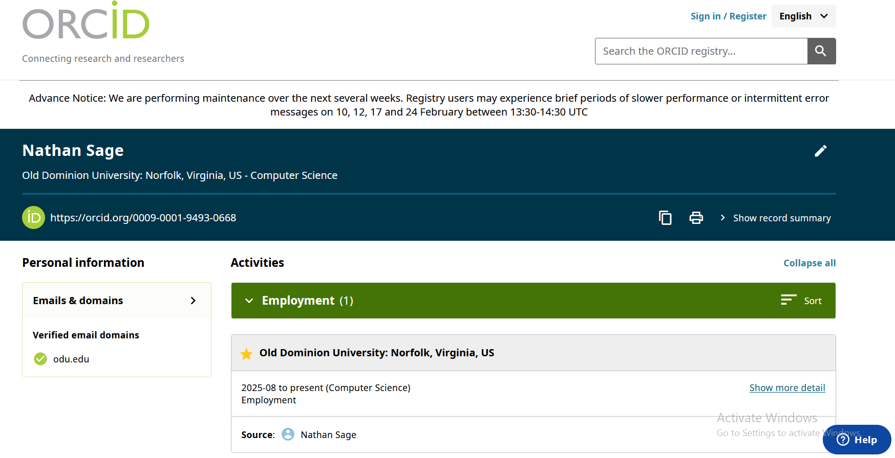
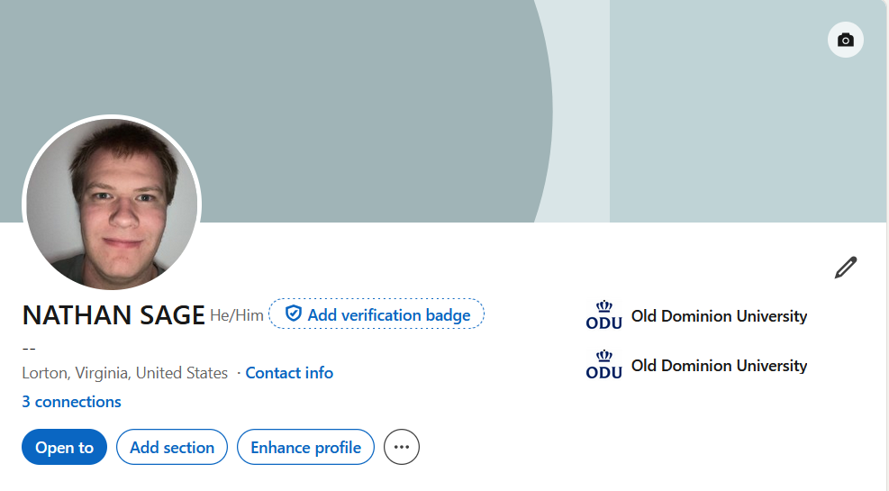
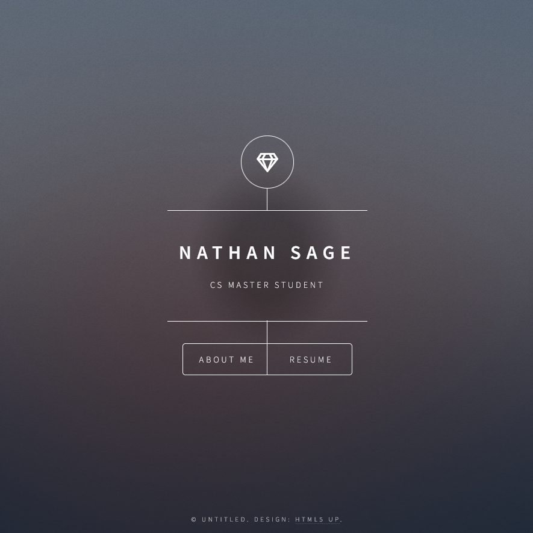
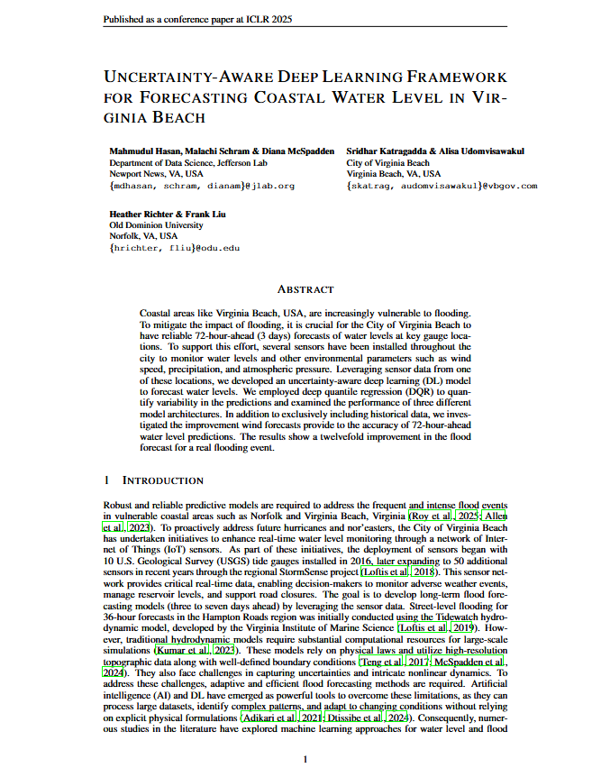
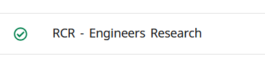

## Assignment A2

**Course:** CS 800  
**Institution:** Old Dominion University  
**Instructor:** Dr. Nelson  
**Assignment:** Professional Presence (2)  
**Student Name:** Nathan Sage  
**Date Submitted:** 2/9/2026

## Google Scholar

**Profile Link:**
🔗 https://scholar.google.com/citations?user=c0O7oq0AAAAJ&hl=en

My Google Scholar profile.

### Faculty and Scholars Followed

I am currently following the following professors:

**ODU Computer Science Faculty:**
- Frank Liu
- Ravi Mukkamala
- Jiangwen Sun
- Lusi Li
- Nikos Chrisochoides

I will continue to follow more researchers throughout the semester.

## ORCID

https://orcid.org/0009-0001-9493-0668

## LinkedIn

www.linkedin.com/in/nathan-sage-294401303

## Website

I created this website https://spartansold.github.io/#

I will update this website as I continue learning and working at ODU

## Overleaf

Here is the example latex project

- [Latex document](latex_example/example_project.pdf)

## Responsible Conduct of Research (RCR)'

I completed the RCR

- [RCR completion](RCR/RCR_proof.png)

## Youtube link

Here is the youtube link of me going over everything I did

https://youtu.be/HuRCdPi74M8
