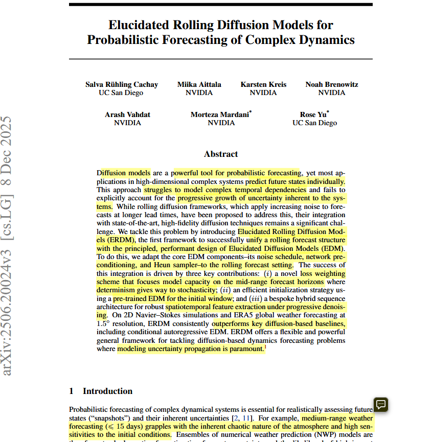
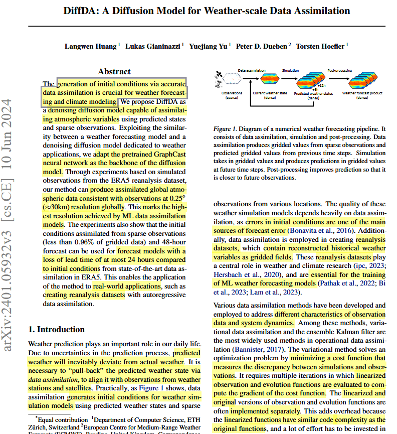
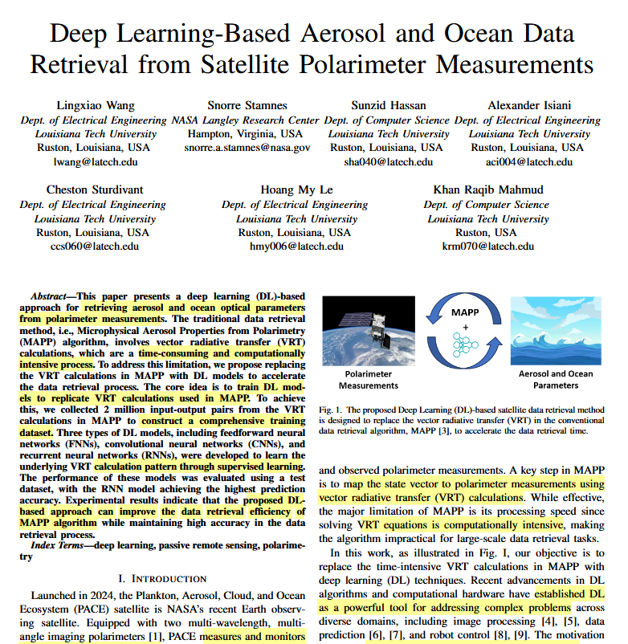
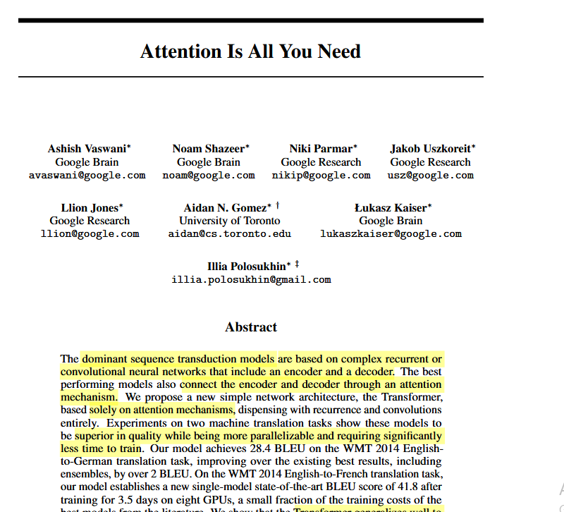
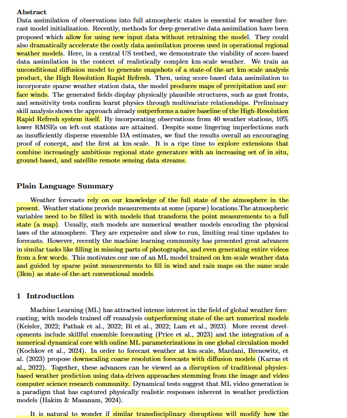

Papers
--------
[Elucidated Rolling Diffusion Model](papers/Elucidated_Rolling_diffusion_models.pdf)
[diffda](papers/diffda.pdf)
[aerosol ocean retrieval](papers/areosol_ocean_retrieval.pdf)
[Transformers](papers/transformer_paper)
[Generative data assimiliation](papers/NVIDIA_Paper)
[BibTeX References](references/bibtec.pdf)

------
Paper 1 Elucidated Rolling Diffusion Models

First Page

Reference

 Salva R¨uhling Cachay, Miika Aittala, Karsten Kreis, Noah Brenowitz, Arash Vahdat,
Morteza Mardani, and Rose Yu. Elucidated rolling diffusion models for probabilistic fore-
casting of complex dynamics. ArXiv preprint ArXiv:2506.20024, 2025.

DOI

https://doi.org/10.48550/arXiv.2506.20024

Problem:

Traditional diffusion models are powerful for generative tasks but are not well suited for probabilistic forecasting of complex time evolving systems such as weather or climate dynamics. Existing forecasting models often struggle with uncertainty estimation and long range temporal dependencies.

Approach:

The authors introduce Rolling Diffusion Models (RDMs) combined with the Elucidated Diffusion Model (EDM) framework. The model generates forecasts step by step over time by rolling the diffusion process forward while maintaining stable training and sampling procedures.

Contributions:

Introduces Elucidated Rolling Diffusion Models for probabilistic forecasting.

Improves stability and performance of diffusion-based forecasting methods.

Demonstrates strong results on complex dynamical systems and long-horizon predictions.

-------
Paper 2 DiffDA

First Page

Reference

Langwen Huang, Lukas Gianinazzi, Yuejiang Yu, Peter D. D¨uben, and Torsten Hoe-
fler. DiffDA: A diffusion model for weather-scale data assimilation. ArXiv preprint
ArXiv:2401.05932, 2024.

DOI
https://doi.org/10.48550/arXiv.2401.05932

Problem

Weather data assimilation is computationally expensive and difficult at large spatial scales. Traditional assimilation methods (e.g., variational or ensemble methods) can struggle with scalability and uncertainty modeling.

Approach

The authors propose DiffDA, a diffusion-model-based approach for data assimilation that learns the distribution of atmospheric states and incorporates observational data into the generative process.

Contributions

Introduces a diffusion based data assimilation framework.

Demonstrates the ability to handle weather scale systems efficiently.

Shows improved reconstruction of atmospheric states from sparse observations.

----
Paper 3 Deep Learning Based Aerosol and Ocean Data Retrieval

First Page

Reference

Lingxiao Wang, Snorre Stamnes, Sunzid Hassan, Alexander Isiani, Cheston Sturdivant,
Hoang My Le, and Khan Raqib Mahmud. Deep learning-based aerosol and ocean data
retrieval from satellite polarimeter measurements. In IEEE SoutheastCon, pages 1542–
1547, 2025

Problem

Retrieving aerosol and ocean properties from satellite polarimeter measurements is complex due to nonlinear relationships between measurements and environmental variables. Traditional retrieval algorithms are often slow and limited.

Approach

The paper applies deep learning models to estimate aerosol and ocean parameters directly from satellite polarimeter data. The model learns the mapping between observed measurements and geophysical properties.

Contributions

Develops a deep learning based retrieval method for satellite polarimeter data.

Improves accuracy and efficiency compared to traditional retrieval methods.

Demonstrates the feasibility of AI driven remote sensing data analysis.

----
Paper 4 Attention Is All You Need

First Page

Reference

Ashish Vaswani, Noam Shazeer, Niki Parmar, Jakob Uszkoreit, Llion Jones, Aidan N.
Gomez, Lukasz Kaiser, and Illia Polosukhin. Attention is all you need. ArXiv preprint
ArXiv:1706.03762, 2017.

DOI

https://doi.org/10.48550/arXiv.1706.03762

Problem

Sequence modeling methods such as recurrent neural networks (RNNs) and convolutional models have limitations in capturing long-range dependencies and are computationally inefficient for large datasets.

Approach

The authors introduce the Transformer architecture, which relies entirely on self attention mechanisms instead of recurrence or convolution to model relationships between tokens in a sequence.

Contributions

Proposes the Transformer, a new neural network architecture.

Introduces self-attention as the core mechanism for sequence modeling.

Significantly improves performance and training efficiency in machine translation and other NLP tasks.

-----
Paper 5 Generative Data Assimilation of Sparse Weather Station Observations

First Page

Reference

Peter Manshausen, Yair Cohen, Peter Harrington, Jaideep Pathak, Mike S. Pritchard,
Piyush Garg, Morteza Mardani, Karthik Kashinath, Simon Byrne, and Noah D. Brenowitz.
Generative data assimilation of sparse weather station observations at kilometer scales.
Journal of Advances in Modeling Earth Systems, 17(10):e2024MS004505, 2025

DOI

https://doi.org/10.1029/2024MS004505

Problem

Weather prediction systems often rely on dense observation networks, but many regions only have sparse weather station data, making high resolution forecasting difficult.

Approach

The authors propose a generative data assimilation framework that uses machine learning to combine sparse observations with atmospheric models to reconstruct high resolution weather fields.

Contributions

Introduces a generative approach to data assimilation for sparse observations.

Enables kilometer-scale weather reconstruction from limited data.

Demonstrates improved forecasting capability in data-sparse regions.

----

Youtube

https://youtu.be/DGotCEO7SM8?si=G6jY5A90KiQFRXzQ
