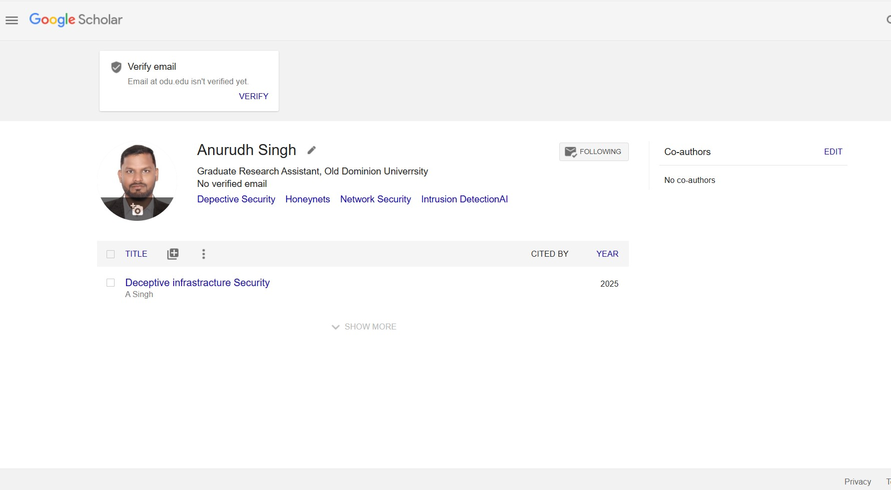
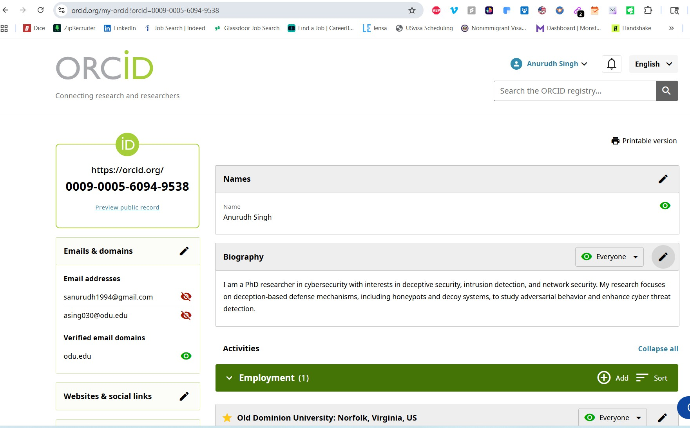
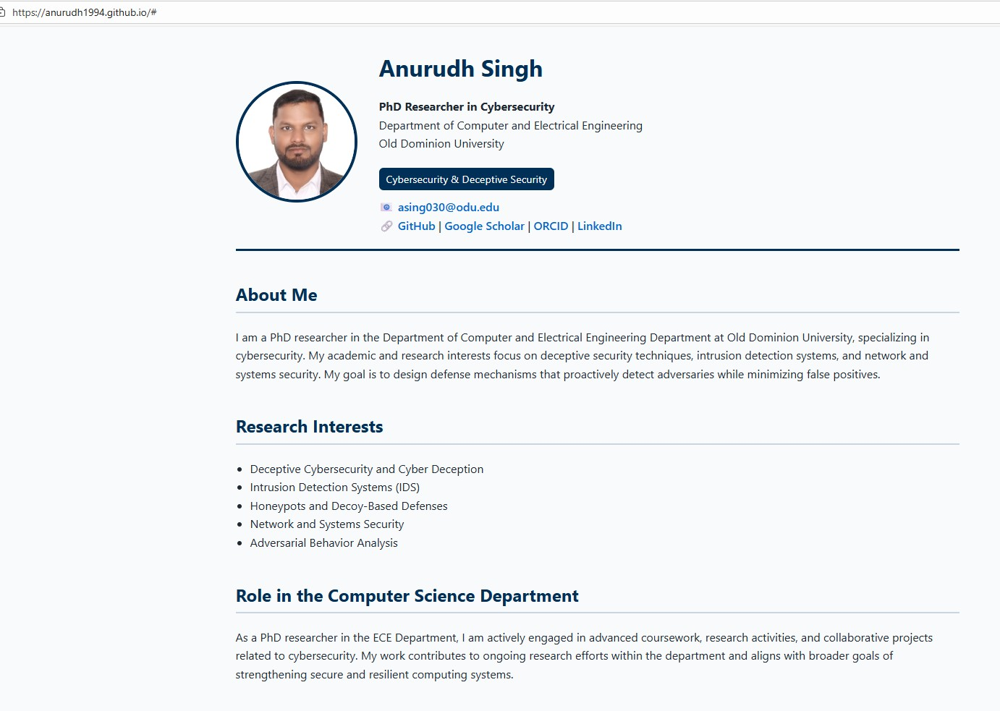

# CS 800 – Assignment 2: Presence, Tools, RCR
**Course:** CS 800 – Research Methods, Spring 2026  
**Due:** 2026-02-09  

---

## **1. Assignment Description**
This assignment demonstrates professional online presence, familiarity with research tools, LaTeX proficiency, and completion of Responsible Conduct of Research (RCR) training.  
The components include:

1. **Professional online accounts**
2. **Academic webpage**
3. **LaTeX assignment in Overleaf**
4. **RCR certificate**
5. **Walkthrough video**

---

## **2. Professional Accounts**

### **2.1 Google Scholar**
- **Profile link:** [Click Here](https://scholar.google.com/citations?user=imXYteMAAAAJ&hl=en)
- **Screenshot:**  
  
- **Faculty/Researchers followed:**
  1. Faculty 1 (ODU): Hossein Sarrafzadeh
  2. Faculty 2 (ODU): Mohammad GhasemiGol
  3. Faculty 3 (ODU): Pratip Rana
  4. Faculty 4 (ODU): Khan Iftekharuddin
  5. Faculty 5 (ODU):Dimitrie C. Popescu
  6. Researcher 1 : Kshitiz Aryal
  7. Researcher 2 : Shahabuddin Khan
  8. Researcher 3 : Ganesh Sapkota
  

---

### **3.2 ORCID**
- **Profile link:** [Click here ](https://orcid.org/my-orcid?orcid=0009-0005-6094-9538)
- **Screenshot:**  
  

---

### **3.3 LinkedIn**
- **Profile link:** [Click Me](https://www.linkedin.com/in/singh-anurudh/)
- **Screenshot:**  
  
- **Other accounts linked:** Google Scholar, ORCID, Academic Webpage

---

## **4. Academic Webpage**
- **Webpage link:** [Github webpage](https://anurudh1994.github.io/)
- **Screenshot:**  
  
- **Notes:** Bi-directional linkage to all professional accounts included.

---

## **5. LaTeX Assignment (Overleaf)**
- **PDF Download:** [Assignment 2 PDF](LaTeX_basics.pdf)
- **Notes:** Used Overleaf template from class Slide 65. Replaced all URLs, images, and text with personal info.

---

## **6. Responsible Conduct of Research (RCR)**
- **Certificate PDF:**  [RCR Certificate](citi_course.pdf)
- **Completion Notes:** Completed "Responsible Conduct of Research for Engineers" modules at ODU.

---

## **7. Walkthrough Video**
- **YouTube Link:** [Assignment 2 Walkthrough Video](https://youtu.be/Ek4k2qwJgG8)
- **Notes:** Demonstrates all accounts, RCR completion, and academic webpage.

---

## **8. Notes / Additional Information**
- All accounts include profile pictures and filled bios.
- Repository structure is organized for easy navigation.
- Links are bi-directional where applicable.

