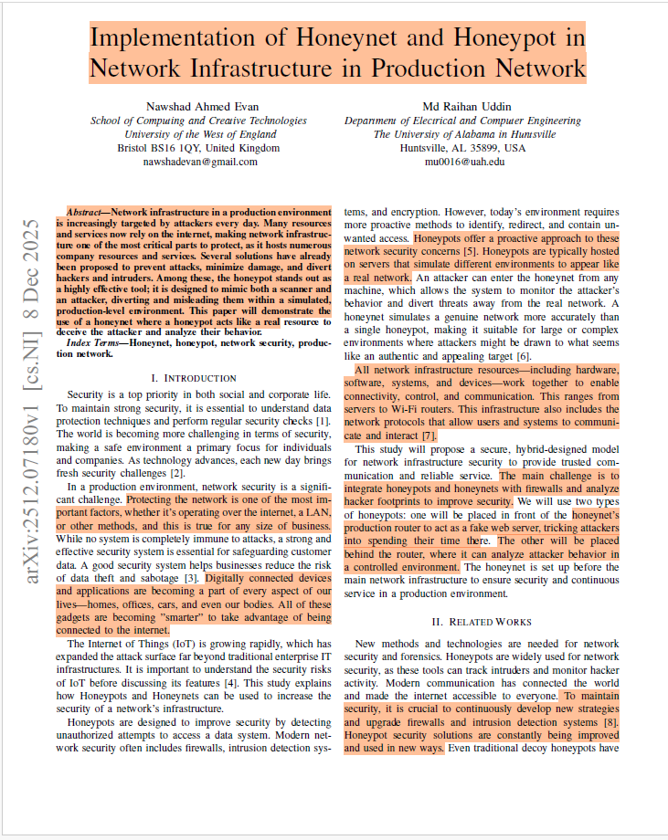
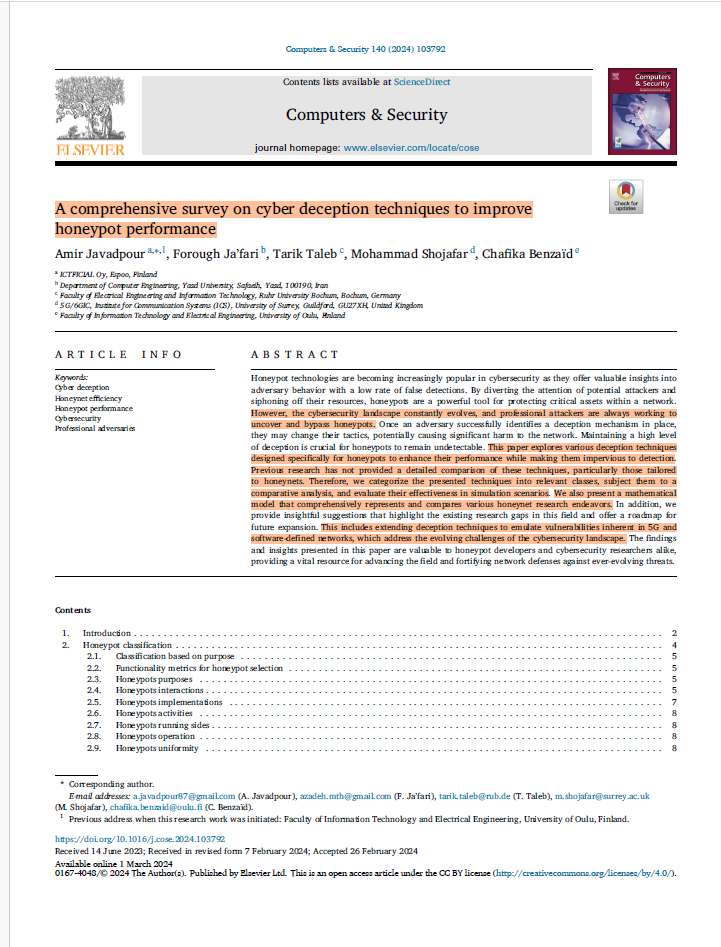
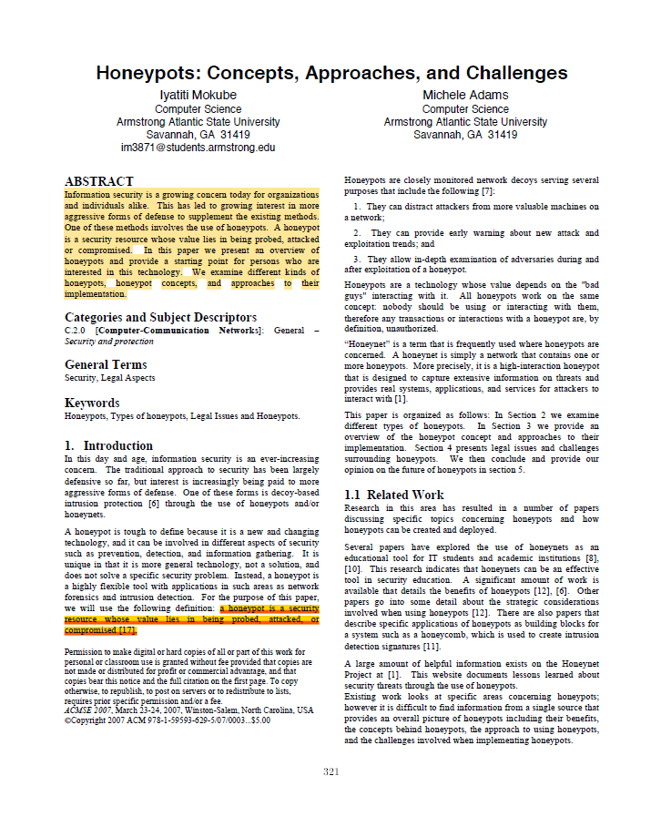
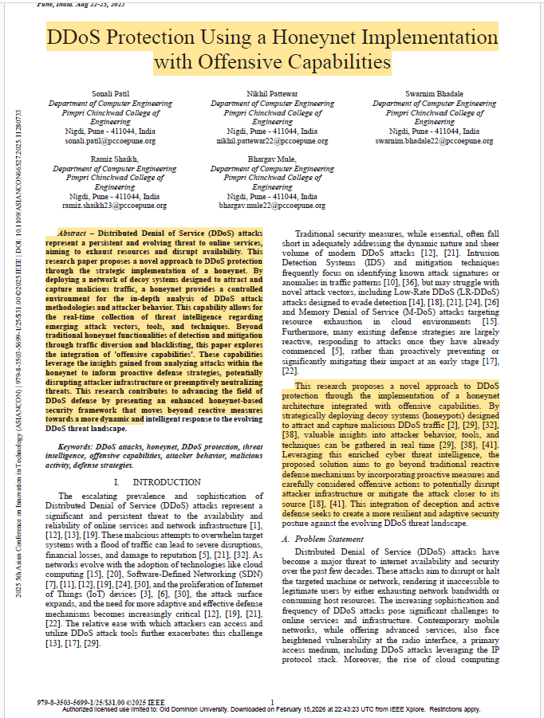
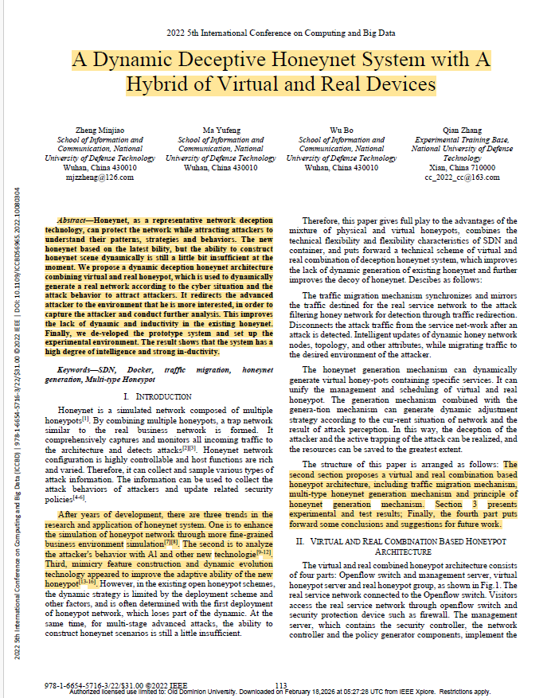

# Assignment 3: Reading Papers  
**CS 800 Research Methods, Spring 2026**  
**Name : Anurudh Singh**

This submission contains five papers from my research area (**Honeypots, Honeynets, and Deception-Based Defense**).   
Each paper includes:

- Keshav's 1st-pass summary (Problem, Approach, Contributions)  
- Full reference  
- DOI link  
- BibTeX entry  
- Screenshot of Page 1  
- Marked-up PDF with highlighted sections  

---
# Selected Papers
My research focuses on Honeypots, honeynets, and deception-based defense mechanisms. The following papers were selected because they provide foundational and practical insights into these areas.

## Paper 1: *Implementation of Honeynet and Honeypot in Network Infrastructure in Production Network*

**Reference:**  
- Evan, N.A., Uddin, M.R.: Implementation of Honeynet and Honeypot in Network Infrastructure in Production Network (2025). https://arxiv.org/abs/2512.07180

**DOI:** 10.48550/arXiv.2512.07180

```bibtex
@misc{evan2025implementationhoneynethoneypotnetwork,
      title={Implementation of Honeynet and Honeypot in Network Infrastructure in Production Network}, 
      author={Nawshad Ahmed Evan and Md Raihan Uddin},
      year={2025},
      eprint={2512.07180},
      archivePrefix={arXiv},
      primaryClass={cs.NI},
      url={https://arxiv.org/abs/2512.07180}, 
}
```

# 1st Pass (Keshav)

## Problem
- The paper addresses the increasing security challenges faced by network infrastructure in production environments due to the growing reliance on the internet and the expansion of the attack surface, particularly with the rise of IoT devices. 
- Traditional security measures like firewalls and intrusion detection systems are insufficient to counter modern cyber threats, such as unauthorized access, data theft, and Distributed Denial of Service (DDoS) attacks. 
- The study highlights the need for proactive security measures to detect, divert, and analyze attacker behavior to protect critical network resources. 


## Approach
- The paper proposes a hybrid network security model that integrates honeypots and honeynets with firewalls to enhance network security.
  The methodology involves:
### 1.	Honeypot and Honeynet Implementation:
- A honeynet is set up as a decoy network with devices mimicking real resources. 
- Two honeypots are deployed: one in front of the honeynet router to act as a fake web server and mislead attackers, and another behind the router to analyze attacker behavior and collect logs. 
### 2.	Simulation and Testing:
- The network topology is designed using the GNS3 open-source simulator, incorporating routers, switches, firewalls, and honeypots.
- Attacker behavior is simulated using tools like Kali Linux and Slowloris to generate random attacks and DDoS scenarios.
- Data is collected and analyzed using tools like Wireshark and KFSensor to understand attack patterns and trace attacker origins. 

## Contributions:
- **Hybrid Security Model:** The study introduces a three-layer security system combining honeypots, honeynets, and firewalls to provide advanced protection for production networks.
- **Proactive Threat Analysis:** The honeypots and honeynets are used to mislead attackers, collect their footprints, and analyze their behavior, providing valuable insights into attack patterns and vulnerabilities.
- **Real-Time Simulation:** The paper demonstrates the effectiveness of the proposed model through a virtual lab setup using GNS3 and VMWare, simulating real-world attack scenarios.
- **Enhanced Security Measures:** The study highlights the importance of integrating honeypots and honeynets with firewalls to provide additional layers of security, allowing security engineers to prepare for potential attacks.
- **Future Work:** The paper outlines plans to improve honeypot functionality, implement intrusion protection systems, and automate the integration of honeynets with production networks for enhanced security. 
   

## Screenshot (Page 1)


## Marked-up PDF : [View Marked-up PDF](papers/paper1_implementation_honeynet.pdf)

## Paper 2: *A comprehensive survey on cyber deception techniques to improve honeypot performance*

**Reference:**  

- Javadpour, A., Ja’fari, F., Taleb, T., Shojafar, M., Benza¨ıd, C.: A comprehensive survey on cyber deception techniques to improve honeypot performance.Computers & Security 140, 103792 (2024)

**Link:** https://doi.org/10.1016/j.cose.2024.103792  

```bibtex
@article{javadpour2024comprehensive,
  title={A comprehensive survey on cyber deception techniques to improve honeypot performance},
  author={Javadpour, Amir and Ja'fari, Forough and Taleb, Tarik and Shojafar, Mohammad and Benza{\"\i}d, Chafika},
  journal={Computers \& Security},
  volume={140},
  pages={103792},
  year={2024},
  publisher={Elsevier}
}
```

# 1st Pass (Keshav)

## Problem
The document identifies several challenges in the field of honeypots and honeynets:
- **Evolving Cyber Threats:** Attackers are constantly developing new techniques to detect and bypass honeypots, making it difficult to maintain their effectiveness. 
- **Lack of Comprehensive Evaluation:** Existing research lacks a standardized framework for evaluating honeypot performance and deception techniques. 
- **Limited Focus on Emerging Technologies:** Current honeypot research often overlooks specific vulnerabilities and services in modern environments like Software-Defined Networking (SDN), cloud computing, and 5G networks. 
- **Research Gaps:** There is insufficient exploration of advanced deception techniques, botnet-specific honeypots, distributed honeypots, and the impact of vulnerability types on honeynet effectiveness. 

## Approach
The survey adopts a systematic approach to address these challenges:
- **Categorization of Honeypots:** Honeypots are classified based on their purpose, interaction level, implementation, activity, operation, and uniformity. 
- **Deception Techniques:** The paper explores and categorizes various deception techniques for single honeypots and honeynets, including advanced mimicking, fake cooperation, deceptive databases, subtle interruptions, honeytoken baiting, and traffic redirection. 
- **Mathematical Modeling:** A general mathematical model is proposed to analyze honeynets, enabling comparison of different deception techniques and strategies. 
- **Simulation Experiments:** Python-based simulations are conducted to evaluate the effectiveness of key deception techniques in various network scenarios. 
- **Evaluation Metrics:** A set of metrics is proposed to measure honeypot performance, including intrusion detection rate, engagement rate, time to compromise, and more.
- **Recommendations for Future Research:** The paper identifies open issues and suggests areas for further investigation, such as SDN-based honeypots, 5G-specific honeypots, and machine learning-based honeynet optimization.


## Contributions:
- **Comprehensive Survey:**  The paper provides a detailed review of honeypot research over the past two decades, categorizing honeypots and honeynets based on various criteria.
- **Deception Techniques:**  It introduces and categorizes six deception techniques for single honeypots and five for honeynets, offering insights into their implementation and effectiveness.
- **Mathematical Model:** A novel general mathematical model is proposed to analyze honeynets and compare different deception techniques. 
- **Simulation Results:** Empirical simulations are conducted to evaluate the performance of key deception techniques, providing actionable insights for researchers and practitioners. 
- **Evaluation Framework:** The paper suggests robust metrics and methodologies, including red-teaming experiments, to assess honeypot effectiveness comprehensively. 
- **Future Research Directions:**  It identifies research gaps and provides recommendations for improving honeypot technologies, including the use of machine learning, addressing SDN and 5G vulnerabilities, and enhancing honeypot dynamization and topology shaping.


## Screenshot (Page 1)


## Marked-up PDF : [View Marked-up PDF](papers/paper2_deception_techniques.pdf)

## Paper 3: *Honeypots: concepts, approaches, and challenges*

**Reference:**  
- Mokube, I., Adams, M.: Honeypots: concepts, approaches, and challenges. In: Proceedings of the 45th Annual ACM Southeast Conference. ACMSE ’07, pp. 321–326. Association for Computing Machinery, New York, NY, USA (2007). https://doi.org/10.1145/1233341.1233399
  
**DOI:** 10.1145/1233341.1233399

```bibtex
@inproceedings{10.1145/1233341.1233399,
author = {Mokube, Iyatiti and Adams, Michele},
title = {Honeypots: concepts, approaches, and challenges},
year = {2007},
isbn = {9781595936295},
publisher = {Association for Computing Machinery},
address = {New York, NY, USA},
url = {https://doi.org/10.1145/1233341.1233399},
doi = {10.1145/1233341.1233399},
abstract = {Information security is a growing concern today for organizations and individuals alike. This has led to growing interest in more aggressive forms of defense to supplement the existing methods. One of these methods involves the use of honeypots. A honeypot is a security resource whose value lies in being probed, attacked or compromised. In this paper we present an overview of honeypots and provide a starting point for persons who are interested in this technology. We examine different kinds of honeypots, honeypot concepts, and approaches to their implementation.},
booktitle = {Proceedings of the 45th Annual ACM Southeast Conference},
pages = {321–326},
numpages = {6},
keywords = {honeypots, legal issues, types of honeypots},
location = {Winston-Salem, North Carolina},
series = {ACMSE '07}
}
```

# 1st Pass (Keshav)

## Problem
The paper addresses the increasing concern of information security for organizations and individuals.  Traditional security methods are primarily defensive, which may not be sufficient to combat evolving cyber threats.  The problem lies in the need for more proactive and effective security measures to detect, prevent, and analyze cyberattacks.  Honeypots are proposed as a solution to address these challenges.

## Approach
The authors explore the concept of honeypots as a flexible security tool that can be used for prevention, detection, and information gathering. They classify honeypots based on their purpose (research, production, and honeytokens) and level of interaction (low, medium, and high).  The paper also discusses strategic considerations for implementing honeypots, such as data management, preventing liability, and deciding between building or purchasing honeypots. Additionally, it examines legal issues like entrapment, privacy concerns, and liability risks. 

## Contributions:
- **Comprehensive Overview:** The paper provides a detailed survey of honeypots, serving as a starting point for individuals interested in the technology. 
- **Classification Framework:** It categorizes honeypots by purpose and interaction level, offering a structured understanding of their types and applications. 
- **Implementation Insights:** Practical guidelines are provided for deploying honeypots, including considerations for data, location, and legal compliance.
- **Legal Analysis:** The paper highlights key legal challenges (entrapment, privacy, liability) and offers strategies to mitigate risks. 
- **Evaluation of Pros and Cons:** It identifies the advantages (e.g., simplicity, minimal resources, discovery of new tools) and disadvantages (e.g., limited vision, risk of takeover, fingerprinting) of honeypots.
- **Future Outlook:** The authors emphasize the potential of honeypots in cybersecurity and digital forensics, predicting their increased adoption as commercial solutions become more accessible. 


## Screenshot (Page 1)


## Marked-up PDF : [View Marked-up PDF](papers/paper3_honeypots.pdf)

## Paper 4: *DDoS Protection Using a Honeynet Implementation with Offensive Capabilities*

**Reference:**  
- Patil, S., Pattewar, N., Bhadale, S., Shaikh, R., Mule, B.: Ddos protection using a honeynet implementation with offensive capabilities. In: 2025 5th Asian Conference on Innovation in Technology (ASIANCON), pp. 1–8 (2025). https://doi.org/10.1109/ASIANCON66527.2025.11280733
 
**DOI:** 10.1109/ASIANCON66527.2025.11280733

```bibtex
@INPROCEEDINGS{11280733,
  author={Patil, Sonali and Pattewar, Nikhil and Bhadale, Swarnim and Shaikh, Ramiz and Mule, Bhargav},
  booktitle={2025 5th Asian Conference on Innovation in Technology (ASIANCON)}, 
  title={DDoS Protection Using a Honeynet Implementation with Offensive Capabilities}, 
  year={2025},
  volume={},
  number={},
  pages={1-8},
  keywords={Adaptation models;Technological innovation;Prevention and mitigation;Denial-of-service attack;Vectors;Servers;Security;Computer crime;Protection;Load modeling;DDoS attacks;honeynet;DDoS protection;threat intelligence;offensive capabilities;attacker behavior;malicious activity;defense strategies},
  doi={10.1109/ASIANCON66527.2025.11280733}}

```

# 1st Pass (Keshav)

## Problem
The paper addresses the critical vulnerability of modern networks to Distributed Denial of Service (DDoS) attacks.
- **Reactive Failure:** Conventional security measures are often reactive, meaning they only trigger after an attack has already impacted the production environment.
- **Attacker Anonymity:** Attackers often hide their true identities and tactics, making it difficult for defenders to learn and adapt to new threat vectors in real-time.
- **Resource Exhaustion:** Standard firewalls and IDS can become overwhelmed by the sheer volume of DDoS traffic, leading to service outages for legitimate users.


## Approach
The researchers propose a proactive defense framework centered on a specialized honeynet architecture.
- **Multi-Tiered Honeynet:** The system uses a series of decoy hosts designed to appear as high-value targets to lure attackers away from the real production servers.
- **Redirection and Isolation:** Malicious traffic is dynamically rerouted into the honeynet environment, where it can be safely isolated and monitored without affecting operational integrity.
- **Offensive Capabilities:** Unlike standard honeypots that only record data, this implementation includes "offensive" or active components designed to disrupt the attacker’s tools and gather deeper intelligence on their backend infrastructure.


## Contributions:
The paper provides several significant contributions to the field of cybersecurity:
- **Active Defense Model:** It successfully demonstrates a shift from passive observation to an active defense model where the honeynet interacts with and mitigates the threat.
- **DDoS Telemetry Dataset:** The study contributes a methodology for capturing high-fidelity telemetry data on DDoS attack patterns, which can be used to train better detection algorithms.
- **Integration Framework:** It provides a technical blueprint for how deceptive infrastructure can be integrated with existing network security layers (like firewalls) to create a more resilient "defense-in-depth" posture.
- **Proof of Concept:** The paper offers empirical evidence that offensive honeynets can effectively stall or neutralize sophisticated DDoS campaigns without risking the primary network.


## Screenshot (Page 1)


## Marked-up PDF : [View Marked-up PDF](papers/paper4_DDoS_protection.pdf)


## Paper 5: *A Dynamic Deceptive Honeynet System with A Hybrid of Virtual and Real Devices*

**Reference:**  
-  Minjiao, Z., Yufeng, M., Bo, W., Zhang, Q.: A dynamic deceptive honeynet system with a hybrid of virtual and real devices. In: 2022 5th International Conference on Computing and Big Data (ICCBD), pp. 113–117 (2022). https://doi.org/10.1109/ICCBD56965.2022.10080304
  
**DOI:** 10.1109/ICCBD56965.2022.10080304

```bibtex
@INPROCEEDINGS{10080304,
  author={Minjiao, Zheng and Yufeng, Ma and Bo, Wu and Zhang, Qian},
  booktitle={2022 5th International Conference on Computing and Big Data (ICCBD)}, 
  title={A Dynamic Deceptive Honeynet System with A Hybrid of Virtual and Real Devices}, 
  year={2022},
  volume={},
  number={},
  pages={113-117},
  keywords={Network topology;Computational modeling;Prototypes;Systems architecture;Containers;Big Data;Hybrid power systems;SDN;Docker;traffic migration;honeynet generation;Multi-type Honeypot},
  doi={10.1109/ICCBD56965.2022.10080304}}

```

# 1st Pass (Keshav)

## Problem
The paper identifies significant limitations in current honeynet implementations that hinder their effectiveness against advanced persistent threats:
- **Static Environments:** Existing honeynets often lack the capability to construct network scenes dynamically, making them predictable to sophisticated attackers.
- **Insufficient Inductivity:** Traditional systems often fail to lead or "induce" attackers deeper into the trap because the environment does not evolve based on the attacker's specific interests or behaviors.
- **Fixed Resource Allocation:** There is a noted difficulty in generating realistic network scenarios that adapt in real-time to the changing cyber situation.


## Approach
The researchers propose a system that combines virtualization with physical hardware to create a more convincing and adaptive trap:
- **Virtual-Real Hybrid:** The architecture integrates both virtual honeypots and real physical devices to increase the realism of the network environment.
- **Dynamic Scene Construction:** The system is designed to dynamically generate a network scene that reflects the current cyber situation and the specific behaviors of the attacker.
- **Intelligent Redirection:** It utilizes behavioral analysis to redirect advanced attackers toward specific environments they find most "interesting," ensuring longer engagement and better data capture.
- **Prototype Development:** The authors developed a functional prototype to test the system's ability to capture and analyze attacker movements in a controlled, hybrid setting.


## Contributions:
The study provides several key contributions to the field of deceptive security:
- **Enhanced Inductivity:** By tailoring the environment to the attacker, the system demonstrates a higher degree of intelligence and "strong inductivity" compared to static models.
- **Adaptive Network Generation:** The paper introduces a methodology for generating a "real" network environment on the fly based on real-time attack telemetry.
- **Hybrid Integration Model:** It successfully proves that combining virtual and real devices creates a more effective capture environment for further forensic analysis.
- **Experimental Validation:** Through the setup of an experimental environment, the paper validates that this hybrid approach effectively addresses the lack of dynamic capabilities in existing honeynets.


## Screenshot (Page 1)


## Marked-up PDF : [View Marked-up PDF](papers/paper5_Deceptive_honeynet.pdf)

# YouTube Video Link: 


