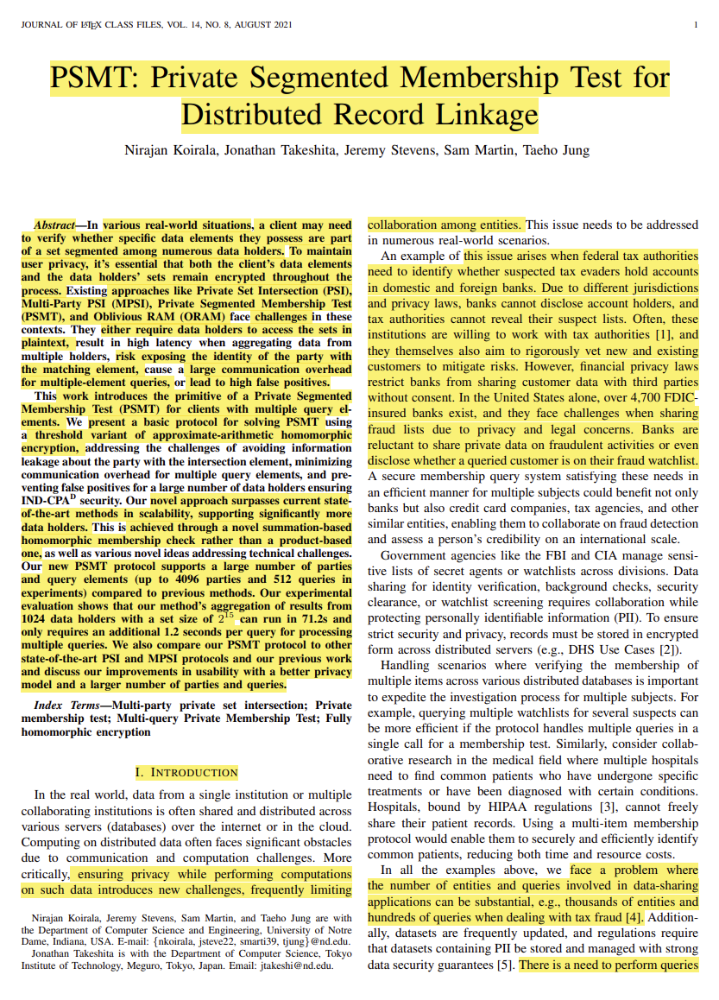
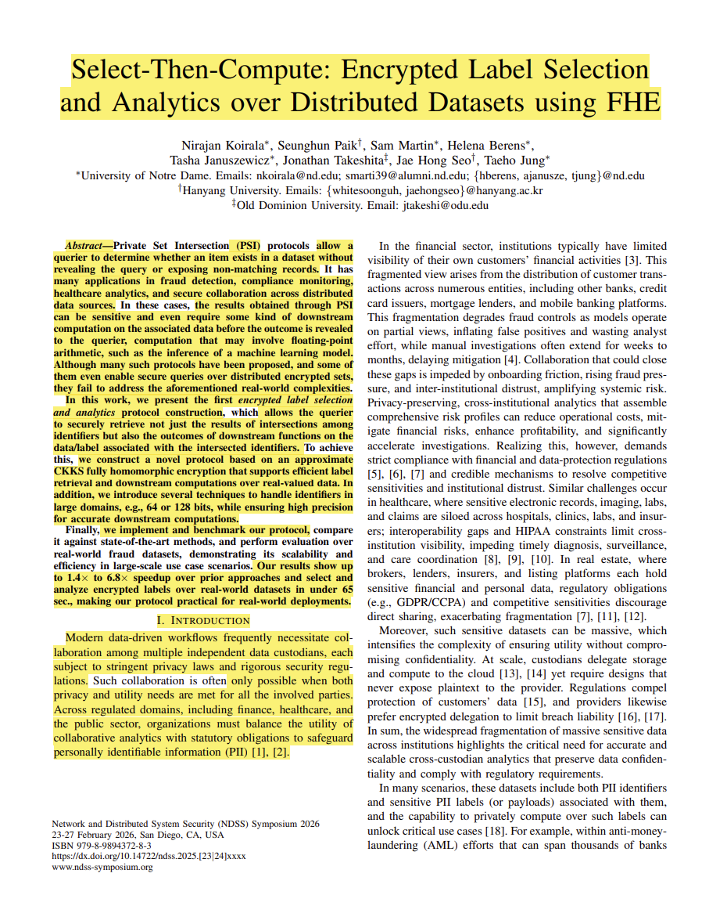
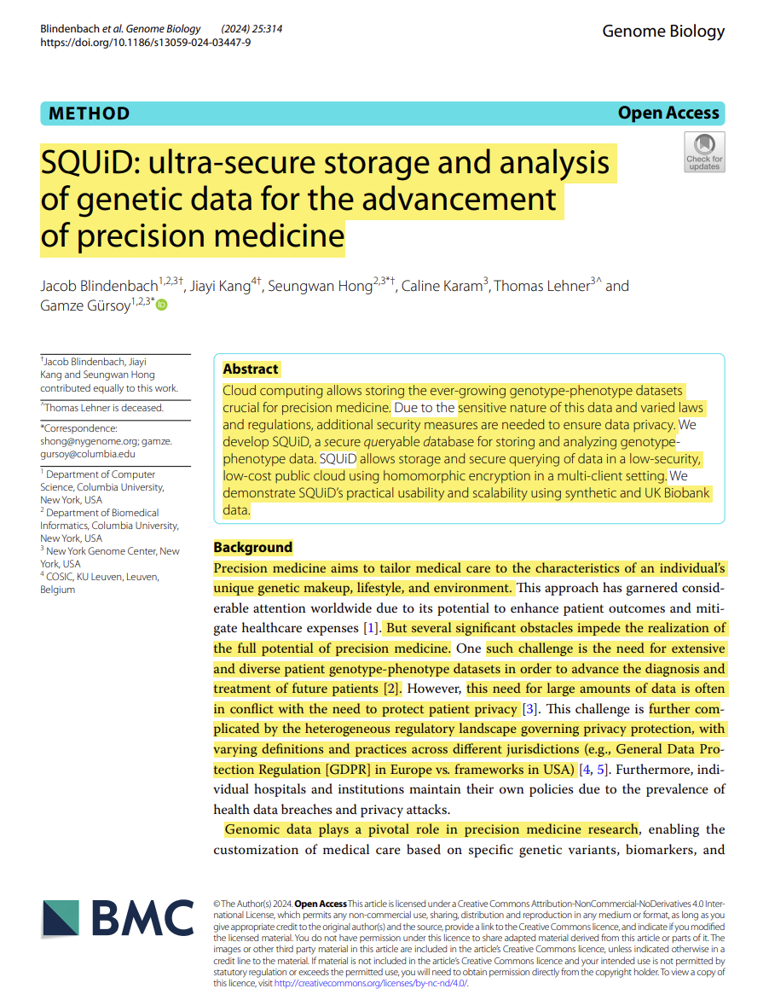
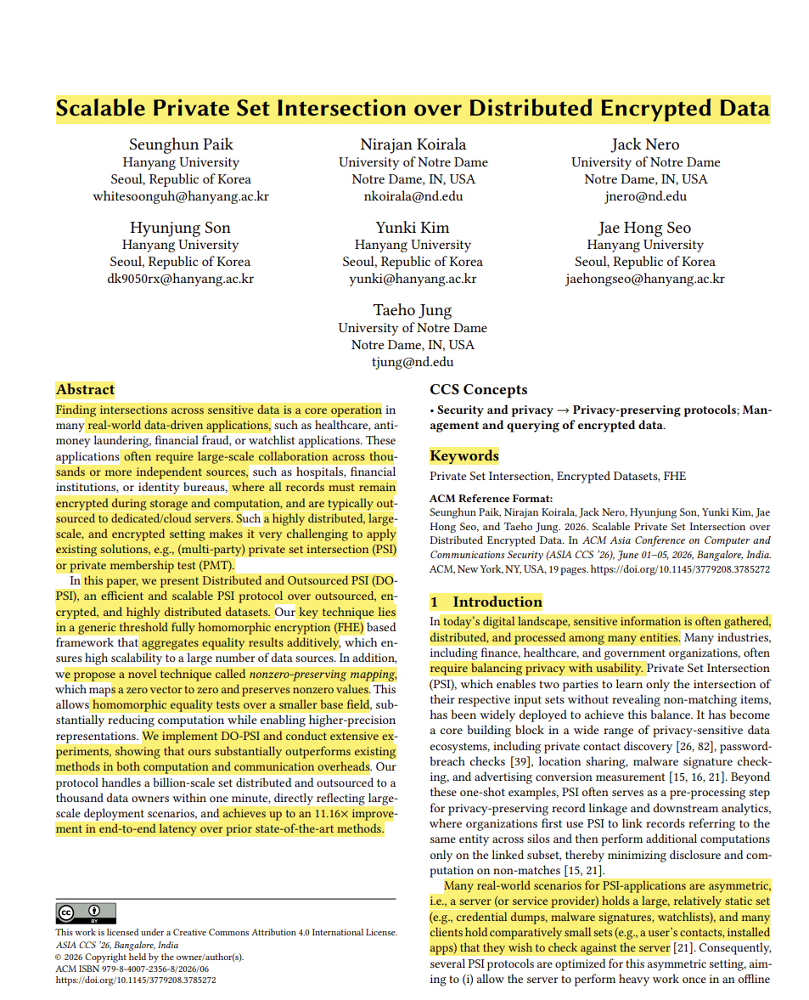
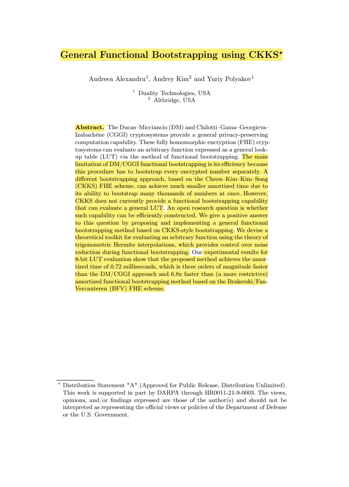

# Assignment 3: Reading Papers
## CS 800 Research Methods, Spring 2026
### Name : Bikash Thapa


This submission contains five papers from my research area (applied cryptography, data security and privacy), each with Keshav's 1st-pass summary (problem, approach, contributions), reference, DOI link, BibTeX, and a marked-up PDF.

## Directory structure

* **README.md** — This file (description, links, screenshots, video).
* **markedup-papers/** — Marked-up PDFs of the five papers (highlights/boxes/text for problem, approach, contributions).
* **imgs/** — Screenshots of page 1 of each paper.


## Papers

### Paper 1: PSMT: Private Segmented Membership Test for Distributed Record Linkage

**Reference:** Nirajan Koirala, Jonathan Takeshita, Jeremy Stevens, Sam Martin, and Taeho Jung. PSMT: Private segmented membership test for distributed record linkage. *Cryptology ePrint Archive*, 2025.

**DOI:** This paper is a minor revision on this one: [https://doi.org/10.56553/popets-2024-0114](https://doi.org/10.56553/popets-2024-0114)

```bibtex
@article{koirala2025psmt,
  title={{PSMT}: Private Segmented Membership Test for Distributed Record Linkage},
  author={Koirala, Nirajan and Takeshita, Jonathan and Stevens, Jeremy and Martin, Sam and Jung, Taeho},
  journal={Cryptology ePrint Archive},
  year={2025}
}
```

**1st pass (Keshav):**
- **Problem:** Existing Private Set Intersection (PSI) and Oblivious RAM (ORAM) protocols face challenges with high latency, large communication overheads, or the requirement that data holders access sets in plaintext.
- **Approach:** The author introduces a Private Segmented Membership Test (PSMT) protocol using threshold approximate-arithmetic homomorphic encryption that utilizes a novel summation-based homomorphic membership check instead of traditional product-based methods to enhance scalability.
- **Contributions:**
  - Proposes a summation-based protocol instead of traditional product-based methods that supports up to 4,096 parties and 512 queries.
  - Introduces receiver-side batching and sender-side query extraction to minimize communication overhead.
  - Extends the PSMT protocol to support multi-item queries.
  - Achieves up to 512x performance improvement for multi-query scenarios compared to previous works.

**Screenshot (Page 1):**



**Marked-up PDF:** [Paper 1](marked-up-pdfs/PSMT_1.pdf)

---

### Paper 2: Select-Then-Compute: Encrypted Label Selection and Analytics over Distributed Datasets using FHE

**Reference:** Nirajan Koirala, Seunghun Paik, Sam Martin, Helena Berens, Tasha Januszewicz, Jonathan Takeshita, Jae Hong Seo, and Taeho Jung. Select-Then-Compute: Encrypted label selection and analytics over distributed datasets using FHE. In *Proceedings of the 2026 Network and Distributed System Security Symposium (NDSS)*, 2026.

**DOI:** [https://dx.doi.org/10.14722/ndss.2026.240207](https://dx.doi.org/10.14722/ndss.2026.240207)

```bibtex
@inproceedings{koirala2026select,
  title={{Select-Then-Compute}: Encrypted Label Selection and Analytics over Distributed Datasets using {FHE}},
  author={Koirala, Nirajan and Paik, Seunghun and Martin, Sam and Berens, Helena and Januszewicz, Tasha and Takeshita, Jonathan and Seo, Jae Hong and Jung, Taeho},
  booktitle={Proceedings of the 2026 Network and Distributed System Security Symposium ({NDSS})},
  year={2026}
}
```

**1st pass (Keshav):**
- **Problem:** Most PSI protocols only support whether an item exists in a dataset or not but don't support any downstream analytics or computation on the matched items' associated labels.
- **Approach:** This paper uses approximate CKKS FHE to support real-valued downstream computations on matched items.
- **Contributions:**
  - Designs the first CKKS-based protocol for Encrypted Label Selection and Analytics that supports real-valued downstream computations without requiring Secure Multi-Party Computation (SMPC).
  - Proposes a novel approximation for homomorphic equality testing over very large identifier domains.
  - Optimizes domain extension polynomials to reduce the unit cost of selection while maintaining precision.
  - Demonstrates practical scalability by evaluating real-world fraud datasets in under 65 seconds.

**Screenshot (Page 1):**



**Marked-up PDF:** [Paper 2](marked-up-pdfs/PSMT_Select_Then_Compute.pdf)

---

### Paper 3: SQUiD: ultra‑secure storage and analysis of genetic data for the advancement of precision medicine

**Reference:** Jacob Blindenbach, Jiayi Kang, Seungwan Hong, Caline Karam, Thomas Lehner, and Gamze Gürsoy. SQUID: Ultra-secure storage and analysis of genetic data for the advancement of precision medicine. *Genome Biology*, 25(1):314, 2024.

**DOI:** [https://doi.org/10.1186/s13059-024-03447-9](https://doi.org/10.1186/s13059-024-03447-9)

```bibtex
@article{blindenbach2024squid,
  title={{SQUID}: Ultra-Secure Storage and Analysis of Genetic Data for the Advancement of Precision Medicine},
  author={Blindenbach, Jacob and Kang, Jiayi and Hong, Seungwan and Karam, Caline and Lehner, Thomas and G{\"u}rsoy, Gamze},
  journal={Genome Biology},
  volume={25},
  number={1},
  pages={314},
  year={2024},
  publisher={Springer}
}
```

**1st pass (Keshav):**
- **Problem:** Researchers often have to download and decrypt large amounts of genotype-phenotype data locally to perform analysis, which is resource-intensive and creates security vulnerabilities.
- **Approach:** The authors develop a framework that uses homomorphic encryption to store and analyze data directly in a public cloud.
- **Contributions:**
  - Creates a scalable, secure framework for multi-client queries on encrypted genomic data.
  - Introduces a vertical packing method that is nearly 50,000x more storage-efficient than unpacked homomorphic storage.
  - Implements a set of encrypted query functionalities, like Count, Minor Allele Frequency (MAF), Polygenic Risk Score (PRS), and similarity queries.
  - Demonstrates that query performance scales linearly with the number of patients and processor cores, making it suitable for datasets with millions of patients.

**Screenshot (Page 1):**



**Marked-up PDF:** [Paper 3](marked-up-pdfs/SQUID_database.pdf)

---

### Paper 4: Scalable Private Set Intersection over Distributed Encrypted Data

**Reference:** Seunghun Paik, Nirajan Koirala, Jack Nero, Hyunjung Son, Yunki Kim, Jae Hong Seo, and Taeho Jung. Scalable private set intersection over distributed encrypted data. In *Proceedings of the 21st ACM Asia Conference on Computer and Communications Security (ASIA CCS ’26)*, 2026.

**DOI:** [https://doi.org/10.1145/3779208.3785272](https://doi.org/10.1145/3779208.3785272)

```bibtex
@inproceedings{paik2026scalable,
  title={Scalable Private Set Intersection over Distributed Encrypted Data},
  author={Paik, Seunghun and Koirala, Nirajan and Nero, Jack and Son, Hyunjung and Kim, Yunki and Seo, Jae Hong and Jung, Taeho},
  booktitle={Proceedings of the 21st {ACM} Asia Conference on Computer and Communications Security ({ASIA CCS} '26)},
  year={2026}
}
```

**1st pass (Keshav):**
- **Problem:** Scaling PSI to thousands of independent data sources is computationally expensive because multi-party aggregation typically requires high multiplicative depth.
- **Approach:** The authors develop a framework based on threshold FHE that aggregates membership results additively rather than multiplicatively.
- **Contributions:**
  - Develops a generic, highly scalable DO-PSI framework based on Fermat's Little Theorem for Value Annihilating Function (VAF).
  - Introduces the Non-zero Preserving Mapping (NPM) technique to allow equality tests over smaller base fields, reducing computation significantly.
  - Achieves up to an 11.16x improvement in end-to-end latency compared to prior state-of-the-art methods.

**Screenshot (Page 1):**



**Marked-up PDF:** [Paper 4](marked-up-pdfs/Scalable_PSI.pdf)

---

### Paper 5: General Functional Bootstrapping using CKKS

**Reference:** Andreea Alexandru, Andrey Kim, and Yuriy Polyakov. General functional bootstrapping using CKKS. In *Proceedings of the Annual International Cryptology Conference (CRYPTO 2025)*, pages 304–337. Springer, 2025.

**DOI:** [https://doi.org/10.1007/978-3-032-01881-6_10](https://doi.org/10.1007/978-3-032-01881-6_10)

```bibtex
@inproceedings{alexandru2025general,
  title={General Functional Bootstrapping using {CKKS}},
  author={Alexandru, Andreea and Kim, Andrey and Polyakov, Yuriy},
  booktitle={Proceedings of the Annual International Cryptology Conference ({CRYPTO} 2025)},
  pages={304--337},
  year={2025},
  publisher={Springer}
}
```

**1st pass (Keshav):**
- **Problem:** Functional bootstrapping in traditional cryptosystems like DM/CGGI is inefficient because it must process every encrypted number individually.
- **Approach:** The authors develop a hybrid Fully Homomorphic Encryption (FHE) scheme that "vectorizes" the process, encrypting many numbers in a single RLWE ciphertext and bootstrapping them simultaneously using CKKS.
- **Contributions:**
  - Introduces a general functional bootstrapping capability based on CKKS for RLWE ciphertexts.
  - Provides analytical expressions for first, second, and third-order Trigonometric Hermite Interpolations to enable higher-order noise reduction.
  - Develops multi-precision sign and arbitrary function evaluation procedures.
  - Demonstrates performance for 8-bit LUT evaluation that is three orders of magnitude faster than previous DM/CGGI methods.

**Screenshot (Page 1):**



**Marked-up PDF:** [Paper 5](marked-up-pdfs/ckks_functional_bootstrapping.pdf)

---

## Video walkthrough

A short YouTube video walking through the papers and discussing the 1st-pass highlights:

**Video Link:** [YouTube Video](https://youtu.be/lpKWtv5JQQY)
