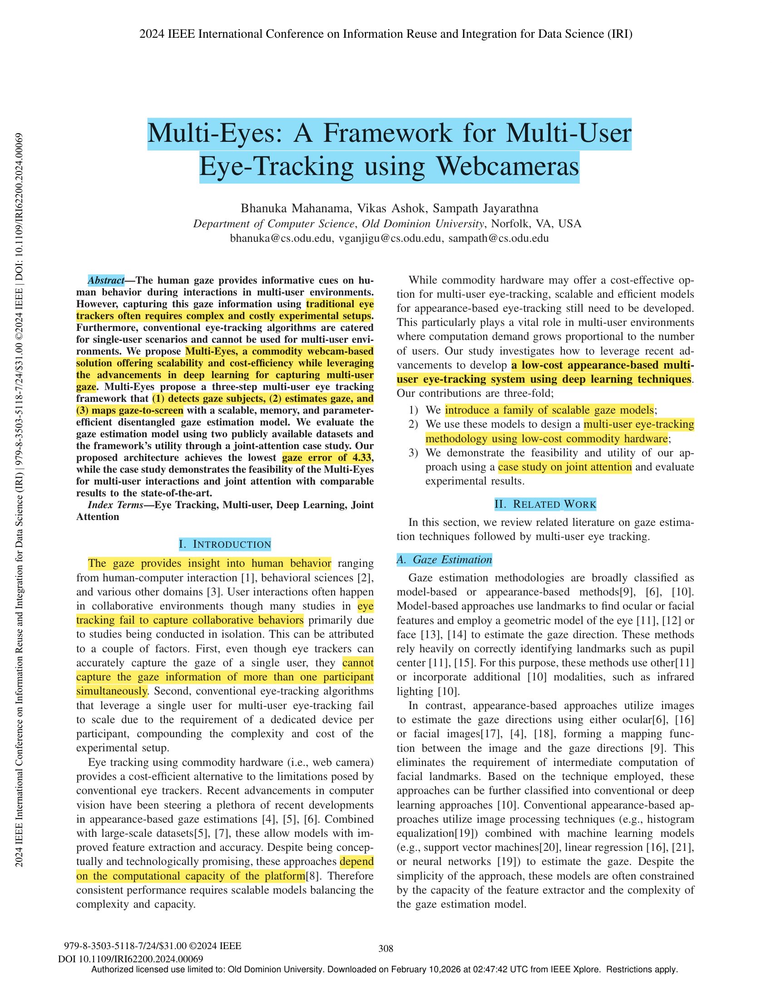
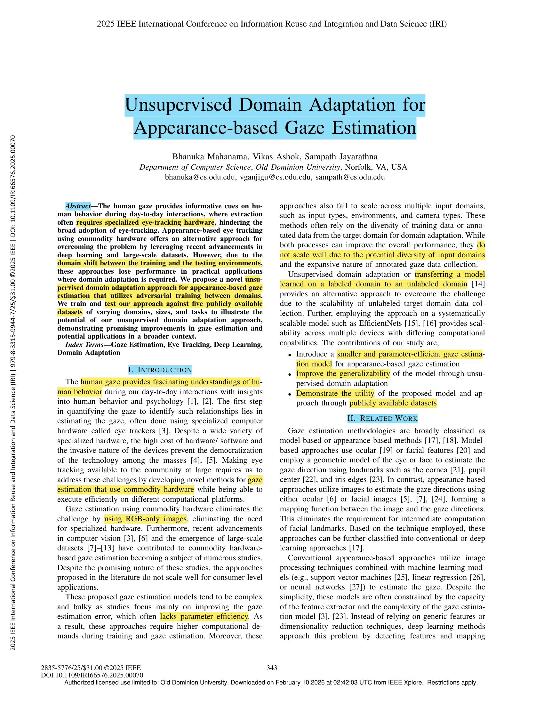
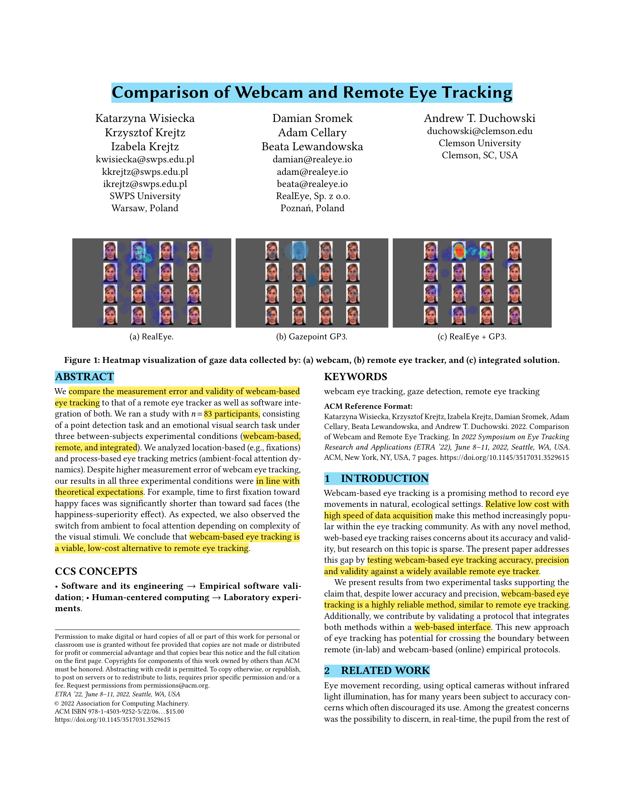
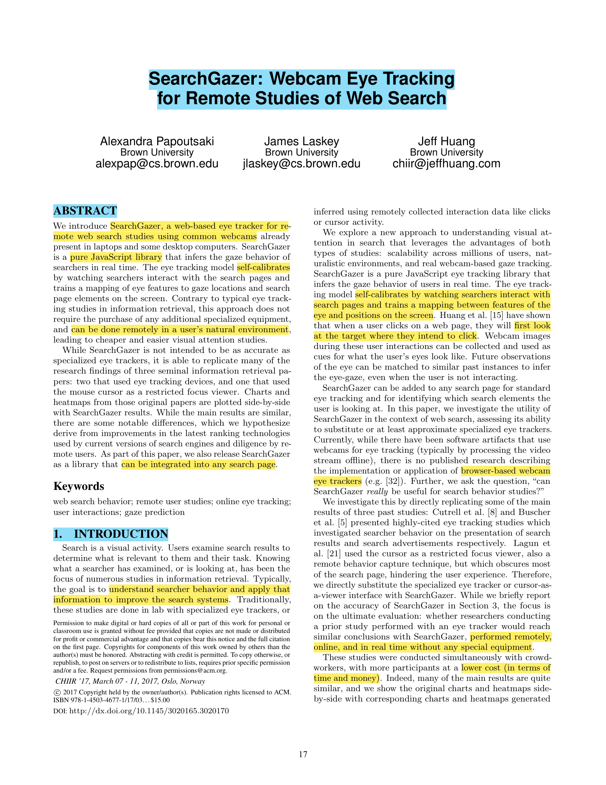
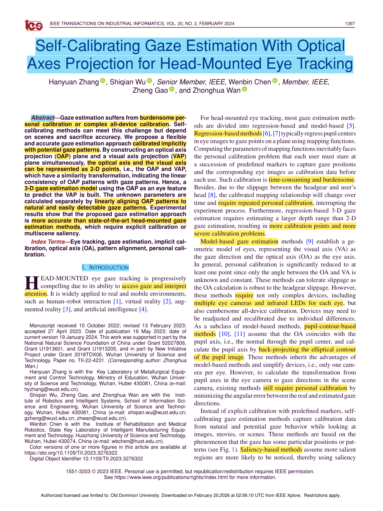

# Assignment 3

This is my submission for Assignment 3.

## Description

This assignment involves finding five papers related to my research area (eye-tracking and gaze estimation), performing Keshav's 1st pass on each paper, and identifying the problem, approach, and contributions of each paper.

## Directory Structure

```
3/
├── README.md       # This file - assignment documentation
├── Papers/         # Directory containing marked-up PDFs of all 5 papers
└── images/         # Directory containing screenshots of page 1 of each paper
```

## Paper 1: Multi-Eyes: A Framework for Multi-User Eye-Tracking using Webcameras

### Page 1 Screenshot


### Reference
Mahanama, B., Ashok, V., & Jayarathna, S. (2024, August). Multi-eyes: A framework for multi-user eye-tracking using webcameras. In 2024 IEEE International Conference on Information Reuse and Integration for Data Science (IRI) (pp. 308-313). IEEE.

### DOI
[https://doi.org/10.1109/IRI62200.2024.00069](https://doi.org/10.1109/IRI62200.2024.00069)

### BibTeX
```bibtex
@inproceedings{mahanama2024multi,
  title={Multi-eyes: A framework for multi-user eye-tracking using webcameras},
  author={Mahanama, Bhanuka and Ashok, Vikas and Jayarathna, Sampath},
  booktitle={2024 IEEE International Conference on Information Reuse and Integration for Data Science (IRI)},
  pages={308--313},
  year={2024},
  organization={IEEE}
}
```

### Keshav's 1st Pass
- **Problem:** Multi-user eye tracking is costly and complex. Traditional eye trackers only work for single users, and scaling to collaborative environments requires dedicated hardware per participant, making setups expensive and unwieldy.
- **Approach:** The authors propose Multi-Eyes, a webcam-based framework using deep learning that detects gaze subjects, estimates gaze via a disentangled autoencoder model built on EfficientNet, and maps gaze to screen coordinates, enabling scalable, low-cost multi-user eye tracking.
- **Contributions:** 
  - Introduced a family of scalable, parameter-efficient disentangled gaze estimation models.
  - Designed a three-step multi-user eye-tracking framework using commodity webcams.
  - Demonstrated feasibility through a joint attention case study with results comparable to state-of-the-art conventional eye-tracking setups.

**Marked-up PDF:** [1. Multi-Eyes_ A Framework for Multi-User Eye-Tracking using Webcameras.pdf](papers/1.%20Multi-Eyes_%20A%20Framework%20for%20Multi-User%20Eye-Tracking%20using%20Webcameras.pdf)

---

## Paper 2: Unsupervised Domain Adaptation for Appearance-Based Gaze Estimation

### Page 1 Screenshot


### Reference
Mahanama, B., Ashok, V., & Jayarathna, S. (2025, August). Unsupervised Domain Adaptation for Appearance-Based Gaze Estimation. In 2025 IEEE International Conference on Information Reuse and Integration and Data Science (IRI) (pp. 343-348). IEEE.

### DOI
[https://doi.org/10.1109/IRI66576.2025.00070](https://doi.org/10.1109/IRI66576.2025.00070)

### BibTeX
```bibtex
@inproceedings{mahanama2025unsupervised,
  title={Unsupervised Domain Adaptation for Appearance-Based Gaze Estimation},
  author={Mahanama, Bhanuka and Ashok, Vikas and Jayarathna, Sampath},
  booktitle={2025 IEEE International Conference on Information Reuse and Integration and Data Science (IRI)},
  pages={343--348},
  year={2025},
  organization={IEEE}
}
```

### Keshav's 1st Pass
- **Problem:** Appearance-based gaze estimation models trained on one domain lose performance in new environments (domain shift), and existing adaptation approaches either require labeled target domain data or rely on complex, parameter-heavy models that don't scale well.
- **Approach:** The authors propose an unsupervised domain adaptation (UDA) framework built on a disentangled EfficientNetV2-based encoder that separates gaze-defining from non-gaze-defining features, using adversarial training with a domain classifier to learn domain-invariant representations, without needing labels from the target domain.
- **Contributions:**
  - Introduced a smaller, parameter-efficient disentangled gaze estimation model built on EfficientNetV2.
  - Proposed an unsupervised domain adaptation approach using adversarial discriminative classification.
  - Demonstrated improved generalizability and domain adaptability across five publicly available datasets with varying input/output domains.

**Marked-up PDF:** [2. Unsupervised Domain Adaptation for Appearance-Based Gaze Estimation.pdf](papers/2.%20Unsupervised%20Domain%20Adaptation%20for%20Appearance-Based%20Gaze%20Estimation.pdf)

---

## Paper 3: Comparison of Webcam and Remote Eye Tracking

### Page 1 Screenshot


### Reference
Wisiecka, K., Krejtz, K., Krejtz, I., Sromek, D., Cellary, A., Lewandowska, B., & Duchowski, A. (2022, June). Comparison of webcam and remote eye tracking. In 2022 Symposium on eye tracking research and applications (pp. 1-7).

### DOI
[https://doi.org/10.1145/3517031.3529615](https://doi.org/10.1145/3517031.3529615)

### BibTeX
```bibtex
@inproceedings{wisiecka2022comparison,
  title={Comparison of webcam and remote eye tracking},
  author={Wisiecka, Katarzyna and Krejtz, Krzysztof and Krejtz, Izabela and Sromek, Damian and Cellary, Adam and Lewandowska, Beata and Duchowski, Andrew},
  booktitle={2022 Symposium on eye tracking research and applications},
  pages={1--7},
  year={2022}
}
```

### Keshav's 1st Pass
- **Problem:** Webcam-based eye tracking is increasingly popular as a low-cost alternative to remote eye trackers, but its accuracy, precision, and validity for behavioral research remain insufficiently validated.
- **Approach:** The authors ran a controlled in-lab study with 83 participants across three conditions (webcam-only, remote eye tracker, and integrated) using a point detection task and an emotional visual search task, comparing location-based and process-based eye tracking metrics across all conditions.
- **Contributions:**
  - Demonstrated that webcam eye tracking, despite higher measurement error, produces results consistent with established theoretical predictions (e.g., happiness-superiority effect, ambient-to-focal attention shifts).
  - Provided the first study examining dynamics of ambient/focal visual attention recorded via a webcam eye tracker.
  - Validated a protocol integrating webcam software with a remote eye tracker within a single web-based interface.

**Marked-up PDF:** [3. Comparison of Webcam and Remote Eye Tracking.pdf](papers/3.%20Comparison%20of%20Webcam%20and%20Remote%20Eye%20Tracking.pdf)

---

## Paper 4: SearchGazer: Webcam Eye Tracking for Remote Studies of Web Search

### Page 1 Screenshot


### Reference
Papoutsaki, A., Laskey, J., & Huang, J. (2017, March). Searchgazer: Webcam eye tracking for remote studies of web search. In Proceedings of the 2017 conference on conference human information interaction and retrieval (pp. 17-26).

### DOI
[https://doi.org/10.1145/3020165.3020170](https://doi.org/10.1145/3020165.3020170)

### BibTeX
```bibtex
@inproceedings{papoutsaki2017searchgazer,
  title={Searchgazer: Webcam eye tracking for remote studies of web search},
  author={Papoutsaki, Alexandra and Laskey, James and Huang, Jeff},
  booktitle={Proceedings of the 2017 conference on conference human information interaction and retrieval},
  pages={17--26},
  year={2017}
}
```

### Keshav's 1st Pass
- **Problem:** Eye tracking studies of web search behavior require expensive specialized hardware and controlled lab settings, making large-scale, remote, and naturalistic studies impractical and costly.
- **Approach:** The authors introduce SearchGazer, a JavaScript library that self-calibrates in real time using the gaze-cursor relationship during natural user interactions (clicks and cursor movements), mapping eye features to screen coordinates without requiring explicit calibration or specialized equipment.
- **Contributions:**
  - Developed and released SearchGazer, an open-source real-time webcam eye tracking library embeddable in any search page.
  - Demonstrated its validity by replicating key findings from three seminal web search eye tracking studies using remote crowd-workers at a fraction of the cost and time.

**Marked-up PDF:** [4. Searchgazer.pdf](papers/4.%20Searchgazer.pdf)

---

## Paper 5: Self-Calibrating Gaze Estimation With Optical Axes Projection for Head-Mounted Eye Tracking

### Page 1 Screenshot


### Reference
Zhang, H., Wu, S., Chen, W., Gao, Z., & Wan, Z. (2023). Self-calibrating gaze estimation with optical axes projection for head-mounted eye tracking. IEEE Transactions on Industrial Informatics, 20(2), 1397-1407.

### DOI
[https://doi.org/10.1109/TII.2023.3276322](https://doi.org/10.1109/TII.2023.3276322)

### BibTeX
```bibtex
@article{zhang2023self,
  title={Self-calibrating gaze estimation with optical axes projection for head-mounted eye tracking},
  author={Zhang, Hanyuan and Wu, Shiqian and Chen, Wenbin and Gao, Zheng and Wan, Zhonghua},
  journal={IEEE Transactions on Industrial Informatics},
  pages={1397--1407},
  year={2023}
}
```

### Keshav's 1st Pass
- **Problem:** Head-mounted eye tracking requires burdensome personal calibration (staring at predefined markers) or complex all-device calibration, while existing self-calibrating alternatives sacrifice accuracy by relying on scene-dependent saliency maps.
- **Approach:** The authors introduce a new eye feature, the Optical Axis Projection (OAP) and prove theoretically that it has a linear (similarity) relationship with gaze patterns, enabling implicit calibration by aligning OAP patterns to three naturally occurring and easily detectable gaze patterns: gaze center, gaze movements (e.g., reading direction), and gaze range.
- **Contributions:**
  - Theoretically derived the similarity transformation between the OAP and VAP, establishing for the first time a direct linear relationship between eye-movement patterns and gaze patterns.
  - Built a pupil-contour-based 3D gaze estimation model using the OAP with fewer unknown parameters and simpler hardware than prior methods.
  - Proposed a scene-independent implicit calibration method using natural gaze patterns that outperforms state-of-the-art head-mounted methods requiring explicit calibration or known scene saliency. 

**Marked-up PDF:** [5. Self-Calibrating_Gaze_Estimation_With_Optical_Axes_Projection_for_Head-Mounted_Eye_Tracking.pdf](papers/5.%20Self-Calibrating_Gaze_Estimation_With_Optical_Axes_Projection_for_Head-Mounted_Eye_Tracking.pdf)

---

## YouTube Video

The YouTube video is available at: [https://youtu.be/xDTzpnIC0Tc](https://youtu.be/xDTzpnIC0Tc)
